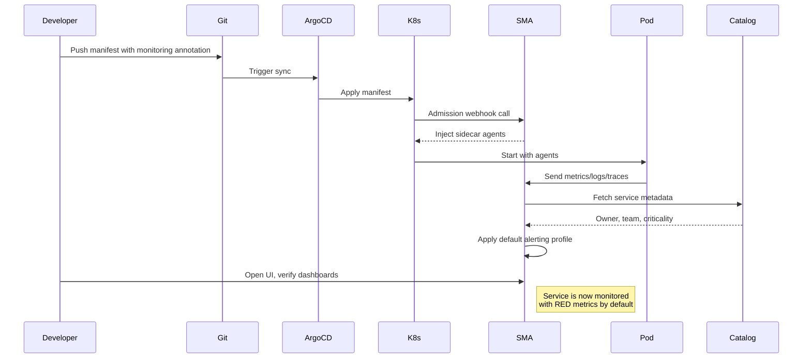
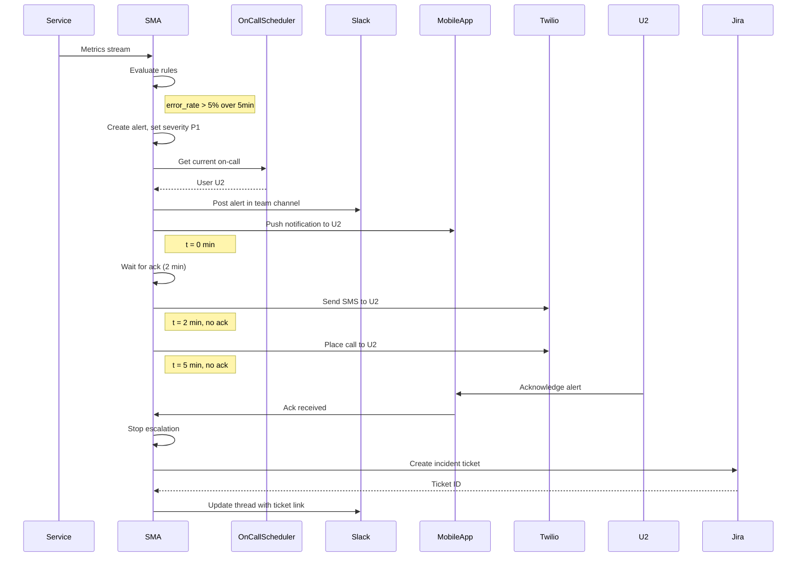
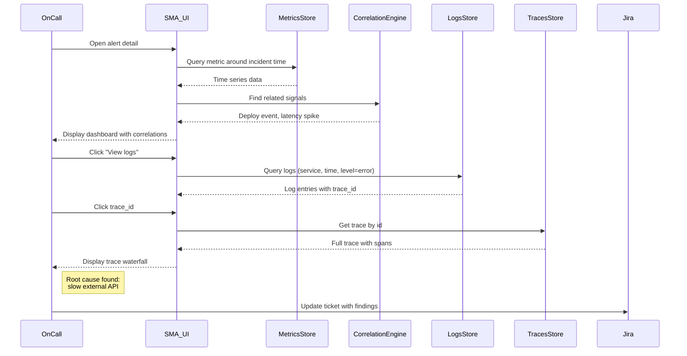
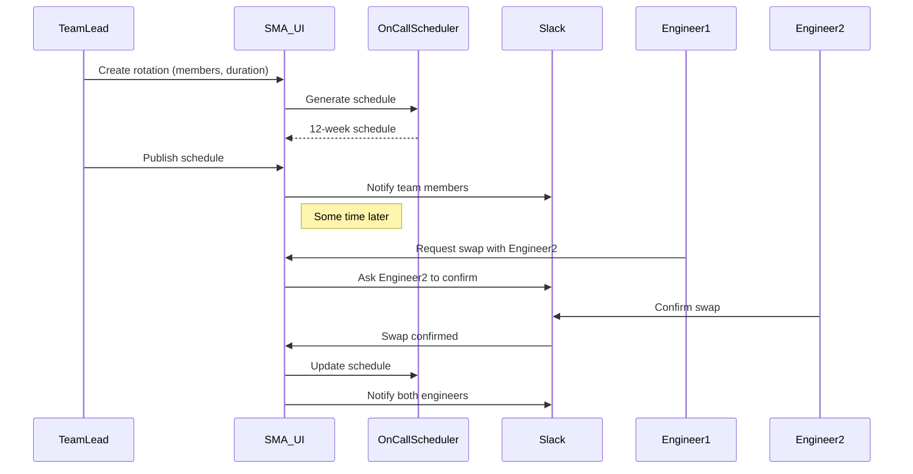
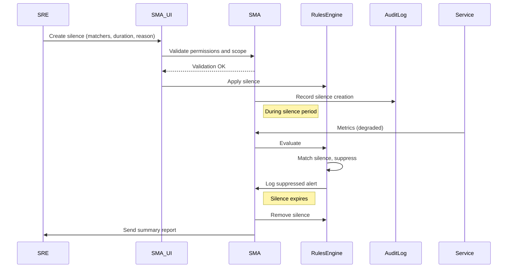
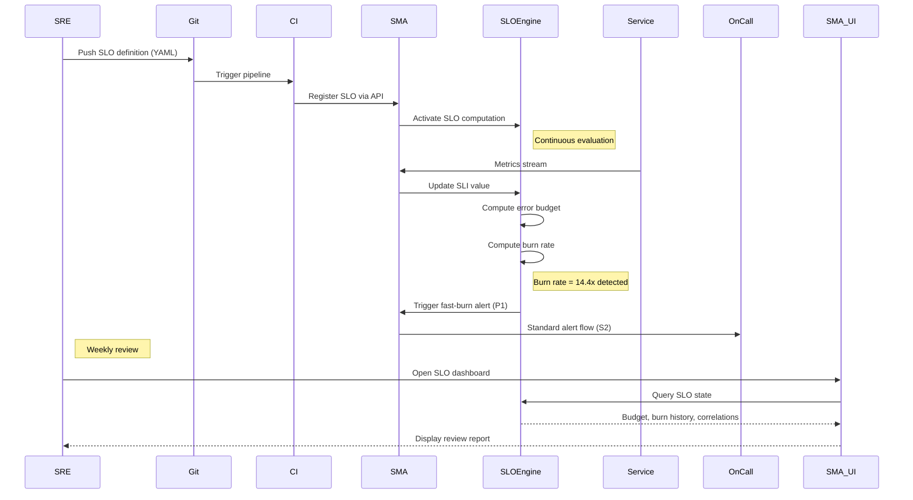
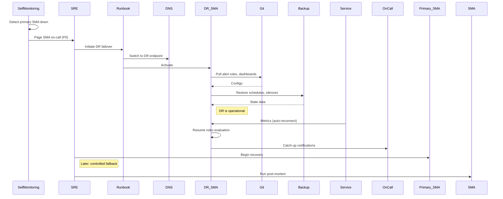

# CONOPS — Concept of Operations

## 2.1. Назначение раздела

Раздел описывает, как Система мониторинга и алертинга (далее — СМА) 
функционирует в реальной эксплуатации с точки зрения её пользователей 
и взаимодействующих систем.

Раздел фиксирует:
- Акторов системы и их цели (2.2)
- Каталог ключевых сценариев эксплуатации (2.3)
- Детальное описание каждого сценария: предусловия, основной поток, 
  альтернативы, метрики успеха (2.4–2.10)
- Сводную матрицу «сценарии × компоненты СМА» (2.11)
- Связанные темы, рассматриваемые в других разделах (2.12)

## 2.2. Акторы и их цели

Перенесём пользователей из Раздела 1 в формат **goal-oriented**: для каждого актора — главные цели и метрики успеха.

| ID  | Актор                  | Главные цели   | Метрики успеха                  |
| ----| --------------------|--------------------|--------------------| 
| U1  | SRE                    | - Обеспечить SLO продуктовой платформы  | - SLO compliance >= target       |
|     |                        | - Минимизировать MTTR инцидентов        | - MTTR < 30 мин для P1           |
|     |                        | - Снизить alert fatigue                 | - Signal-to-noise > 80%          |
| U2  | On-call инженер        | - Быстро узнать о проблеме              | - Time-to-acknowledge < 2 мин    |
|     |                        | - Понять root cause                     | - MTTD < 5 мин                   |
|     |                        | - Разрешить инцидент или эскалировать   | - False-positive rate < 5%       |
| U3  | Разработчик            | - Подключить свой сервис к мониторингу  | - Onboarding < 1 час             |
|     | (Service Owner)        | - Понять поведение сервиса в проде      | - Self-service без тикетов в SRE |
|     |                        | - Получать релевантные алерты           | - Coverage метрик >= 80%         |
| U4  | Тимлид                 | - Управлять on-call ротациями команды   | - Fair distribution дежурств     |
|     |                        | - Видеть здоровье сервисов команды      | - Burnout risk minimization      |
|     |                        | - Принимать решения по приоритетам      | - Weekly review доступен         |
| U5  | Security инженер       | - Детектировать security-аномалии       | - Detection latency < 10 мин     |
|     |                        | - Получать audit logs всех действий     | - 100% покрытие audit            |
|     |                        | - Расследовать security-инциденты       | - Retention audit >= 1 год       |

**Дополнительные акторы (системы), которые ведут себя как пользователи:**
| ID  | Системный актор        | Главные цели | Метрики успеха|
|-----|------------------------|-----------------------------------------|----------------------------------|
| SA1 | CI/CD pipeline (E7)    | - Уведомить СМА о деплое                | - Deploy event delivered < 5 сек |
|     |                        | - Получить smoke-check status           |                                  |
| SA2 | Service Catalog (E8)   | - Синхронизировать метаданные сервисов  | - Sync lag < 1 мин               |
|     |                        | - Передавать ownership info             |                                  |
| SA3 | Auto-instrumentation   | - Получать конфиги collection           | - Config delivery < 30 сек       |
|     | агенты в Pods          | - Отправлять метрики/логи/трейсы        | - Data loss < 0.01% |
## 2.3. Каталог сценариев

| ID | Название  | Главный актор| Частота   | Критичн. |
|----|-------------------|-----------------------|-----------|---------|
| S1 | Onboarding нового сервиса | U3 Разработчик | Дневн. | Средняя  |
| S2 | Срабатывание алерта и эскалация | U2 On-call | Ежечасн.  | Высокая  |
| S3 | Расследование инцидента (M->L->T)| U2 On-call / U3| Дневн.| Высокая  |
| S4 | Управление on-call ротациями | U4 Тимлид | Недельн.  | Средняя  |
| S5 | Maintenance window / silence | U1 SRE  | Дневн. | Средняя  |
| S6 | Управление SLO и burn-rate алертами| U1 SRE / U4 Тимлид | Месячн.| Высокая|
| S8 | DR: восстановление СМА после сбоя | U1 SRE | Редко | Критич.  |

**Примечание:** S7 (security-инциденты) и S9 (multi-tenancy onboarding) намеренно вынесены за рамки CONOPS — они затрагиваются в Разделе 7 (Cross-cutting: Security и Multi-tenancy).

## 2.4. Сценарий S1: Onboarding нового сервиса

### Краткое описание

Разработчик подключает свой новый сервис к СМА: настраивает сбор метрик, логов, трейсов; конфигурирует базовые алерты; верифицирует видимость данных в UI.

### Акторы

-   **Главный:**  U3 Разработчик (Service Owner)
-   **Поддержка:**  U1 SRE (при сложных случаях)
-   **Системы:**  E7 CI/CD, E8 Service Catalog, СМА

### Предусловия

-   Сервис деплоится в Kubernetes
-   В Service Catalog (E8) зарегистрирован service entry с ownership info
-   У разработчика есть доступ к СМА (через IdP / E2)

### Постусловия (success)

-   Метрики/логи/трейсы сервиса видны в UI СМА
-   Применены стандартные алерты (RED-метрики: Rate, Errors, Duration)
-   Сервис привязан к команде и попадает в on-call rotation команды

### Основной поток

1.  Разработчик добавляет в манифест K8s аннотацию  `monitoring.sma.io/enabled: true`  и  `service-id: my-service`
2.  ArgoCD (E7) применяет манифест в кластере
3.  СМА через mutating admission webhook инжектит в Pod sidecar-агенты (OTel collector, log shipper) и/или включает eBPF-сбор
4.  Агенты начинают отправлять метрики/логи/трейсы в СМА
5.  СМА запрашивает метаданные сервиса из Service Catalog (E8): owner, team, criticality
6.  СМА применяет default alerting profile на основе criticality (например, для tier-1 — стандартные RED-алерты с порогами)
7.  Разработчик заходит в UI СМА, видит свой сервис в каталоге, проверяет дашборды
8.  Разработчик при желании кастомизирует алерты через декларативный конфиг (PR в Git-репозиторий с alerting rules)

### Альтернативные потоки

-   **A1: Сервис не в K8s**  (legacy VM) → разработчик ставит agent вручную, получает токен из СМА UI
-   **A2: Service Catalog не содержит сервис**  → СМА требует ручного указания owner через UI или fail-closed (отказ онбординга)

### Метрики успеха сценария

-   Time-to-first-metric: < 5 минут с момента push
-   Time-to-onboarding-complete (с дашбордами и алертами): < 1 час
-   % сервисов, прошедших onboarding self-service (без участия SRE): > 90%

## 2.5. Сценарий S2: Срабатывание алерта и эскалация

### Краткое описание

Главный happy path системы. СМА детектирует аномалию, оценивает её серьёзность, уведомляет дежурного, обеспечивает эскалацию при отсутствии реакции.

### Акторы

-   **Главный:**  U2 On-call инженер
-   **Поддержка:**  U4 Тимлид (при эскалации)
-   **Системы:**  E3 (Slack/Telegram), E4 (Mobile), E9 (Twilio), E10 (PagerDuty), E5 (Jira)

### Предусловия

-   Сервис уже on-boarded (S1 пройден)
-   Определён on-call rotation для команды-владельца
-   Настроена эскалационная политика (например: → Slack → Push → SMS → Call → Lead)

### Постусловия (success)

-   Алерт acknowledged on-call инженером в течение SLA
-   При необходимости создан incident ticket в Jira (E5)
-   Инцидент либо разрешён, либо эскалирован

### Основной поток

1.  Сервис (E1) отправляет метрики в СМА
2.  Rules Engine СМА в реальном времени вычисляет alerting rules
3.  Сработало условие (например, error rate > 5% в течение 5 минут)
4.  СМА создаёт alert instance, определяет severity (P1/P2/P3) на основе criticality сервиса и burn rate
5.  СМА смотрит on-call schedule команды-владельца сервиса, находит текущего дежурного (U2)
6.  СМА отправляет уведомление по эскалационной политике:
    -   t=0: Slack в канал команды + push в мобильное приложение
    -   t+2 мин: если нет ack → SMS через Twilio
    -   t+5 мин: если нет ack → звонок через Twilio
    -   t+10 мин: если нет ack → эскалация на тимлида U4
7.  On-call инженер (U2) acknowledged алерт в мобильном приложении
8.  СМА останавливает эскалацию, фиксирует ack time, owner
9.  Если severity = P1, СМА автоматически создаёт ticket в Jira (E5) с контекстом
10.  On-call переходит к расследованию (см. S3)

### Альтернативные потоки

-   **A1: On-call не отвечает**  > 10 мин → эскалация на тимлида (U4), дальше — на secondary on-call команды
-   **A2: Alert storm**  (множество связанных алертов) → СМА группирует через correlation engine, отправляет один rolled-up notification
-   **A3: Flapping alert**  (быстро меняет state) → auto-suppression на N минут, уведомление в Slack без эскалации
-   **A4: Алерт во время известного maintenance window**  → suppressed автоматически (см. S5)

### Exception handling

-   **E1: Канал доставки недоступен**  (Slack down) → fallback на следующий канал в политике + событие в self-monitoring
-   **E2: Service Catalog недоступен**  → СМА использует cached ownership info (TTL 1 час)
-   **E3: Twilio rate limit**  → fallback на email + critical event в self-monitoring

### Метрики успеха сценария

-   Time-to-Detect (MTTD): P95 < 5 минут
-   Time-to-Notify: P95 < 30 секунд от создания алерта до Slack/Push
-   Time-to-Acknowledge: P95 < 2 минут (для P1)
-   False-positive rate: < 5%
-   Escalation rate (% алертов, ушедших на secondary): < 10%

## 2.6. Сценарий S3: Расследование инцидента (metrics → logs → traces)

### Краткое описание

On-call получил алерт, открывает UI СМА, переходит от агрегированной метрики к конкретным логам и трейсам, находит root cause.

### Акторы

-   **Главный:**  U2 On-call (часто привлекает U3 Разработчика)
-   **Системы:**  СМА UI, backend стораджи метрик/логов/трейсов

### Предусловия

-   Алерт acknowledged (S2 завершён шагом 7-8)
-   В UI открыт контекст алерта со ссылками на dashboards

### Постусловия (success)

-   Идентифицирован root cause (или гипотеза)
-   Зафиксированы findings в incident ticket (E5)
-   Принято решение: hotfix / rollback / scale / wait

### Основной поток

1.  On-call открывает alert detail page в UI СМА
2.  Видит график метрики, превысившей порог, с маркером времени аномалии
3.  UI показывает correlated signals: всплеск latency, рост ошибок, недавний деплой (событие от E7 CI/CD)
4.  On-call кликает «View logs» в контексте аномалии → переход в log explorer с предзаполненным фильтром (service, time range, error level)
5.  Видит exception stacktrace, копирует trace_id
6.  Кликает «View trace» → переход в trace viewer с конкретным trace
7.  Видит, что 80% времени запроса проводится в внешнем API, который недавно деградировал
8.  Формирует гипотезу: «внешний API X отвечает медленно, наш сервис не имеет circuit breaker»
9.  Записывает findings в Jira ticket
10.  Принимает решение: временно увеличить timeout + поставить задачу на добавление circuit breaker

### Альтернативные потоки

-   **A1: Логи не содержат trace_id**  → on-call использует поиск по времени и текстовый поиск
-   **A2: Trace неполный**  (потерян span) → on-call работает с тем, что есть, помечает gap
-   **A3: Несколько потенциальных причин**  → on-call параллельно проверяет несколько гипотез через split-screen в UI

### Метрики успеха сценария

-   Time-to-investigate-start: < 1 минута от ack до открытия UI
-   Кол-во переходов «metric → log → trace» успешных (без потери контекста): > 95%
-   Time-to-root-cause (для типовых проблем): < 15 минут

## 2.7. Сценарий S4: Управление on-call ротациями

### Краткое описание

Тимлид настраивает расписание дежурств для команды, разрешает overrides и swaps между инженерами.

### Акторы

-   **Главный:**  U4 Тимлид
-   **Поддержка:**  U2 On-call инженеры команды
-   **Системы:**  СМА (on-call scheduler component), E2 IdP

### Предусловия

-   В IdP есть группа команды с членами
-   У тимлида роль  `team-lead`  для своей команды

### Постусловия (success)

-   Расписание дежурств на N недель вперёд опубликовано
-   Все члены команды видят свои дежурства в UI/календаре
-   При срабатывании алерта (S2) система использует актуальный schedule

### Основной поток

1.  Тимлид открывает раздел «On-call» в UI СМА
2.  Создаёт новое rotation: участники, длительность смены (например, 1 неделя), handoff time (например, понедельник 10:00)
3.  СМА генерирует расписание на 12 недель вперёд по round-robin
4.  Тимлид публикует schedule
5.  СМА уведомляет членов команды через Slack: «Ваше расписание дежурств обновлено»
6.  Инженер видит, что у него отпуск на следующей неделе → запрашивает swap у коллеги
7.  Коллега подтверждает swap в UI/Slack
8.  СМА обновляет schedule, отправляет confirm всем

### Альтернативные потоки

-   **A1: Override**  (тимлид вручную ставит конкретного человека на смену) — без round-robin
-   **A2: Holiday-aware scheduling**  — система знает праздники региона и автоматически пропускает их
-   **A3: Multi-level on-call**  — primary + secondary одновременно

### Метрики успеха сценария

-   Schedule coverage: 100% (no gaps)
-   Swap success rate: > 95%
-   Время на создание rotation: < 5 минут

## 2.8. Сценарий S5: Maintenance window / silence

### Краткое описание

SRE планирует работы по обновлению сервиса. Создаёт окно тишины (silence), чтобы алерты от запланированной деградации не будили on-call.

### Акторы

-   **Главный:**  U1 SRE / U3 DevOps
-   **Системы:**  СМА, E5 Jira (link)

### Предусловия

-   У SRE/owner права на создание silence для своих сервисов
-   Известно: какой сервис, на какое время, причина

### Постусловия (success)

-   В период maintenance алерты для указанных сервисов/метрик не отправляются
-   В audit log зафиксировано: кто, когда, что и почему заглушил
-   После окончания silence — алерты возобновляются автоматически

### Основной поток

1.  SRE открывает раздел «Silences» в UI
2.  Создаёт silence: matchers (service=payment, env=prod), start_time, duration (2 часа), reason (link to Jira change ticket)
3.  СМА валидирует: есть ли права, не слишком ли широкий matcher (не вся прод заглушается)
4.  СМА сохраняет silence, начинает применять его в Rules Engine
5.  В период silence сработавшие алерты не отправляются в каналы (но фиксируются в истории с пометкой «silenced»)
6.  По истечении времени СМА деактивирует silence
7.  Если за время silence было N suppressed алертов — SRE получает summary report

### Альтернативные потоки

-   **A1: Bulk silence через CI/CD**  — pipeline создаёт silence перед деплоем и снимает после успешного rollout (через СМА API)
-   **A2: Расширение silence**  — если работы затянулись, SRE может продлить silence (требует audit-причину)
-   **A3: Принудительное снятие**  — тимлид/SRE-lead может снять чужой silence в emergency (с логированием действия)

### Exception handling

-   **E1: Слишком широкий matcher**  (например,  `env=prod`  без сервиса) → СМА требует подтверждения от second SRE (4-eyes principle)
-   **E2: Silence пересекается с активным P1 инцидентом**  → СМА предупреждает SRE, требует явного подтверждения

### Метрики успеха сценария

-   % суммарного времени, когда сервисы находятся под silence: < 5% (иначе мониторинг бесполезен)
-   % silence с указанной причиной (Jira link): 100%
-   Время на создание silence: < 1 минуты

## 2.9. Сценарий S6: Управление SLO и burn-rate алертами

### Краткое описание

SRE определяет SLO для сервиса (например, availability 99.9% за 30 дней). СМА непрерывно вычисляет error budget и генерирует burn-rate алерты — стратегические уведомления о том, что сервис «прожигает бюджет» быстрее нормы.

### Акторы

-   **Главный:**  U1 SRE / U4 Service Owner
-   **Поддержка:**  U3 Разработчик (при определении SLI)
-   **Системы:**  СМА (SLO engine), E5 Jira (для action items)

### Предусловия

-   Сервис on-boarded (S1 пройден)
-   Определены SLI (Service Level Indicators) — конкретные метрики (например, success rate HTTP запросов, p99 latency)

### Постусловия (success)

-   SLO зафиксирован декларативно (как код)
-   СМА непрерывно вычисляет error budget consumption
-   Настроены multi-window multi-burn-rate алерты (fast burn + slow burn)
-   Сервис попадает в weekly/monthly SLO review

### Основной поток

1.  SRE определяет SLO в YAML-файле (Git-репозиторий с конфигами):
    -   `service: payment-api`
    -   `sli: http_request_success_rate`
    -   `target: 99.9%`
    -   `window: 30d (rolling)`
2.  PR в Git → CI применяет SLO в СМА через API
3.  СМА регистрирует SLO, начинает вычислять:
    -   Текущий уровень SLI
    -   Error budget remaining (например, осталось 23 минуты простоя из 43 в месяц)
    -   Burn rate (как быстро тратится бюджет)
4.  СМА создаёт стандартные burn-rate алерты:
    -   **Fast burn:**  14.4x за 1 час → P1 (грозит выжечь весь месячный бюджет за 2 дня)
    -   **Slow burn:**  6x за 6 часов → P2 (грозит выжечь бюджет за неделю)
5.  При срабатывании burn-rate alert — стандартный flow S2 (эскалация on-call)
6.  SRE/Service Owner раз в неделю открывает SLO dashboard:
    -   Видит trend error budget
    -   Видит топ причин «прожига» (correlation с инцидентами/деплоями)
    -   Принимает решения: усилить reliability work / разрешить feature work / freeze deploys

### Альтернативные потоки

-   **A1: SLO breach**  (бюджет полностью исчерпан) → автоматический deploy freeze через интеграцию с E7 CI/CD (опционально, как policy)
-   **A2: SLO как leading indicator**  — burn-rate alert сработал, но классические метрики ещё в норме → раннее предупреждение
-   **A3: Multi-SLI SLO**  — composite SLO из нескольких SLI (например, availability AND latency)

### Метрики успеха сценария

-   Coverage: % сервисов tier-1 с определёнными SLO > 90%
-   SLO compliance rate (доля сервисов в зелёной зоне): отслеживается, не имеет fixed target
-   Время от breach до action item в Jira: < 1 рабочий день

## 2.10. Сценарий S8: DR — восстановление СМА после сбоя

### Краткое описание

Сама СМА — критическая система. Если она недоступна, бизнес «слепнет»: алерты не приходят, инциденты не детектятся. Этот сценарий описывает, как СМА восстанавливается после серьёзного сбоя (например, потеря региона, повреждение данных).

### Акторы

-   **Главный:**  U1 SRE (СМА-team — да, у самой СМА есть свои SRE)
-   **Системы:**  СМА (DR-инстанс), резервные хранилища, E6 Object Storage

### Предусловия

-   Существует secondary deployment СМА в другом регионе (warm standby)
-   Существуют регулярные backup критичных данных: alert rules, on-call schedules, silences, dashboards
-   Определены и протестированы RTO/RPO (см. Раздел 7)

### Постусловия (success)

-   СМА снова принимает метрики/логи/трейсы
-   Восстановлены alert rules, on-call schedules, dashboards
-   Inflight алерты обработаны (либо доставлены, либо помечены как «потеряны во время DR»)
-   Запущен post-mortem процесс

### Основной поток

1.  Self-monitoring СМА (или внешний синтетический мониторинг) детектирует, что primary СМА недоступна > 5 минут
2.  Автоматически или вручную (по runbook) — failover на secondary
3.  DNS / load balancer переключают трафик на DR-инстанс
4.  DR-инстанс поднимает актуальные конфиги из Git (alert rules, dashboards) и из бэкапа (on-call schedules, silences)
5.  Source-системы (E1 продуктовая платформа) автоматически переподключают агентов к новому endpoint
6.  Метрики/логи/трейсы начинают идти в DR-инстанс
7.  СМА оценивает, какие алерты «потерялись» в окно недоступности → отправляет catch-up notification on-call инженерам
8.  SRE команда СМА начинает recovery primary региона параллельно
9.  После восстановления primary — controlled failback (обычно в нерабочее время)
10.  Запускается post-mortem (через S3-подобный процесс)

### Альтернативные потоки

-   **A1: Частичный сбой**  (например, недоступен только rules engine) → graceful degradation, остальные подсистемы продолжают работать
-   **A2: Data corruption**  (метрики/логи повреждены) → восстановление из read-only архива (E6 Object Storage)
-   **A3: Catastrophic loss**  (потеря обоих регионов) → cold start из Git + Object Storage, потеря свежих данных за окно RPO

### Exception handling

-   **E1: DR-инстанс тоже недоступен**  → fallback на «emergency mode»: минимальный набор critical алертов через standalone notifier из Object Storage
-   **E2: Source systems не могут переподключиться**  (DNS не обновился) → manual override через runbook

### Метрики успеха сценария

-   RTO (Recovery Time Objective): < 15 минут до восстановления базовой функциональности
-   RPO (Recovery Point Objective): < 5 минут потерянных данных
-   Catch-up notification delivery: 100% алертов окна восстановлены или явно помечены как «lost»
-   DR drill frequency: квартально (game day)

## 2.11. Сводная матрица сценариев и компонентов СМА

Чтобы связать CONOPS с будущей декомпозицией (Раздел 5), отметим, какие компоненты СМА задействованы в каждом сценарии.

| S  | Сценарий       | Ingestion  | Storage  | Rules  | Alerts   | OnCall | UI/API | Notifier |
|----|----------------|------------|----------|--------|----------|--------|--------|----------|
| S1 | Onboarding     |    X       |    X     |   X    |          |        |   X    |          |
| S2 | Алерт+эскал.   |    X       |    X     |   X    |    X     |   X    |        |    X     |
| S3 | Расследование  |            |    X     |        |          |        |   X    |          |
| S4 | On-call rotat. |            |          |        |          |   X    |   X    |          |
| S5 | Maintenance    |            |          |   X    |    X     |        |   X    |          |
| S6 | SLO            |    X       |    X     |   X    |    X     |        |   X    |          |
| S8 | DR             |    X       |    X     |   X    |    X     |   X    |   X    |    X     |

**Вывод:** S2 (главный happy path) задействует **почти все** компоненты — это объясняет, почему он самый критичный для архитектуры. S3 (расследование) показывает важность UI/API и storage с быстрым ad-hoc query. S8 (DR) — единственный сценарий, требующий полной кросс-компонентной отказоустойчивости.

## 2.12. Что НЕ покрыто CONOPS (Out of scope)
Следующие аспекты эксплуатации намеренно вынесены в другие разделы: 
| Тема | Раздел | 
|------|-----------| 
| Multi-tenancy onboarding | Раздел 7 | 
| Security incident response | Раздел 7 | 
| Capacity planning | Раздел 8 | 
| Внутренние операции (upgrades) | Раздел 7 | 
| Compliance аудит | Раздел 7 |
