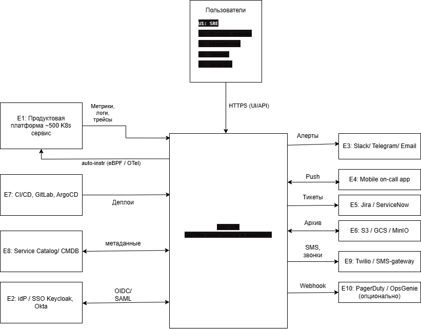

# Контекст и границы SoI

## 1.1. Миссия системы
**Система мониторинга и алертинга (далее — СМА)** обеспечивает наблюдаемость продуктовой платформы из ~500 сервисов: собирает метрики, логи и трейсы (в том числе через автоматическое инструментирование), своевременно уведомляет дежурных инженеров о деградациях и инцидентах, управляет on-call ротациями и эскалациями, а также предоставляет инструменты для расследования и анализа надёжности. Цель — снизить **MTTD** (среднее время обнаружения) и **MTTR** (среднее время восстановления) инцидентов, минимизировав при этом alert fatigue.

## 1.2. Контекстная диаграмма

## 1.3. Внешние сущности
|    #          |Сущность           |Тип      |Роль во взаимодействии|
|----------------|-----------------|---------------|---------------|
|E1|**Продуктовая платформа** (~500 сервисов в K8s)|Источник данных|Поставляет метрики, логи, трейсы; принимает auto-instrumentation агенты от СМА|
|E2|**IdP / SSO** (Keycloak, Okta)|Внешний сервис|Аутентификация и авторизация пользователей СМА (OIDC/SAML)|
|E3|**Каналы уведомлений** (Slack, Telegram, Email)|Получатель|Доставка алертов в чаты и почту|
|E4|**Мобильное приложение on-call**|Получатель|Push-уведомления, подтверждение алертов, просмотр контекста инцидента|
|E5|**Тикет-системы** (Jira, ServiceNow)|Получатель / интеграция|Создание инцидентов и пост-мортемов|
|E6|**Object Storage** (S3, GCS, MinIO)|Внешний сервис|Холодное хранение логов и долгосрочных метрик|
|E7|**CI/CD-системы** (GitLab CI, ArgoCD)|Источник событий|Поставляют события деплоев для корреляции с алертами|
|E8|**Service Catalog / CMDB**|Источник метаданных|Информация о сервисах, их владельцах, критичности, зависимостях|
|E9|** Twilio / SMS-gateway**|Внешний сервис|Голосовые звонки и SMS для критичных алертов|
|E10|**PagerDuty / OpsGenie**  _(опционально)_|Внешний сервис|Альтернативный канал доставки для команд с существующей подпиской|
|U1-U5|**Пользователи** (SRE, on-call, dev, lead, security)|Акторы|Используют UI/API для просмотра, настройки, расследования|

## 1.4. Потоки данных через границу SoI

### Входящие потоки
|    ID          |Поток            |Источник       |Протокол/Формат|Объем (порядок)|
|----------------|-----------------|---------------|---------------|---------------|
|IN-1|Метрики (pull)|E1 (экспортеры сервисов)|Prometheus exposition(HTTP)|~500k–1M точек/сек |
|IN-2 |Метрики (pull)|E1 (auto-instrumentation, eBPF)|OTLP/gRPC |~200k точек/сек |
|IN-3 |Логи| E1 (Fluent Bit, контейнеры)|HTTP/gRPC |~5–10 ТБ/сутки|
|IN-4 |Трейсы|  E1 (OpenTelemetry SDK / агенты)|OTLP/gRPC|~50k–100k spans/сек|
|IN-5 |События деплоев|E7|Webhook (HTTPS)|~1k событий/сутки|
|IN-6 |Метаданные сервисов|E8|REST API (синхронизация)|каждые 10 мин|
|IN-7 |Действия пользователей|U1–U5|HTTPS (UI/API)|–|
|IN-8 |Подтверждения алертов|E4 (мобилка)|HTTPS (push response)|–|

### Исходящие потоки
|    ID          |Поток            |  Получатель   |Протокол/Формат|SLA    |
|----------------|-----------------|---------------|---------------|-------|
|OUT-1|Уведомления (чаты, почта)|E3|Webhook, SMTP, Bot API|p95 < 60 с|
|OUT-2|Push-уведомления|E4|APNs / FCM|p95 < 30 с|
|OUT-3|Голосовые звонки / SMS|E9|REST API (Twilio)|p95 < 90 с|
|OUT-4|Создание тикетов|  E5|REST API|best effort|
|OUT-5|Архив логов / даунсэмпл. метрики|E6|S3 API|асинхронно|
|OUT-6|Эскалация (опционально)|E10|Webhook|–|
|OUT-7|UI / API ответы|U1–U5|HTTPS|p95 < 1 с|
|OUT-8|AuthN запросы|E2|OIDC|p95 < 500 мс|
|OUT-9|Auto-instrumentation агенты|E1|Kubernetes mutating webhook|при деплое|

## 1.5. Границы SoI

### Включено в SoI

-   **Ingestion-слой**  для метрик, логов и трейсов (валидация, маршрутизация, multi-protocol)
-   **Auto-instrumentation подсистема:**
    -   eBPF-агент для RED-метрик с хостов
    -   Mutating webhook для инъекции OpenTelemetry-агентов в Pod'ы
-   **Очередь буферизации**  (Kafka-подобная) между ingestion и хранилищем
-   **Хранилище временных рядов (TSDB)**  — метрики
-   **Хранилище логов**  (поисковый индекс + сырое хранение)
-   **Хранилище трейсов**
-   **Rules engine**  — вычисление алертов и SLO-burn rate
-   **Alert Manager**  — дедупликация, группировка, маршрутизация, silences, maintenance windows
-   **On-call модуль:**
    -   Управление расписаниями ротаций
    -   Эскалационные политики
    -   Override и обмен дежурствами
-   **Notification Dispatcher**  — доставка во внешние каналы с ретраями и failover
-   **Сервис дашбордов и UI**  для визуализации и расследования
-   **Admin API**  — управление правилами, сервисами, RBAC, расписаниями
-   **Tenant management**  — изоляция команд (50+), квоты, биллинг ресурсов
-   **Аудит-лог**  действий пользователей

### Исключено из SoI (внешние ответственности)

-   Сами  **продуктовые сервисы**  и их бизнес-логика (за это отвечают команды)
-   **Ручное инструментирование**  кода сервисов (auto делаем, ручное — на усмотрение команд)
-   **Разработка мобильного приложения on-call**  (отдельный продукт; СМА только предоставляет API для него)
-   **Полноценный инцидент-менеджмент**  и пост-мортемы (Jira/ServiceNow)
-   **Управление инфраструктурой**  K8s, сетью, виртуальными машинами
-   **APM в смысле бизнес-аналитики**  (RUM, продуктовые дашборды)
-   **Security Monitoring / SIEM**  (отдельная система)
-   **Управление IdP, SSO, ролями организации**  (СМА только потребитель)
-   **Service Catalog / CMDB**  (СМА только читает оттуда)

## 1.6. Допущения
|    ID          |Допущение                        |
|----------------|-------------------------------|
|A1              |Сервисы могут быть инструментированы вручную (предпочтительно по OpenTelemetry / Prometheus exposition), но базовая observability обеспечивается auto-instrumentation от СМА            |
|A2             |Сетевая связность между регионами (cloud ↔ on-prem) обеспечена корпоративной VPN/Direct Connect и не является ответственностью СМА           |
|A3              |IdP, тикет-системы и Service Catalog уже развёрнуты и поддерживаются другими командами           |
|A4              |Команды-потребители используют self-service для подключения сервисов (СМА предоставляет UI / API / Terraform-провайдер)            |
|A5              |Для on-prem датацентров доступен локальный Object Storage (MinIO) на случай потери связи с cloud-S3            |
|A6              |Мобильное приложение on-call разрабатывается отдельной командой и взаимодействует с СМА через публичный API           |
|A7              |Twilio (или эквивалент) используется как доверенный SMS/Voice-провайдер с SLA не хуже 99.9%          |
## 1.7. Ограничения

 |   ID   |  Ограничение                                                            |  Обоснование  | 
 | -------|--------------------------------------                                   |---------------|
 | C1     |Часть данных не должна покидать on-prem контур (регуляторные требования)| Compliance               |
 |   C2     |  Бюджет на инфраструктуру СМА — не более 3% от инфраструктурного бюджета платформы                                    | Финансовое ограничение              | 
 |   C3     | Использовать преимущественно open-source стек, лицензионные платные продукты — только при отсутствии альтернатив                                    | Корпоративная политика              | 
 |   C4    |  Совместимость с существующим CI/CD (GitOps, Terraform)                                    | Унификация эксплуатации              | 
 |  C5     | Поддержка multi-tenancy на уровне 50+ команд с изолированным RBAC                                    | Масштаб организации              | 
 |   C6     |  Доставка критичных алертов должна работать даже при отказе одного канала уведомлений (multi-channel failover)                                    | Надёжность              | 
