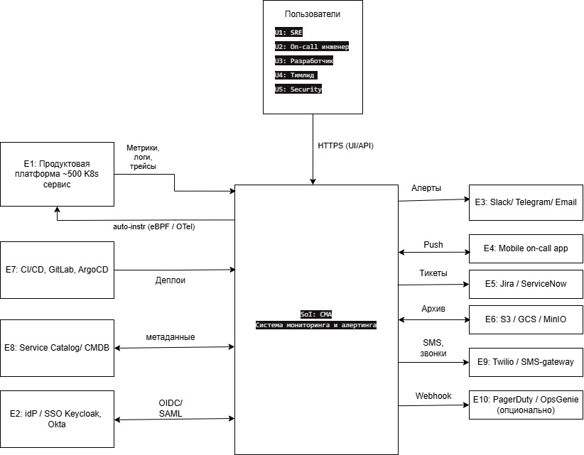
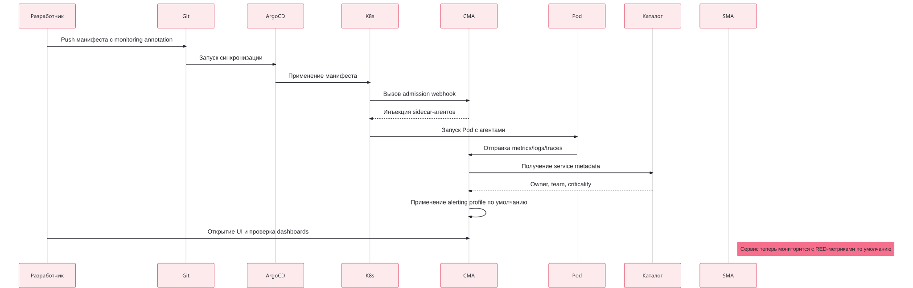
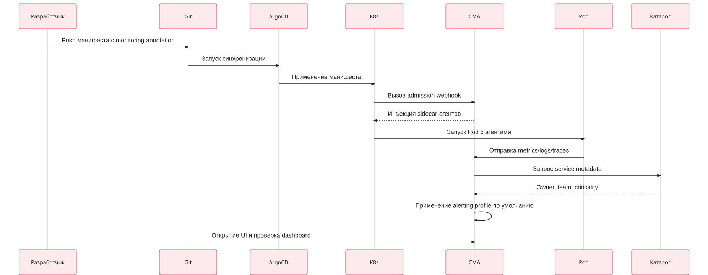
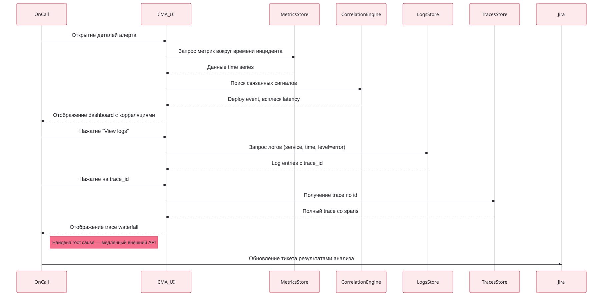
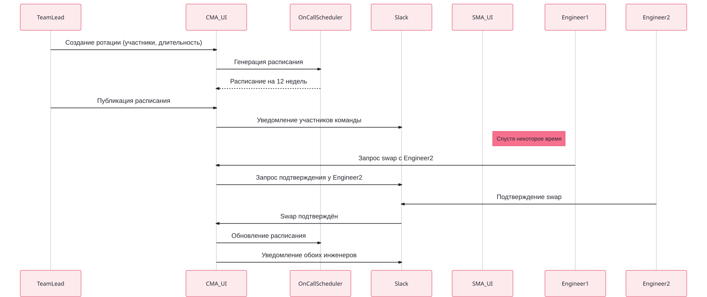
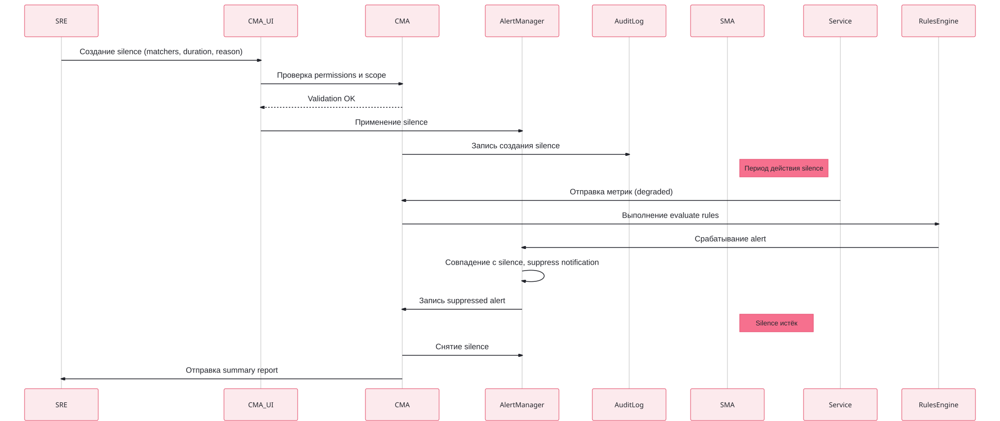
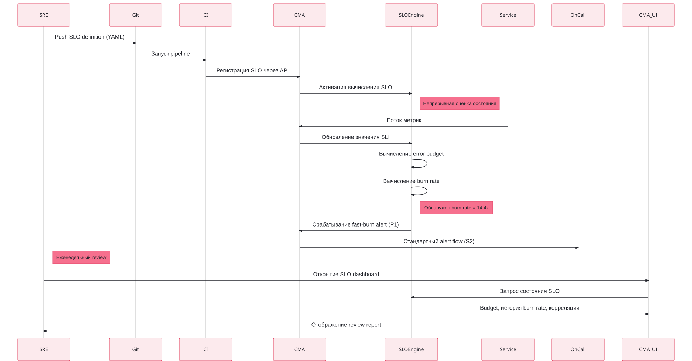
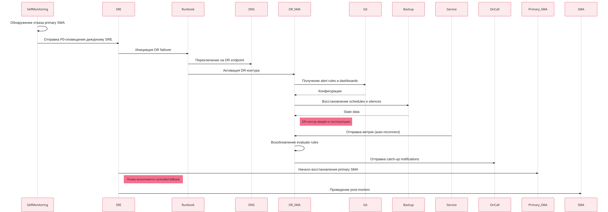

# Контекст и границы SoI

## 1.1. Миссия системы
**Система мониторинга и алертинга (далее — СМА)** обеспечивает наблюдаемость продуктовой платформы из ~500 сервисов: собирает метрики, логи и трейсы (в том числе через автоматическое инструментирование), своевременно уведомляет дежурных инженеров о деградациях и инцидентах, управляет on-call ротациями и эскалациями, а также предоставляет инструменты для расследования и анализа надёжности. Цель — снизить **MTTD** (среднее время обнаружения) и **MTTR** (среднее время восстановления) инцидентов, минимизировав при этом alert fatigue.


## 1.2. Контекстная диаграмма



## 1.3. Внешние сущности
|    #          |Сущность           |Тип      |Роль во взаимодействии|
|----------------|-----------------|---------------|---------------|
|E1|**Продуктовая платформа** (~500 сервисов в K8s)|Источник данных|Поставляет метрики, логи, трейсы; принимает auto-instrumentation агенты от СМА|
|E2|**IdP / SSO** (Keycloak, Okta)|Внешний сервис|Аутентификация и авторизация пользователей СМА (OIDC/SAML)|
|E3|**Каналы уведомлений** (Slack, Telegram, Email)|Получатель|Доставка алертов в чаты и почту|
|E4|**Мобильное приложение on-call**|Получатель|Push-уведомления, подтверждение алертов, просмотр контекста инцидента|
|E5|**Тикет-системы** (Jira, ServiceNow)|Получатель / интеграция|Создание инцидентов и пост-мортемов|
|E6|**Object Storage** (S3, GCS, MinIO)|Внешний сервис|Холодное хранение логов и долгосрочных метрик|
|E7|**CI/CD-системы** (GitLab CI, ArgoCD)|Источник событий|Поставляют события деплоев для корреляции с алертами|
|E8|**Service Catalog / CMDB**|Источник метаданных|Информация о сервисах, их владельцах, критичности, зависимостях|
|E9|**Twilio / SMS-gateway**|Внешний сервис|Голосовые звонки и SMS для критичных алертов|
|E10|**PagerDuty / OpsGenie**  _(опционально)_|Внешний сервис|Альтернативный канал доставки для команд с существующей подпиской|
|U1-U5|**Пользователи** (SRE, on-call, dev, lead, security)|Акторы|Используют UI/API для просмотра, настройки, расследования|

## 1.4. Потоки данных через границу SoI

### Входящие потоки
|    ID          |Поток            |Источник       |Протокол/Формат|Объем (порядок)|
|----------------|-----------------|---------------|---------------|---------------|
|IN-1|Метрики (pull)|E1 (экспортеры сервисов)|Prometheus exposition(HTTP)|~500k–1M точек/сек |
|IN-2 |Метрики (pull)|E1 (auto-instrumentation, eBPF)|OTLP/gRPC |~200k точек/сек |
|IN-3 |Логи| E1 (Fluent Bit, контейнеры)|HTTP/gRPC |~5–10 ТБ/сутки|
|IN-4 |Трейсы|  E1 (OpenTelemetry SDK / агенты)|OTLP/gRPC|~50k–100k spans/сек|
|IN-5 |События деплоев|E7|Webhook (HTTPS)|~1k событий/сутки|
|IN-6 |Метаданные сервисов|E8|REST API (синхронизация)|каждые 10 мин|
|IN-7 |Действия пользователей|U1–U5|HTTPS (UI/API)|–|
|IN-8 |Подтверждения алертов|E4 (мобилка)|HTTPS (push response)|–|

### Исходящие потоки
|    ID          |Поток            |  Получатель   |Протокол/Формат|SLA    |
|----------------|-----------------|---------------|---------------|-------|
|OUT-1|Уведомления (чаты, почта)|E3|Webhook, SMTP, Bot API|p95 < 60 с|
|OUT-2|Push-уведомления|E4|APNs / FCM|p95 < 30 с|
|OUT-3|Голосовые звонки / SMS|E9|REST API (Twilio)|p95 < 90 с|
|OUT-4|Создание тикетов|  E5|REST API|best effort|
|OUT-5|Архив логов / даунсэмпл. метрики|E6|S3 API|асинхронно|
|OUT-6|Эскалация (опционально)|E10|Webhook|–|
|OUT-7|UI / API ответы|U1–U5|HTTPS|p95 < 1 с|
|OUT-8|AuthN запросы|E2|OIDC|p95 < 500 мс|
|OUT-9|Auto-instrumentation агенты|E1|Kubernetes mutating webhook|при деплое|

## 1.5. Границы SoI

### Включено в SoI

-   **Ingestion-слой**  для метрик, логов и трейсов (валидация, маршрутизация, multi-protocol)
-   **Auto-instrumentation подсистема:**
    -   eBPF-агент для RED-метрик с хостов
    -   Mutating webhook для инъекции OpenTelemetry-агентов в Pod'ы
-   **Очередь буферизации**  (Kafka-подобная) между ingestion и хранилищем
-   **Хранилище временных рядов (TSDB)**  — метрики
-   **Хранилище логов**  (поисковый индекс + сырое хранение)
-   **Хранилище трейсов**
-   **Rules engine**  — вычисление алертов и SLO-burn rate
-   **Alert Manager**  — дедупликация, группировка, маршрутизация, silences, maintenance windows
-   **On-call модуль:**
    -   Управление расписаниями ротаций
    -   Эскалационные политики
    -   Override и обмен дежурствами
-   **Notification Dispatcher**  — доставка во внешние каналы с ретраями и failover
-   **Meta-monitoring / Self-monitoring** — независимая минимальная инсталляция для мониторинга самой СМА (см. FR-DR-001, QAS-MON-01)
-   **Сервис дашбордов и UI**  для визуализации и расследования
-   **Admin API**  — управление правилами, сервисами, RBAC, расписаниями
-   **Tenant management**  — изоляция команд (50+), квоты, биллинг ресурсов
-   **Аудит-лог**  действий пользователей

### Исключено из SoI (внешние ответственности)

-   Сами  **продуктовые сервисы**  и их бизнес-логика (за это отвечают команды)
-   **Ручное инструментирование**  кода сервисов (auto делаем, ручное — на усмотрение команд)
-   **Разработка мобильного приложения on-call**  (отдельный продукт; СМА только предоставляет API для него)
-   **Полноценный инцидент-менеджмент**  и пост-мортемы (Jira/ServiceNow)
-   **Управление инфраструктурой**  K8s, сетью, виртуальными машинами
-   **APM в смысле бизнес-аналитики**  (RUM, продуктовые дашборды)
-   **Security Monitoring / SIEM**  (отдельная система)
-   **Управление IdP, SSO, ролями организации**  (СМА только потребитель)
-   **Service Catalog / CMDB**  (СМА только читает оттуда)

## 1.6. Допущения
|    ID          |Допущение                        |
|----------------|-------------------------------|
|A1              |Сервисы могут быть инструментированы вручную (предпочтительно по OpenTelemetry / Prometheus exposition), но базовая observability обеспечивается auto-instrumentation от СМА            |
|A2             |Сетевая связность между регионами (cloud ↔ on-prem) обеспечена корпоративной VPN/Direct Connect и не является ответственностью СМА           |
|A3              |IdP, тикет-системы и Service Catalog уже развёрнуты и поддерживаются другими командами           |
|A4              |Команды-потребители используют self-service для подключения сервисов (СМА предоставляет UI / API / Terraform-провайдер)            |
|A5              |Для on-prem датацентров доступен локальный Object Storage (MinIO) на случай потери связи с cloud-S3            |
|A6              |Мобильное приложение on-call разрабатывается отдельной командой и взаимодействует с СМА через публичный API           |
|A7              |Twilio (или эквивалент) используется как доверенный SMS/Voice-провайдер с SLA не хуже 99.9%          |
## 1.7. Ограничения 
В разделе приведена сводка ключевых ограничений. Детализация и обоснования — в Разделе 3.6 (там же — расширенная нумерация C-TECH-*, C-REG-*, C-ORG-*, C-COST-*).

| ID | Ограничение | Категория | Детализация | 
| -------|-------|---------------|--------| 
|C1|Часть данных не должна покидать on-prem контур (регуляторные требования)| Compliance|C-REG-02| 
|C2|Бюджет на инфраструктуру СМА — не более 3–5% от инфраструктурного бюджета платформы|Financial|C-COST-01|
|C3|Использовать преимущественно open-source стек; платные продукты — только при отсутствии альтернатив|Corporate|C-TECH-02|
|C4|Совместимость с существующим CI/CD (GitOps, Terraform)|Operational|C-ORG-04| |C5| Поддержка multi-tenancy на уровне 50+ команд с изолированным RBAC|Scale|FR-ADM-003, C-ORG-02| |C6|Доставка критичных алертов должна работать даже при отказе одного канала уведомлений (multi-channel failover)|Reliability |FR-NTF-002, FR-NTF-005| 
||

**Примечание:** ограничения C1–C6 — высокоуровневые рамки от заказчика. В Разделе 3.6 они декомпозированы в технические/регуляторные/организационные/cost constraints с конкретными формулировками для верификации.


# CONOPS — Concept of Operations

## 2.1. Назначение раздела

Раздел описывает, как Система мониторинга и алертинга (далее — СМА) 
функционирует в реальной эксплуатации с точки зрения её пользователей 
и взаимодействующих систем.

Раздел фиксирует:
- Акторов системы и их цели (2.2)
- Каталог ключевых сценариев эксплуатации (2.3)
- Детальное описание каждого сценария: предусловия, основной поток, 
  альтернативы, метрики успеха (2.4–2.11)
- Сводную матрицу «сценарии × компоненты СМА» (2.12)

## 2.2. Акторы и их цели

Перенесём пользователей из Раздела 1 в формат **goal-oriented**: для каждого актора — главные цели и метрики успеха.

| ID  | Актор                  | Главные цели   | Метрики успеха                  |
| ----| --------------------|--------------------|--------------------| 
| U1  | SRE                    | - Обеспечить SLO продуктовой платформы  | - SLO compliance >= target       |
|     |                        | - Минимизировать MTTR инцидентов        | - MTTR < 30 мин для P1           |
|     |                        | - Снизить alert fatigue                 | - Signal-to-noise > 80%          |
| U2  | On-call инженер        | - Быстро узнать о проблеме              | - Time-to-acknowledge < 2 мин    |
|     |                        | - Понять root cause                     | - MTTD < 5 мин                   |
|     |                        | - Разрешить инцидент или эскалировать   | - False-positive rate < 5%       |
| U3  | Разработчик            | - Подключить свой сервис к мониторингу  | - Onboarding < 1 час             |
|     | (Service Owner)        | - Понять поведение сервиса в проде      | - Self-service без тикетов в SRE |
|     |                        | - Получать релевантные алерты           | - Coverage метрик >= 80%         |
| U4  | Тимлид                 | - Управлять on-call ротациями команды   | - Fair distribution дежурств     |
|     |                        | - Видеть здоровье сервисов команды      | - Burnout risk minimization      |
|     |                        | - Принимать решения по приоритетам      | - Weekly review доступен         |
| U5  | Security инженер       | - Детектировать security-аномалии       | - Detection latency < 10 мин     |
|     |                        | - Получать audit logs всех действий     | - 100% покрытие audit            |
|     |                        | - Расследовать security-инциденты       | - Retention audit >= 1 год       |

**Дополнительные акторы (системы), которые ведут себя как пользователи:**

| ID | Системный актор | Главные цели | Метрики успеха |
|----|-----------------|---------------|-----------------|
| SA1 | CI/CD pipeline (E7) | Уведомить СМА о деплое; получить smoke-check status | Deploy event delivered < 5 сек |
| SA2 | Service Catalog (E8) | Синхронизировать метаданные сервисов; передавать ownership info | Sync lag < 1 мин |
| SA3 | Auto-instrumentation агенты в Pods | Получать конфиги collection; отправлять метрики/логи/трейсы | Config delivery < 30 сек; Data loss < 0.01% |
||

## 2.3. Каталог сценариев

| ID | Название  | Главный актор| Частота   | Критичн. |
|----|-------------------|-----------------------|-----------|---------|
| S1 | Onboarding нового сервиса | U3 Разработчик | Дневн. | Средняя  |
| S2 | Срабатывание алерта и эскалация | U2 On-call | Ежечасн.  | Высокая  |
| S3 | Расследование инцидента (M->L->T)| U2 On-call / U3| Дневн.| Высокая  |
| S4 | Управление on-call ротациями | U4 Тимлид | Недельн.  | Средняя  |
| S5 | Maintenance window / silence | U1 SRE  | Дневн. | Средняя  |
| S6 | Управление SLO и burn-rate алертами| U1 SRE / U4 Тимлид | Месячн.| Высокая|
| S7 | Capacity planning | U1 SRE / Платформа | Квартальн. | Средняя |
| S8 | DR: восстановление СМА после сбоя | U1 SRE | Редко | Критич.  |
**Примечание:** Security-инциденты и multi-tenancy onboarding намеренно вынесены за рамки CONOPS — они затрагиваются в Разделе 7 (Cross-cutting: Security и Multi-tenancy).

## 2.4. Сценарий S1: Onboarding нового сервиса

### Краткое описание

Разработчик подключает свой новый сервис к СМА: настраивает сбор метрик, логов, трейсов; конфигурирует базовые алерты; верифицирует видимость данных в UI.

### Акторы

-   **Главный:**  U3 Разработчик (Service Owner)
-   **Поддержка:**  U1 SRE (при сложных случаях)
-   **Системы:**  E7 CI/CD, E8 Service Catalog, СМА

### Предусловия

-   Сервис деплоится в Kubernetes
-   В Service Catalog (E8) зарегистрирован service entry с ownership info
-   У разработчика есть доступ к СМА (через IdP / E2)

### Постусловия (success)

-   Метрики/логи/трейсы сервиса видны в UI СМА
-   Применены стандартные алерты (RED-метрики: Rate, Errors, Duration)
-   Сервис привязан к команде и попадает в on-call rotation команды

### Основной поток

1.  Разработчик добавляет в манифест K8s аннотацию  `monitoring.sma.io/enabled: true`  и  `service-id: my-service`
2.  ArgoCD (E7) применяет манифест в кластере
3.  СМА через mutating admission webhook инжектит в Pod sidecar-агенты (OTel collector, log shipper) и/или включает eBPF-сбор
4.  Агенты начинают отправлять метрики/логи/трейсы в СМА
5.  СМА запрашивает метаданные сервиса из Service Catalog (E8): owner, team, criticality
6.  СМА применяет default alerting profile на основе criticality (например, для tier-1 — стандартные RED-алерты с порогами)
7.  Разработчик заходит в UI СМА, видит свой сервис в каталоге, проверяет дашборды
8.  Разработчик при желании кастомизирует алерты через декларативный конфиг (PR в Git-репозиторий с alerting rules)



### Альтернативные потоки

-   **A1: Сервис не в K8s**  (legacy VM) → разработчик ставит agent вручную, получает токен из СМА UI
-   **A2: Service Catalog не содержит сервис**  → СМА требует ручного указания owner через UI или fail-closed (отказ онбординга)

### Метрики успеха сценария

-   Time-to-first-metric: < 5 минут с момента push
-   Time-to-onboarding-complete (с дашбордами и алертами): < 1 час
-   % сервисов, прошедших onboarding self-service (без участия SRE): > 90%

## 2.5. Сценарий S2: Срабатывание алерта и эскалация

### Краткое описание

Главный happy path системы. СМА детектирует аномалию, оценивает её серьёзность, уведомляет дежурного, обеспечивает эскалацию при отсутствии реакции.

### Акторы

-   **Главный:**  U2 On-call инженер
-   **Поддержка:**  U4 Тимлид (при эскалации)
-   **Системы:**  E3 (Slack/Telegram), E4 (Mobile), E9 (Twilio), E10 (PagerDuty), E5 (Jira)

### Предусловия

-   Сервис уже on-boarded (S1 пройден)
-   Определён on-call rotation для команды-владельца
-   Настроена эскалационная политика (например: → Slack → Push → SMS → Call → Lead)

### Постусловия (success)

-   Алерт acknowledged on-call инженером в течение SLA
-   При необходимости создан incident ticket в Jira (E5)
-   Инцидент либо разрешён, либо эскалирован

### Основной поток

1.  Сервис (E1) отправляет метрики в СМА
2.  Rules Engine СМА в реальном времени вычисляет alerting rules
3.  Сработало условие (например, error rate > 5% в течение 5 минут)
4.  СМА создаёт alert instance, определяет severity (P1/P2/P3) на основе criticality сервиса и burn rate
5.  СМА смотрит on-call schedule команды-владельца сервиса, находит текущего дежурного (U2)
6.  СМА отправляет уведомление по эскалационной политике:
    -   t=0: Slack в канал команды + push в мобильное приложение
    -   t+2 мин: если нет ack → SMS через Twilio
    -   t+5 мин: если нет ack → звонок через Twilio
    -   t+10 мин: если нет ack → эскалация на тимлида U4
7.  On-call инженер (U2) acknowledged алерт в мобильном приложении
8.  СМА останавливает эскалацию, фиксирует ack time, owner
9.  Если severity = P1, СМА автоматически создаёт ticket в Jira (E5) с контекстом
10.  On-call переходит к расследованию (см. S3)



### Альтернативные потоки

-   **A1: On-call не отвечает**  > 10 мин → эскалация на тимлида (U4), дальше — на secondary on-call команды
-   **A2: Alert storm**  (множество связанных алертов) → СМА группирует через correlation engine, отправляет один rolled-up notification
-   **A3: Flapping alert**  (быстро меняет state) → auto-suppression на N минут, уведомление в Slack без эскалации
-   **A4: Алерт во время известного maintenance window**  → suppressed автоматически (см. S5)

### Exception handling

-   **E1: Канал доставки недоступен**  (Slack down) → fallback на следующий канал в политике + событие в self-monitoring
-   **E2: Service Catalog недоступен**  → СМА использует cached ownership info (TTL 1 час)
-   **E3: Twilio rate limit**  → fallback на email + critical event в self-monitoring

### Метрики успеха сценария

-   Time-to-Detect (MTTD): P95 < 5 минут
-   Time-to-Notify: P95 < 30 секунд от создания алерта до Slack/Push
-   Time-to-Acknowledge: P95 < 2 минут (для P1)
-   False-positive rate: < 5%
-   Escalation rate (% алертов, ушедших на secondary): < 10%

## 2.6. Сценарий S3: Расследование инцидента (metrics → logs → traces)

### Краткое описание

On-call получил алерт, открывает UI СМА, переходит от агрегированной метрики к конкретным логам и трейсам, находит root cause.

### Акторы

-   **Главный:**  U2 On-call (часто привлекает U3 Разработчика)
-   **Системы:**  СМА UI, backend стораджи метрик/логов/трейсов

### Предусловия

-   Алерт acknowledged (S2 завершён шагом 7-8)
-   В UI открыт контекст алерта со ссылками на dashboards

### Постусловия (success)

-   Идентифицирован root cause (или гипотеза)
-   Зафиксированы findings в incident ticket (E5)
-   Принято решение: hotfix / rollback / scale / wait

### Основной поток

1.  On-call открывает alert detail page в UI СМА
2.  Видит график метрики, превысившей порог, с маркером времени аномалии
3.  UI показывает correlated signals: всплеск latency, рост ошибок, недавний деплой (событие от E7 CI/CD)
4.  On-call кликает «View logs» в контексте аномалии → переход в log explorer с предзаполненным фильтром (service, time range, error level)
5.  Видит exception stacktrace, копирует trace_id
6.  Кликает «View trace» → переход в trace viewer с конкретным trace
7.  Видит, что 80% времени запроса проводится в внешнем API, который недавно деградировал
8.  Формирует гипотезу: «внешний API X отвечает медленно, наш сервис не имеет circuit breaker»
9.  Записывает findings в Jira ticket
10.  Принимает решение: временно увеличить timeout + поставить задачу на добавление circuit breaker



### Альтернативные потоки

-   **A1: Логи не содержат trace_id**  → on-call использует поиск по времени и текстовый поиск
-   **A2: Trace неполный**  (потерян span) → on-call работает с тем, что есть, помечает gap
-   **A3: Несколько потенциальных причин**  → on-call параллельно проверяет несколько гипотез через split-screen в UI

### Метрики успеха сценария

-   Time-to-investigate-start: < 1 минута от ack до открытия UI
-   Кол-во переходов «metric → log → trace» успешных (без потери контекста): > 95%
-   Time-to-root-cause (для типовых проблем): < 15 минут

## 2.7. Сценарий S4: Управление on-call ротациями

### Краткое описание

Тимлид настраивает расписание дежурств для команды, разрешает overrides и swaps между инженерами.

### Акторы

-   **Главный:**  U4 Тимлид
-   **Поддержка:**  U2 On-call инженеры команды
-   **Системы:**  СМА (on-call scheduler component), E2 IdP

### Предусловия

-   В IdP есть группа команды с членами
-   У тимлида роль  `team-lead`  для своей команды

### Постусловия (success)

-   Расписание дежурств на N недель вперёд опубликовано
-   Все члены команды видят свои дежурства в UI/календаре
-   При срабатывании алерта (S2) система использует актуальный schedule

### Основной поток

1.  Тимлид открывает раздел «On-call» в UI СМА
2.  Создаёт новое rotation: участники, длительность смены (например, 1 неделя), handoff time (например, понедельник 10:00)
3.  СМА генерирует расписание на 12 недель вперёд по round-robin
4.  Тимлид публикует schedule
5.  СМА уведомляет членов команды через Slack: «Ваше расписание дежурств обновлено»
6.  Инженер видит, что у него отпуск на следующей неделе → запрашивает swap у коллеги
7.  Коллега подтверждает swap в UI/Slack
8.  СМА обновляет schedule, отправляет confirm всем



### Альтернативные потоки

-   **A1: Override**  (тимлид вручную ставит конкретного человека на смену) — без round-robin
-   **A2: Holiday-aware scheduling**  — система знает праздники региона и автоматически пропускает их
-   **A3: Multi-level on-call**  — primary + secondary одновременно

### Метрики успеха сценария

-   Schedule coverage: 100% (no gaps)
-   Swap success rate: > 95%
-   Время на создание rotation: < 5 минут

## 2.8. Сценарий S5: Maintenance window / silence

### Краткое описание

SRE планирует работы по обновлению сервиса. Создаёт окно тишины (silence), чтобы алерты от запланированной деградации не будили on-call.

### Акторы

-   **Главный:**  U1 SRE / U3 Service Owner
-   **Системы:**  СМА, E5 Jira (link)

### Предусловия

-   У SRE/owner права на создание silence для своих сервисов
-   Известно: какой сервис, на какое время, причина

### Постусловия (success)

-   В период maintenance алерты для указанных сервисов/метрик не отправляются
-   В audit log зафиксировано: кто, когда, что и почему заглушил
-   После окончания silence — алерты возобновляются автоматически

### Основной поток

1.  SRE открывает раздел «Silences» в UI
2.  Создаёт silence: matchers (service=payment, env=prod), start_time, duration (2 часа), reason (link to Jira change ticket)
3.  СМА валидирует: есть ли права, не слишком ли широкий matcher (не вся прод заглушается)
4.  СМА сохраняет silence, начинает применять его в Alert Manager  (silence подавляет уведомления уже сгенерированных алертов,  а не отключает evaluation правил)
5.  В период silence сработавшие алерты не отправляются в каналы (но фиксируются в истории с пометкой «silenced»)
6.  По истечении времени СМА деактивирует silence
7.  Если за время silence было N suppressed алертов — SRE получает summary report



### Альтернативные потоки

-   **A1: Bulk silence через CI/CD**  — pipeline создаёт silence перед деплоем и снимает после успешного rollout (через СМА API)
-   **A2: Расширение silence**  — если работы затянулись, SRE может продлить silence (требует audit-причину)
-   **A3: Принудительное снятие**  — тимлид/SRE-lead может снять чужой silence в emergency (с логированием действия)

### Exception handling

-   **E1: Слишком широкий matcher**  (например,  `env=prod`  без сервиса) → СМА требует подтверждения от second SRE (4-eyes principle)
-   **E2: Silence пересекается с активным P1 инцидентом**  → СМА предупреждает SRE, требует явного подтверждения

### Метрики успеха сценария

-   % суммарного времени, когда сервисы находятся под silence: < 5% (иначе мониторинг бесполезен)
-   % silence с указанной причиной (Jira link): 100%
-   Время на создание silence: < 1 минуты

## 2.9. Сценарий S6: Управление SLO и burn-rate алертами

### Краткое описание

SRE определяет SLO для сервиса (например, availability 99.9% за 30 дней). СМА непрерывно вычисляет error budget и генерирует burn-rate алерты — стратегические уведомления о том, что сервис «прожигает бюджет» быстрее нормы.

### Акторы

-   **Главный:**  U1 SRE / U4 Service Owner
-   **Поддержка:**  U3 Разработчик (при определении SLI)
-   **Системы:**  СМА (SLO engine), E5 Jira (для action items)

### Предусловия

-   Сервис on-boarded (S1 пройден)
-   Определены SLI (Service Level Indicators) — конкретные метрики (например, success rate HTTP запросов, p99 latency)

### Постусловия (success)

-   SLO зафиксирован декларативно (как код)
-   СМА непрерывно вычисляет error budget consumption
-   Настроены multi-window multi-burn-rate алерты (fast burn + slow burn)
-   Сервис попадает в weekly/monthly SLO review

### Основной поток

1.  SRE определяет SLO в YAML-файле (Git-репозиторий с конфигами):
    -   `service: payment-api`
    -   `sli: http_request_success_rate`
    -   `target: 99.9%`
    -   `window: 30d (rolling)`
2.  PR в Git → CI применяет SLO в СМА через API
3.  СМА регистрирует SLO, начинает вычислять:
    -   Текущий уровень SLI
    -   Error budget remaining (например, осталось 23 минуты простоя из 43 в месяц)
    -   Burn rate (как быстро тратится бюджет)
4.  СМА создаёт стандартные burn-rate алерты:
    -   **Fast burn:**  14.4x за 1 час → P1 (грозит выжечь весь месячный бюджет за 2 дня)
    -   **Slow burn:**  6x за 6 часов → P2 (грозит выжечь бюджет за неделю)
5.  При срабатывании burn-rate alert — стандартный flow S2 (эскалация on-call)
6.  SRE/Service Owner раз в неделю открывает SLO dashboard:
    -   Видит trend error budget
    -   Видит топ причин «прожига» (correlation с инцидентами/деплоями)
    -   Принимает решения: усилить reliability work / разрешить feature work / freeze deploys



### Альтернативные потоки

-   **A1: SLO breach**  (бюджет полностью исчерпан) → автоматический deploy freeze через интеграцию с E7 CI/CD (опционально, как policy)
-   **A2: SLO как leading indicator**  — burn-rate alert сработал, но классические метрики ещё в норме → раннее предупреждение
-   **A3: Multi-SLI SLO**  — composite SLO из нескольких SLI (например, availability AND latency)

### Метрики успеха сценария

-   Coverage: % сервисов tier-1 с определёнными SLO > 90%
-   SLO compliance rate (доля сервисов в зелёной зоне): отслеживается, не имеет fixed target
-   Время от breach до action item в Jira: < 1 рабочий день

## 2.10. Сценарий S7: Capacity planning

### Краткое описание

Платформенная команда (SRE СМА) периодически анализирует тренды роста нагрузки на платформу, прогнозирует точки исчерпания ресурсов и инициирует горизонтальное расширение до возникновения проблем.

### Акторы

-   **Главный:** U1 SRE (платформенная команда СМА)
-   **Поддержка:** U4 Тимлиды команд-тенантов (при peer review прогнозов)
-   **Системы:** СМА (long-range queries по собственным метрикам), E7 CI/CD (для применения capacity changes)

### Предусловия

-   СМА работает в production не менее 3 месяцев (накоплены baseline метрики)
-   Включён self-monitoring (FR-DR-001) — доступны метрики собственного потребления ресурсов
-   Определены capacity thresholds (например, 70% утилизации = trigger для планирования)

### Постусловия (success)

-   Зафиксирован прогноз роста на горизонте 1–2 квартала
-   Принято решение: scale out / optimize / accept risk
-   При необходимости — выполнено horizontal scaling без downtime (QAS-SCAL-02)

### Основной поток

1.  SRE открывает self-monitoring dashboard СМА
2.  Анализирует long-range метрики (13-месячное окно): ingestion rate, cardinality growth, storage usage, query volume per tenant
3.  Идентифицирует top growth contributors:
    -   Какие тенанты растут быстрее всего
    -   Какие сигналы (metrics / logs / traces) дают основной прирост cost
    -   Где приближаемся к квотам (FR-ADM-002)
4.  Строит прогноз на 1–2 квартала через linear/exponential extrapolation
5.  Сравнивает прогноз с текущей capacity:
    -   Хватит ли storage до конца квартала?
    -   Хватит ли compute для query peak?
    -   Не упрёмся ли в cardinality limits Mimir?
6.  Принимает решение:
    -   **Scale out** — увеличить количество replicas Mimir/Loki/Tempo через Argo CD PR
    -   **Optimize** — пересмотреть retention для отдельных tenants, добавить recording rules для дорогих queries
    -   **Quota adjustment** — пересмотреть квоты тенантов
    -   **Cost report** — отправить отчёт тимлидам с рекомендациями
7.  Изменения применяются через GitOps (ADR-010); валидируется через QAS-SCAL-02

### Альтернативные потоки

-   **A1: Внеплановый рост** — burst-онбординг новой большой команды → ad-hoc capacity review
-   **A2: Cost overrun** (превышение C-COST-01) → emergency review с прямой коммуникацией владельцам ресурсов
-   **A3: Cardinality explosion от одного тенанта** → не capacity planning, а instant rate limiting через FR-ADM-002

### Метрики успеха сценария

-   Время от прогноза до scale-out (если нужен): < 1 рабочий день
-   Capacity headroom: всегда ≥ 30% (никогда не работаем «впритык»)
-   Точность прогноза 1-квартального горизонта: ±20%
-   Количество capacity-инцидентов (out-of-capacity surprises): 0

### Связи

QAS-SCAL-01 (изоляция тенантов), QAS-SCAL-02 (горизонтальное масштабирование), FR-ADM-002 (квоты), FR-DR-001 (self-monitoring).

## 2.11. Сценарий S8: DR — восстановление СМА после сбоя

### Краткое описание

Сама СМА — критическая система. Если она недоступна, бизнес «слепнет»: алерты не приходят, инциденты не детектятся. Этот сценарий описывает, как СМА восстанавливается после серьёзного сбоя (например, потеря региона, повреждение данных).

### Акторы

-   **Главный:**  U1 SRE (СМА-team — да, у самой СМА есть свои SRE)
-   **Системы:**  СМА (DR-инстанс), резервные хранилища, E6 Object Storage

### Предусловия

-   Существует secondary deployment СМА в другом регионе (warm standby)
-   Существуют регулярные backup критичных данных: alert rules, on-call schedules, silences, dashboards
-   Определены и протестированы RTO/RPO (см. Раздел 7)

### Постусловия (success)

-   СМА снова принимает метрики/логи/трейсы
-   Восстановлены alert rules, on-call schedules, dashboards
-   Inflight алерты обработаны (либо доставлены, либо помечены как «потеряны во время DR»)
-   Запущен post-mortem процесс

### Основной поток

1.  Self-monitoring СМА (или внешний синтетический мониторинг) детектирует, что primary СМА недоступна > 5 минут
2.  Автоматически или вручную (по runbook) — failover на secondary
3.  DNS / load balancer переключают трафик на DR-инстанс
4.  DR-инстанс поднимает актуальные конфиги из Git (alert rules, dashboards) и из бэкапа (on-call schedules, silences)
5.  Source-системы (E1 продуктовая платформа) автоматически переподключают агентов к новому endpoint
6.  Метрики/логи/трейсы начинают идти в DR-инстанс
7.  СМА оценивает, какие алерты «потерялись» в окно недоступности → отправляет catch-up notification on-call инженерам
8.  SRE команда СМА начинает recovery primary региона параллельно
9.  После восстановления primary — controlled failback (обычно в нерабочее время)
10.  Запускается post-mortem (через S3-подобный процесс)



### Альтернативные потоки

-   **A1: Частичный сбой**  (например, недоступен только rules engine) → graceful degradation, остальные подсистемы продолжают работать
-   **A2: Data corruption**  (метрики/логи повреждены) → восстановление из read-only архива (E6 Object Storage)
-   **A3: Catastrophic loss**  (потеря обоих регионов) → cold start из Git + Object Storage, потеря свежих данных за окно RPO

### Exception handling

-   **E1: DR-инстанс тоже недоступен**  → fallback на «emergency mode»: минимальный набор critical алертов через standalone notifier из Object Storage
-   **E2: Source systems не могут переподключиться**  (DNS не обновился) → manual override через runbook

### Метрики успеха сценария

-   RTO (Recovery Time Objective): < 15 минут до восстановления базовой функциональности
-   RPO (Recovery Point Objective): < 5 минут потерянных данных
-   Catch-up notification delivery: 100% алертов окна восстановлены или явно помечены как «lost»
-   DR drill frequency: квартально (game day)


## 2.12. Сводная матрица сценариев и компонентов СМА

Чтобы связать CONOPS с будущей декомпозицией (Раздел 5), отметим, какие компоненты СМА задействованы в каждом сценарии.

| S  | Сценарий          | Ingestion | Storage | Rules | Alerts | OnCall | UI/API | Notifier |
|----|-------------------|-----------|---------|-------|--------|--------|--------|----------|
| S1 | Onboarding        |    X      |    X    |   X   |        |        |    X   |          |
| S2 | Алерт+эскал.      |    X      |    X    |   X   |   X    |    X   |        |    X     |
| S3 | Расследование     |           |    X    |       |        |        |    X   |          |
| S4 | On-call rotation  |           |         |       |        |    X   |    X   |          |
| S5 | Maintenance       |           |         |   X   |   X    |        |    X   |          |
| S6 | SLO               |    X      |    X    |   X   |   X    |        |    X   |          |
| S7 | Capacity planning |           |    X    |       |        |        |    X   |          |
| S8 | DR                |    X      |    X    |   X   |   X    |    X   |    X   |    X     |

**Вывод:** S2 (главный happy path) задействует **почти все** компоненты — это объясняет, почему он самый критичный для архитектуры. S3 (расследование) показывает важность UI/API и storage с быстрым ad-hoc query. S7 — read-only сценарий на исторических данных. S8 (DR) — единственный сценарий, требующий полной кросс-компонентной отказоустойчивости.


# 3. Требования и Quality Attributes

## 3.1. Назначение раздела

Раздел фиксирует требования к СМА на двух уровнях:

-   **Функциональные требования (FR)**  — что система должна делать. Выведены из сценариев CONOPS (Раздел 2).
-   **Нефункциональные требования (NFR / Quality Attributes)**  — насколько хорошо она должна это делать. Для критичных QA приведены формальные Quality Attribute Scenarios (QAS) в стиле ATAM.

Раздел организован так:

-   3.2 — формат и нотация требований
-   3.3 — функциональные требования (по группам)
-   3.4 — каталог Quality Attributes с приоритетами
-   3.5 — Quality Attribute Scenarios для HIGH-priority QA
-   3.6 — Ограничения (constraints)
-   3.7 — Матрица трассировки CONOPS → FR → QAS
## 3.2. Формат и нотация

### Формат FR
**FR-XXX  Краткое имя требования**
─────────────────────────────────────
Контекст:     ссылка на сценарий CONOPS (S1–S8) или общесистемное
Требование:   формулировка с MUST/SHOULD/MAY (RFC 2119).
 Перевод: MUST = "ДОЛЖНА"; SHOULD = "СЛЕДУЕТ" / "РЕКОМЕНДУЕТСЯ"; MAY = "МОЖЕТ"
Rationale:    зачем это нужно, какую боль решает
Приоритет:    MUST | SHOULD | MAY
Verification: способ проверки (test, review, demo, analysis)

### Уровни приоритета (RFC 2119)
| Уровень | Значение | Что будет, если не реализовать|
|------|-----------|-----| 
| **MUST**|Обязательное требование|система не выполняет основное назначение|
| **SHOULD** |Настоятельно рекомендуется| деградация UX или операционная боль|
| **MAY** | Опциональное |можно отложить без последствий|

### Группировка FR

Требования сгруппированы по функциональным областям, соответствующим компонентам будущей декомпозиции (Раздел 5):

-   **FR-ING-xxx**  — Ingestion (приём метрик/логов/трейсов)
-   **FR-STO-xxx**  — Storage (хранение, retention)
-   **FR-QRY-xxx**  — Query & Investigation (поиск, корреляция)
-   **FR-RUL-xxx**  — Rules & Alerts (правила, генерация алертов)
-   **FR-NTF-xxx**  — Notification & Routing (доставка, эскалация)
-   **FR-OCM-xxx**  — On-call Management (расписания, дежурства)
-   **FR-SLO-xxx**  — SLO & Error Budget
-   **FR-SIL-xxx**  — Silence & Maintenance
-   **FR-API-xxx**  — API & Integration
-   **FR-UI-xxx**  — User Interface
-   **FR-ADM-xxx**  — Administration & Multi-tenancy
-   **FR-DR-xxx**  — Disaster Recovery & Self-monitoring

## 3.3. Функциональные требования

### 3.3.1. Ingestion (FR-ING)
**FR-ING-001  Приём метрик через open-standard протоколы**
─────────────────────────────────────────────
Контекст:     S1 (onboarding), S2 (детекция)
Требование:   Система ДОЛЖНА (MUST) принимать метрики через OpenTelemetry 
              Protocol (OTLP) и Prometheus Remote Write.
Rationale:    Open standards снижают vendor lock-in; OTLP — стратегический 
              стандарт CNCF; Prometheus RW — де-факто стандарт в SRE.
Приоритет:    MUST
Verification: Integration test с эталонным OTel collector и Prometheus

**FR-ING-002  Приём логов через open-standard протоколы**
─────────────────────────────────────────────
Контекст:     S1, S3 (расследование)
Требование:   Система ДОЛЖНА (MUST) принимать логи через OTLP Logs 
              и syslog (RFC 5424).
Rationale:    OTLP для современных сервисов, syslog — для legacy 
              и инфраструктурных компонентов.
Приоритет:    MUST
Verification: Integration test

**FR-ING-003  Приём трейсов через OTLP**
─────────────────────────────────────────────
Контекст:     S3 (расследование, distributed tracing)
Требование:   Система ДОЛЖНА (MUST) принимать distributed traces 
              через OTLP Traces.
Rationale:    Трейсы критичны для расследования в микросервисной среде; 
              OTLP — единственный жизнеспособный стандарт.
Приоритет:    MUST
Verification: Integration test, end-to-end trace propagation check

**FR-ING-004  Backpressure и устойчивость к burst**
─────────────────────────────────────────────
Контекст:     общесистемное; связано с QAS-PERF-01
Требование:   Ingestion pipeline ДОЛЖЕН (MUST) применять backpressure 
              при превышении capacity, а не терять данные молча. 
              Отброшенные данные ДОЛЖНЫ (MUST) логироваться с указанием 
              источника и объёма.
Rationale:    Молчаливая потеря данных подрывает доверие к системе 
              и делает невозможным расследование.
Приоритет:    MUST
Verification: Load test с 10x burst, проверка metrics о drop rate

**FR-ING-005  Авто-обнаружение метаданных**
─────────────────────────────────────────────
Контекст:     S1 (onboarding), снижение ручной конфигурации
Требование:   Система ДОЛЖНА (SHOULD) автоматически обогащать входящую 
              телеметрию метаданными окружения (k8s namespace, pod, 
              cloud region) на основе resource attributes OTel.
Rationale:    Снижает ошибки конфигурации, упрощает onboarding (S1 цель 
              < 1 рабочего дня).
Приоритет:    SHOULD
Verification: E2E test onboarding-сценария

**FR-ING-006  Tenant isolation на уровне ingestion**
─────────────────────────────────────────────
Контекст:     общесистемное; multi-tenancy
Требование:   Каждый ingestion-запрос ДОЛЖЕН (MUST) содержать tenant 
              identifier; данные разных тенантов ДОЛЖНЫ (MUST) быть 
              логически изолированы.
Rationale:    Multi-tenancy — базовое требование платформы; без изоляции 
              невозможны RBAC и data governance.
Приоритет:    MUST
Verification: Security test, попытка cross-tenant access

### 3.3.2. Storage (FR-STO)
**FR-STO-001  Дифференцированный retention по типам данных**
─────────────────────────────────────────────
Контекст:     общесистемное; стоимость vs доступность
Требование:   Система ДОЛЖНА (MUST) поддерживать конфигурируемый 
              retention отдельно для метрик, логов, трейсов и алертов. 
              Минимум: метрики 13 месяцев (year-over-year), логи 30 дней 
              hot + 90 дней warm, трейсы 7 дней, алерты 2 года.
Rationale:    Разные данные имеют разную ценность во времени; единый 
              retention либо разоряет (всё в hot), либо ломает расследование.
Приоритет:    MUST
Verification: Конфигурационный review + retention test

**FR-STO-002  Tiered storage**
─────────────────────────────────────────────
Контекст:     cost-efficiency, S3 расследование старых инцидентов
Требование:   Система ДОЛЖНА (SHOULD) автоматически перемещать «холодные» 
              данные в object storage (E6) с сохранением возможности 
              query (с допустимой деградацией latency).
Rationale:    Без tiering стоимость хранения растёт линейно с retention; 
              S3 хранение в 10–50x дешевле block storage.
Приоритет:    SHOULD
Verification: Demo: query 6-месячных метрик, latency benchmark

**FR-STO-003  Durability данных**
─────────────────────────────────────────────
Контекст:     S8 (DR), compliance
Требование:   После подтверждения приёма данные ДОЛЖНЫ (MUST) переживать 
              отказ одного узла без потери. Целевая durability >= 99.99% 
              для метрик и логов, 100% для алертов.
Rationale:    Потеря данных мониторинга = потеря доказательной базы для 
              post-mortem и audit.
Приоритет:    MUST
Verification: Chaos test (kill node), data integrity check

**FR-STO-004  Запрет на изменение исторических данных**
─────────────────────────────────────────────
Контекст:     compliance, аудит
Требование:   Метрики, логи и трейсы ДОЛЖНЫ (MUST) быть immutable 
              после записи (append-only). Удаление допустимо только 
              по retention policy или GDPR-запросу с записью в audit log.
Rationale:    Immutability — базовое требование для доверия к данным 
              расследования и для compliance.
Приоритет:    MUST
Verification: API review, security audit

### 3.3.3. Query & Investigation (FR-QRY)

**FR-QRY-001  Query language для метрик**
─────────────────────────────────────────────
Контекст:     S3 (расследование), S6 (SLO)
Требование:   Система ДОЛЖНА (MUST) поддерживать PromQL или 
              совместимый язык запросов для метрик.
Rationale:    PromQL — де-факто стандарт; экосистема dashboards 
              (Grafana) и алертов на нём построена.
Приоритет:    MUST
Verification: Compatibility test с эталонным PromQL test suite

**FR-QRY-002  Query language для логов**
─────────────────────────────────────────────
Контекст:     S3
Требование:   Система ДОЛЖНА (MUST) поддерживать структурный язык 
              запросов для логов (LogQL-совместимый или эквивалент) 
              с поддержкой full-text search, label filtering 
              и агрегаций.
Приоритет:    MUST
Verification: Functional test

**FR-QRY-003  Кросс-сигнальная корреляция**
─────────────────────────────────────────────
Контекст:     S3 (главная боль расследования)
Требование:   Из контекста алерта или метрики пользователь ДОЛЖЕН (MUST) 
              иметь возможность одним кликом перейти к соответствующим 
              логам и трейсам того же сервиса и временного окна.
Rationale:    Корреляция metrics→logs→traces — главный value-driver 
              observability; ручное переключение между инструментами — 
              основная причина высокого MTTR.
Приоритет:    MUST
Verification: Usability test, E2E investigation scenario

**FR-QRY-004  Сохранение и шеринг запросов**
────────────────────────────────────────────
Контекст:     S3, накопление institutional knowledge
Требование:   Пользователи ДОЛЖНЫ (SHOULD) иметь возможность сохранять 
              named queries и делиться ими через permalink.
Rationale:    Snapshot состояния расследования критичен для передачи 
              контекста при эскалации и для post-mortem.
Приоритет:    SHOULD
Verification: Functional test

### 3.3.4. Rules & Alerts (FR-RUL)

**FR-RUL-001  Декларативное описание правил (rules as code)**
─────────────────────────────────────────────
Контекст:     S1, S6, общесистемное
Требование:   Alert rules ДОЛЖНЫ (MUST) описываться декларативно 
              (YAML или эквивалент), храниться в Git, применяться 
              через API/CI.
Rationale:    Rules as code = версионирование, code review, rollback, 
              reproducibility. UI-only configuration ведёт к drift 
              и непроверяемым изменениям.
Приоритет:    MUST
Verification: API review, CI integration demo

**FR-RUL-002  Multi-condition правила**
─────────────────────────────────────────────
Контекст:     S2, снижение false-positive
Требование:   Правила ДОЛЖНЫ (MUST) поддерживать составные условия 
              (AND/OR), временные окна (for: 5m), агрегации по labels.
Rationale:    Простые threshold-алерты дают высокий false-positive rate; 
              multi-condition позволяет точнее ловить реальные проблемы.
Приоритет:    MUST
Verification: Functional test

**FR-RUL-003  Multi-window multi-burn-rate для SLO**
─────────────────────────────────────────────
Контекст:     S6 (SLO)
Требование:   Система ДОЛЖНА (MUST) поддерживать burn-rate алерты 
              с несколькими окнами (fast/slow burn) согласно Google 
              SRE Workbook методологии.
Rationale:    Burn-rate — лучшая практика для SLO-алертинга; single 
              threshold даёт либо ложные срабатывания, либо поздние.
Приоритет:    MUST
Verification: Functional test, документация методологии

**FR-RUL-004  Группировка и дедупликация алертов**
─────────────────────────────────────────────
Контекст:     S2, alert fatigue prevention
Требование:   Система ДОЛЖНА (MUST) группировать связанные алерты 
              по конфигурируемым labels и подавлять дубликаты 
              в пределах окна.
Rationale:    Без группировки один инцидент может породить сотни 
              notifications — главная причина alert fatigue.
Приоритет:    MUST
Verification: Scenario test: один инцидент → одна группа notifications

**FR-RUL-005  Подавление зависимых алертов (inhibition)**
─────────────────────────────────────────────
Контекст:     S2
Требование:   Система ДОЛЖНА (SHOULD) поддерживать правила inhibition 
              (если алерт A активен, подавить алерт B).
Rationale:    Если упал кластер целиком — не нужны 200 алертов про 
              отдельные сервисы; нужен один корневой.
Приоритет:    SHOULD
Verification: Scenario test

### 3.3.5. Notification & Routing (FR-NTF)

**FR-NTF-001  Маршрутизация по policy**
─────────────────────────────────────────────
Контекст:     S2
Требование:   Маршрутизация алертов ДОЛЖНА (MUST) определяться 
              декларативными routing policies на основе labels 
              (team, severity, env) и времени (рабочие часы / on-call).
Приоритет:    MUST
Verification: Routing policy test matrix

**FR-NTF-002  Множественные каналы доставки**
─────────────────────────────────────────────
Контекст:     S2
Требование:   Система ДОЛЖНА (MUST) поддерживать каналы: 
              Slack/Teams, email, SMS, voice call, mobile push, webhook. 
              Канал выбирается на основе severity и policy.
Rationale:    P1 требует push/voice (гарантия pickup), P3 — chat 
              (не будит ночью). Single-channel система непригодна.
Приоритет:    MUST
Verification: Integration test per channel

**FR-NTF-003  Эскалационные цепочки**
─────────────────────────────────────────────
Контекст:     S2 (шаги 7–8)
Требование:   Система ДОЛЖНА (MUST) поддерживать эскалационные цепочки: 
              если primary on-call не подтвердил алерт за N минут — 
              эскалация на secondary, далее на manager.
Rationale:    Гарантия pickup критичных алертов; без эскалации P1 может 
              висеть всю ночь.
Приоритет:    MUST
Verification: Scenario test с симуляцией no-ack

**FR-NTF-004  Acknowledgement и lifecycle алерта**
─────────────────────────────────────────────
Контекст:     S2
Требование:   Получатель ДОЛЖЕН (MUST) иметь возможность подтвердить 
              (ack) или передать (re-route) алерт через primary канал 
              без перехода в UI. Lifecycle: triggered → acked → 
              resolved/expired.
Rationale:    Минимизация trips в UI критична для MTTR; ack через Slack 
              экономит 30–60 сек на каждом алерте.
Приоритет:    MUST
Verification: Usability test

**FR-NTF-005  Гарантия доставки (at-least-once)**
─────────────────────────────────────────────
Контекст:     S2, S8
Требование:   Notification pipeline ДОЛЖЕН (MUST) обеспечивать 
              at-least-once доставку с retry. Недоставленные после 
              N попыток алерты ДОЛЖНЫ (MUST) попадать в dead-letter 
              queue с alert о факте недоставки.
Приоритет:    MUST
Verification: Chaos test (kill channel), DLQ check

### 3.3.6. On-call Management (FR-OCM)

**FR-OCM-001  Декларативные расписания**
─────────────────────────────────────────────
Контекст:     S4
Требование:   Расписания дежурств ДОЛЖНЫ (MUST) описываться декларативно 
              (ротации, override, holiday calendars) и храниться в Git 
              или managed UI с экспортом.
Приоритет:    MUST
Verification: API review

**FR-OCM-002  Подмены и handoff**
─────────────────────────────────────────────
Контекст:     S4
Требование:   Инженеры ДОЛЖНЫ (MUST) иметь возможность инициировать 
              подмену; подмена ДОЛЖНА (MUST) фиксироваться в audit log 
              и применяться к маршрутизации в течение 1 минуты.
Приоритет:    MUST
Verification: Scenario test

**FR-OCM-003  Calendar integration**
─────────────────────────────────────────────
Контекст:     S4
Требование:   Расписания дежурств ДОЛЖНЫ (SHOULD) экспортироваться 
              в iCal/Google Calendar.
Приоритет:    SHOULD
Verification: Demo

### 3.3.7. SLO & Error Budget (FR-SLO)

**FR-SLO-001  Декларативное описание SLO**
─────────────────────────────────────────────
Контекст:     S6
Требование:   SLO ДОЛЖНЫ (MUST) описываться декларативно с указанием 
              SLI, target, rolling window. Хранятся в Git, применяются 
              через API.
Приоритет:    MUST
Verification: API review

**FR-SLO-002  Непрерывное вычисление error budget**
─────────────────────────────────────────────
Контекст:     S6
Требование:   Система ДОЛЖНА (MUST) непрерывно вычислять текущий уровень 
              SLI, оставшийся error budget, текущий burn rate.
Приоритет:    MUST
Verification: Functional test против reference dataset

**FR-SLO-003  SLO dashboard**
─────────────────────────────────────────────
Контекст:     S6, weekly review
Требование:   Система ДОЛЖНА (MUST) предоставлять dashboard со статусом 
              всех SLO тенанта: текущий уровень, тренд, top consumers 
              бюджета.
Приоритет:    MUST
Verification: UI review

### 3.3.8. Silence & Maintenance (FR-SIL)

**FR-SIL-001  Создание silence с обязательной причиной**
─────────────────────────────────────────────
Контекст:     S5
Требование:   Silence ДОЛЖЕН (MUST) содержать: matcher, время начала/конца, 
              автора, причину (свободный текст + опциональная ссылка 
              на Jira).
Rationale:    «Silence без причины» = «забытый silence» = пропущенный 
              инцидент.
Приоритет:    MUST
Verification: Form validation test

**FR-SIL-002  Auto-expire silence**
─────────────────────────────────────────────
Контекст:     S5
Требование:   Silence ДОЛЖЕН (MUST) автоматически истекать по 
              указанному времени; максимальная длительность — 
              7 дней с возможностью явного продления.
Приоритет:    MUST
Verification: Functional test

**FR-SIL-003  4-eyes principle для широких silence**
─────────────────────────────────────────────
Контекст:     S5, exception E1
Требование:   Silence с matcher, покрывающим > N сервисов или весь env, 
              ДОЛЖЕН (SHOULD) требовать подтверждения второго инженера.
Rationale:    Защита от случайного «silence всего prod».
Приоритет:    SHOULD
Verification: Scenario test

### 3.3.9. API & Integration (FR-API)

**FR-API-001  Полнофункциональный REST/gRPC API**
─────────────────────────────────────────────
Контекст:     общесистемное; всё, что доступно в UI, должно быть в API
Требование:   Все операции, доступные через UI, ДОЛЖНЫ (MUST) быть 
              доступны через документированный API. API ДОЛЖЕН (MUST) 
              следовать принципам OpenAPI 3.0.
Rationale:    Automation, CI/CD integration, GitOps, external tooling.
Приоритет:    MUST
Verification: API review, OpenAPI spec validation

**FR-API-002  Webhook для внешних интеграций**
────────────────────────────────────────────
Контекст:     S2, S3 (Jira), S5
Требование:   Система ДОЛЖНА (MUST) поддерживать outbound webhooks 
              для событий: alert created/acked/resolved, silence 
              created, SLO breach.
Приоритет:    MUST
Verification: Integration test

**FR-API-003  Стандартные интеграции**
─────────────────────────────────────────────
Контекст:     S2, S3
Требование:   Система ДОЛЖНА (SHOULD) предоставлять out-of-the-box 
              интеграции: Jira, PagerDuty-совместимый interface, 
              Slack, Microsoft Teams, ServiceNow.
Приоритет:    SHOULD
Verification: Per-integration test

### 3.3.10. User Interface (FR-UI)
**FR-UI-001  Unified observability UI**
─────────────────────────────────────────────
Контекст:     S3
Требование:   Метрики, логи, трейсы, алерты ДОЛЖНЫ (MUST) быть доступны 
              в едином UI с возможностью переключения контекста 
              (время, сервис, tenant) без потери выбора.
Rationale:    Раздельные UI = переключение вкладок = потеря контекста = 
              рост MTTR. Главная боль legacy stack из 3-5 инструментов.
Приоритет:    MUST
Verification: Usability test, E2E investigation scenario

**FR-UI-002  Дашборды как код**
─────────────────────────────────────────────
Контекст:     S1, S6
Требование:   Дашборды ДОЛЖНЫ (MUST) описываться декларативно (JSON/YAML), 
              версионироваться в Git, применяться через API/CI. 
              UI-редактор ДОЛЖЕН (SHOULD) экспортировать определение.
Rationale:    Dashboards-as-code = воспроизводимость, code review, 
              шаблонизация для onboarding.
Приоритет:    MUST
Verification: API review, CI demo

**FR-UI-003  Permalinks с полным контекстом**
─────────────────────────────────────────────
Контекст:     S3 (эскалация, post-mortem)
Требование:   Любое состояние UI (запрос, временное окно, фильтры, 
              выбранная панель) ДОЛЖНО (MUST) быть представимо ссылкой, 
              открываемой другим пользователем с теми же правами.
Rationale:    Передача контекста при эскалации/handoff критична для MTTR.
Приоритет:    MUST
Verification: Functional test

**FR-UI-004  Производительность UI под нагрузкой**
─────────────────────────────────────────────
Контекст:     S3, on-call под давлением; см. QAS-PERF-03
Требование:   Базовые операции UI (открытие дашборда, выполнение типового запроса) ДОЛЖНЫ (MUST) завершаться за p95 < 3 сек.
Приоритет: MUST
Verification: UI performance test

**FR-UI-005  Мобильный доступ для on-call**
─────────────────────────────────────────────
Контекст:     S2 (получение алерта в нерабочее время)
Требование:   On-call инженер ДОЛЖЕН (SHOULD) иметь mobile-friendly интерфейс для ack алерта, просмотра контекста (top metrics, recent logs) и инициирования эскалации.
Приоритет:    SHOULD
Verification: Mobile usability test

### 3.3.11. Administration & Multi-tenancy (FR-ADM)

**FR-ADM-001  Tenant lifecycle management**
─────────────────────────────────────────────
Контекст:     S1, multi-tenancy
Требование:   Платформа ДОЛЖНА (MUST) поддерживать lifecycle тенанта: 
              create, configure quotas, suspend, archive, delete. 
              Все операции — через API и audit log.
Приоритет:    MUST
Verification: API test, audit log review

**FR-ADM-002  Per-tenant квоты**
─────────────────────────────────────────────
Контекст:     общесистемное; защита от noisy neighbor
Требование:   Для каждого тенанта ДОЛЖНЫ (MUST) задаваться квоты: 
              ingestion rate (samples/sec, logs/sec), storage, 
              cardinality limit, query concurrency.
Rationale:    Без квот один тенант может уронить весь кластер 
              (cardinality explosion — самый частый incident в Prometheus).
Приоритет:    MUST
Verification: Load test с превышением квот

**FR-ADM-003  RBAC**
─────────────────────────────────────────────
Контекст:     S5, S7, общесистемное
Требование:   Система ДОЛЖНА (MUST) поддерживать role-based access control 
              с ролями минимум: Viewer, Editor, On-call Responder, 
              Tenant Admin, Platform Admin. Права назначаются на уровне 
              tenant и (где применимо) на уровне ресурса.
Приоритет:    MUST
Verification: Security audit, permission matrix test

**FR-ADM-004  SSO/OIDC integration**
─────────────────────────────────────────────
Контекст:     enterprise integration
Требование:   Аутентификация ДОЛЖНА (MUST) поддерживать OIDC / SAML 2.0; 
              локальные учётки допустимы только для break-glass.
Приоритет:    MUST
Verification: Integration test с эталонным IdP

**FR-ADM-005  Audit log**
─────────────────────────────────────────────
Контекст:     compliance, post-mortem
Требование:   Все изменения конфигурации (правила, silence, RBAC, tenants), 
              а также действия с алертами (ack, escalate, resolve) 
              ДОЛЖНЫ (MUST) записываться в immutable audit log 
              с retention >= 2 года.
Приоритет:    MUST
Verification: Audit log review, immutability check

### 3.3.12. Disaster Recovery & Self-monitoring (FR-DR)

**FR-DR-001  Self-monitoring через независимый канал**
─────────────────────────────────────────────
Контекст:     S8
Требование:   СМА ДОЛЖНА (MUST) мониториться независимой минимальной 
              инсталляцией (meta-monitoring) с отдельным notification-каналом 
              для критичных алертов о собственном состоянии.
Rationale:    Если СМА мониторит саму себя и падает — никто не узнает. 
              Meta-monitoring — обязательный паттерн для observability.
Приоритет:    MUST
Verification: Chaos test (kill primary), check meta-monitoring alert

**FR-DR-002  Деградация по уровням**
─────────────────────────────────────────────
Контекст:     S8; см. QAS-AVAIL-01
Требование:   При частичном отказе система ДОЛЖНА (MUST) деградировать 
              по приоритетам: 
              (1) приём метрик и алертинг сохраняются дольше всех; 
              (2) query/UI могут деградировать; 
              (3) логи/трейсы могут быть отложены, но не потеряны.
Rationale:    В кризис критичен alerting; UI может подождать. 
              Без явных приоритетов система ломается «всем одинаково».
Приоритет:    MUST
Verification: Chaos test scenarios

**FR-DR-003  Бэкап конфигурации**
─────────────────────────────────────────────
Контекст:     S8
Требование:   Вся конфигурация (rules, dashboards, SLO, schedules, 
              tenants, RBAC) ДОЛЖНА (MUST) непрерывно бэкапиться 
              в внешнее хранилище. RPO для конфигурации <= 5 минут.
Приоритет:    MUST
Verification: Restore drill

**FR-DR-004  Документированная процедура восстановления**
─────────────────────────────────────────────
Контекст:     S8
Требование:   ДОЛЖЕН (MUST) существовать runbook по полному восстановлению 
              СМА из бэкапа, проверенный регулярными DR-учениями (>= 1/квартал).
Rationale:    Непроверенный бэкап = нет бэкапа.
Приоритет:    MUST
Verification: DR drill report

## 3.4. Каталог Quality Attributes

| # | Quality Attribute | Приоритет |QAS в 3.5|Ключевая мотивация для СМА|
|------|-----------| --------|--------|--------|
| 1| **Performance** |HIGH |QAS-PERF-01..03|Latency напрямую влияет на MTTD/MTTR; ingestion должен переживать burst|
| 2| **Availability** |HIGH |QAS-AVAIL-01..02|«Слепота» бизнеса при отказе СМА; graceful degradation обязательна|
|3 | **Reliability** (durability)|HIGH |QAS-RELI-01|Потеря данных = потеря доказательной базы|
| 4| **Scalability**|HIGH |QAS-SCAL-01..02|Cardinality explosion, рост логов нелинейный|
| 5| **Security** |HIGH|QAS-SEC-01..02|Multi-tenancy isolation, sensitive data в логах|
| 6| **Observability of observability**|HIGH|QAS-MON-01|Self-monitoring критичен для DR (S8)|
| 7| **Usability** |MEDIUM|— (требования в FR-UI)|UX под давлением on-call, mobile, permalinks|
| 8| **Maintainability** |MEDIUM|— (tactics в 3.6)|Deployability, debuggability, rules as code|
| 9| **Interoperability** |MEDIUM|— (требования в FR-API, FR-ING)|  OTel, PromQL, open standards|
| 10| **Cost-efficiency** |MEDIUM|— (constraints в 3.6)|Observability — известный cost-driver|

**Принцип работы:**

-   **HIGH**  QA получают формальные QAS (см. 3.5) — стимул, реакция, измеримый ответ
-   **MEDIUM**  QA фиксируются через FR (где применимо) и через constraints/tactics в 3.6

## 3.5. Quality Attribute Scenarios (HIGH-priority)

### 3.5.1. Performance

**QAS-PERF-01  Ingestion latency under normal load**
─────────────────────────────────────────────
Source:           Продуктовые сервисы (E1) через OTel collector
Stimulus:         Steady-state ingestion — 1M samples/sec метрик, 
                  500K log entries/sec, 100K spans/sec
Artifact:         Ingestion pipeline СМА
Environment:      Production, normal operations
Response:         Данные приняты, ack возвращён, данные доступны 
                  для query
Response measure: p95 ack latency < 1 сек; 
                  p99 ack latency < 3 сек;
                  end-to-end visibility (от send до queryable) < 30 сек
Trace:            FR-ING-001..004

**QAS-PERF-02  Ingestion under burst (10x spike)**
─────────────────────────────────────────────
Source:           Продуктовые сервисы (E1) — incident в одном из них 
                  вызывает log storm
Stimulus:         Burst до 10x от baseline в течение 5 минут
Artifact:         Ingestion pipeline + storage
Environment:      Production, peak hours
Response:         (1) backpressure активирован; 
                  (2) приоритетные данные (метрики, P1-релевантные логи) 
                  не теряются;
                  (3) отброшенные данные логируются с метрикой о drop rate;
                  (4) система не уходит в каскадный отказ
Response measure: Data loss для метрик = 0; 
                  data loss для логов <= 5%; 
                  отсутствие impact на other tenants (см. QAS-SCAL-01); 
                  возврат к baseline latency < 5 мин после окончания burst
Trace:            FR-ING-004, FR-ADM-002

**QAS-PERF-03  Query latency для типовых сценариев**
─────────────────────────────────────────────
Source:  On-call инженер (U2) в UI или через API
Stimulus:  Типовой расследовательский запрос: 
                  (a) метрика за 1 час с агрегацией по labels; 
                  (b) поиск по логам сервиса за 1 час с filter; 
                  (c) trace search по trace_id
Artifact:  Query engine + storage
Environment:  Production, p95 нагрузка
Response:  Результат возвращён полностью или с явным указанием на partial result
Response measure: (a) метрики, 1ч окно: p95 < 2 сек, p99 < 5 сек; 
                  (b) логи, 1ч окно: p95 < 5 сек, p99 < 15 сек; 
                  (c) trace by ID: p95 < 1 сек
Trace:  FR-QRY-001..003, FR-UI-004

### 3.5.2. Availability
**QAS-AVAIL-01  Graceful degradation при отказе компонента**
─────────────────────────────────────────────
Source:           Внутренний отказ — теряется один из компонентов 
                  (query engine / log storage / UI backend)
Stimulus:         Полный отказ одного функционального компонента
Artifact:         Система в целом
Environment:      Production
Response:         Система деградирует по приоритетам (см. FR-DR-002): 
                  - alerting продолжает работать (наивысший приоритет); 
                  - ingestion метрик продолжает работать; 
                  - degraded функции явно индицируются в UI; 
                  - meta-monitoring генерирует алерт о деградации
Response measure: Availability alerting pipeline >= 99.95% даже при 
                  отказе query/UI; 
                  MTTR деградировавшего компонента <= 30 минут (auto-recovery) 
                  или явная индикация для оператора
Trace:            FR-DR-001, FR-DR-002
**QAS-AVAIL-02  Доступность при отказе зоны**
─────────────────────────────────────────────
Source:             Облачный провайдер
Stimulus:           Полный отказ одной availability zone из трёх
Artifact:           Вся СМА
Environment:        Production, multi-AZ deployment
Response:           Система продолжает функционировать без потери данных 
                    (durability через replication >= 2 AZ); 
                    наблюдается временная деградация latency на время 
                    rebalance
Response measure:   Data loss = 0; 
                    alerting downtime <= 60 сек; 
                    full functionality recovery <= 5 минут; 
                    общая availability >= 99.9% включая инциденты AZ
Trace:              FR-STO-003, FR-DR-002

### 3.5.3. Reliability (Data Durability)
**QAS-RELI-01  Durability данных после acknowledgement**
─────────────────────────────────────────────
Source:           Любой источник телеметрии (E1) или конфигурации
Stimulus:         После возврата ack клиенту: 
                  (a) отказ одного узла storage; 
                  (b) отказ двух узлов storage; 
                  (c) corruption на диске
Artifact:         Storage layer
Environment:      Production
Response:         (a) данные доступны без задержки; 
                  (b) данные доступны после re-replication; 
                  (c) corrupted блоки автоматически восстанавливаются 
                      из реплик; инцидент логируется
Response measure: Метрики/трейсы: durability >= 99.99% за год; 
                  логи: durability >= 99.99% за год; 
                  алерты и audit log: durability = 100% 
                  (synchronous replication); 
                  RPO для конфигурации <= 5 минут
Trace:            FR-STO-003, FR-STO-004, FR-DR-003

### 3.5.4. Scalability
**QAS-SCAL-01  Изоляция нагрузки между тенантами (noisy neighbor)**
─────────────────────────────────────────────
Source:           Один из тенантов
Stimulus:         Tenant генерирует нагрузку в 100x от своей квоты 
                  (cardinality explosion, log storm)
Artifact:         Ingestion + storage + query
Environment:      Production, multi-tenant
Response:         (1) Tenant rate-limited по квоте; 
                  (2) превышающие данные дропаются с алертом 
                      tenant-админу; 
                  (3) другие тенанты не видят impact ни на latency, 
                      ни на availability
Response measure: Latency других тенантов не превышает baseline 
                  более чем на 10%; 
                  abuser получает rate-limit response < 100ms; 
                  alert tenant-админу в течение 1 минуты
Trace:            FR-ADM-002, FR-ING-006

**QAS-SCAL-02  Горизонтальное масштабирование под рост**
─────────────────────────────────────────────
Source: Платформенная команда (U1 SRE) — планируемый рост нагрузки в 3x за квартал
Stimulus: Постепенное добавление новых тенантов / увеличение cardinality / увеличение log volume
Artifact: Вся платформа
Environment: Production
Response: Платформа масштабируется горизонтально (добавление узлов) без изменения архитектуры и без downtime
Response measure: Linear scaling до 10x текущей нагрузки 
                  (efficiency >= 70% от линейной); 
                  capacity expansion без downtime; 
                  capacity expansion в течение 1 рабочего дня
Trace:  FR-ADM-002 (квоты), tactics в Разделе 5

### 3.5.5. Security

**QAS-SEC-01  Изоляция данных между тенантами**
─────────────────────────────────────────────
Source:           Внешний или внутренний актор — пользователь tenant A
Stimulus:         Попытка прочитать/изменить данные tenant B 
                  через API, UI или прямой query с подменой tenant_id
Artifact:         Auth + authorization + storage
Environment:      Production
Response:         Запрос отклонён с 403; 
                  попытка зафиксирована в audit log и security alert
Response measure: 100% попыток cross-tenant access блокированы; 
                  false-positive rate авторизации < 0.01%; 
                  security alert в течение 1 минуты
Trace:            FR-ING-006, FR-ADM-003, FR-ADM-005

**QAS-SEC-02  Защита sensitive data в телеметрии**
─────────────────────────────────────────────
Source:           Продуктовый сервис — случайно логирует PII / secrets 
                  (token, password, credit card)
Stimulus:         Sensitive payload в incoming log/trace
Artifact:         Ingestion pipeline (PII detection/redaction)
Environment:      Production
Response:         Sensitive поля автоматически redacted перед записью 
                  на основе configurable patterns; 
                  detection event логируется (без самих данных) 
                  для notification security team
Response measure: Detection rate для стандартных шаблонов 
                  (credit card, JWT, common secrets) >= 95%; 
                  redaction latency < 10ms per log entry; 
                  zero sensitive data в persisted storage 
                  (sample-based audit)
Trace:            FR-ING-002, FR-ADM-005

### 3.5.6. Observability of Observability (Self-monitoring)
**QAS-MON-01  Detection отказа самой СМА**
─────────────────────────────────────────────
Source:           Внутренний отказ СМА (любой компонент)
Stimulus:         Деградация или полный отказ компонента СМА
Artifact:         Meta-monitoring (independent minimal instance)
Environment:      Production
Response:         (1) Meta-monitoring детектирует проблему; 
                  (2) уведомляет on-call платформенной команды 
                      через independent канал (НЕ через primary СМА); 
                  (3) формирует context: какой компонент, severity, 
                      impact на tenants
Response measure: MTTD отказа СМА <= 2 минуты; 
                  notification доставлен через canal независимый 
                  от основной СМА; 
                  false-positive rate meta-monitoring < 5%
Trace:            FR-DR-001

## 3.6. Constraints (ограничения)

### 3.6.1. Технологические constraints
| ID| Constraint |Обоснование|
|------|-----------| --------|
|**C-TECH-01**|Платформа развёртывается в Kubernetes (управляемый или self-hosted)|Целевая среда заказчика; cloud-agnostic|
|**C-TECH-02**|Open-source компоненты предпочтительнее proprietary при сопоставимом качестве|Снижение vendor lock-in, audit-ability, community support|
|**C-TECH-03**|Обязательная поддержка OpenTelemetry как primary ingestion стандарта|Стратегическое направление CNCF; будущее observability|
|**C-TECH-04**|Storage tier для горячих данных — block storage; для холодных — S3-compatible object storage|Cost-efficiency; стандартная практика observability платформ|
|**C-TECH-05**|Все компоненты должны быть stateless или явно описывать своё state-management (избегать неявного локального state)|Cloud-native operability, scalability|
### 3.6.2. Регуляторные и compliance constraints
| ID| Constraint |Обоснование|
|------|-----------| --------|
|**C-REG-01**|Audit log retention >= 2 года, immutable|Compliance (SOC 2, ISO 27001)|
|**C-REG-02**|Поддержка data residency: возможность ограничить хранение данных конкретного тенанта одним регионом|GDPR, локальные регуляции|
|**C-REG-03**|Поддержка right-to-be-forgotten для PII в логах (best-effort, через retention/redaction)|GDPR|
|**C-REG-04**|Шифрование данных at-rest и in-transit|Базовое compliance требование|
### 3.6.3. Организационные constraints
| ID| Constraint |Обоснование|
|------|-----------| --------|
|**C-ORG-01**|Платформенная команда (SRE) — ~5-7 человек на старте, не более 15 на горизонте 2 года|Влияет на operational complexity платформы|
|**C-ORG-02**|Продуктовые команды (E1) — self-service, без участия SRE в день-к-день операциях|Архитектура должна поддерживать self-service model|
|**C-ORG-03**|On-call ротация — 1 неделя primary + 1 неделя secondary, 6-8 человек в ротации на команду|Влияет на UX и расписания (FR-OCM)|
| **C-ORG-04**| Все изменения конфигурации должны быть auditable (кто/когда/что) | SOC 2, ISO 27001, post-mortem analysis |
### 3.6.4. Cost constraints
| ID| Constraint |Обоснование|
|------|-----------| --------|
|**C-COST-01**|Общая стоимость инфраструктуры СМА не должна превышать ~3-5% от стоимости infrastructure наблюдаемых сервисов|Стандартный benchmark observability cost|
|**C-COST-02**|Cost per ingested GB логов должен быть в пределах рыночного benchmark managed решений (Datadog/Splunk) минус 50%|Бизнес-case проекта (build vs buy)|
| **C-COST-03** | Холодное хранение должно использовать object  storage tier (Glacier-like) для данных старше 30 дней | Cost-efficiency для long retention |
### 3.6.5. Tactics для MEDIUM-priority QA
Кратко фиксирую архитектурные тактики, которые будут детализированы в Разделе 5:

**Usability (см. также FR-UI):**

-   Unified UI с консистентной навигацией между signals
-   Permalinks и saved queries для передачи контекста
-   Mobile-friendly views для on-call
-   Onboarding wizard для новых тенантов и команд

**Maintainability:**

-   Rules/dashboards/SLO as code (Git-based)
-   Декларативная конфигурация всех ресурсов
-   Стандартизованные deployment patterns (Helm/operators)
-   Comprehensive self-monitoring (см. QAS-MON-01)

**Interoperability:**

-   OpenTelemetry как primary ingestion path
-   PromQL для метрик, LogQL-совместимость для логов
-   OpenAPI 3.0 для всех external API
-   Webhook-based outbound integration

**Cost-efficiency:**

-   Tiered storage (FR-STO-002)
-   Per-tenant квоты (FR-ADM-002) для cost control
-   Configurable retention per data type (FR-STO-001)
-   Sampling tactics для трейсов (head/tail sampling)

## 3.7. Матрица трассировки

Матрица показывает, какие FR/QAS происходят из каких сценариев CONOPS, и какие компоненты будут их реализовывать (forward-reference в Раздел 5).

### 3.7.1. CONOPS → Requirements

| Scenario CONOPS| Связанные FR |Связанные QAS|
|------|-----------|--------|
|**S1** Onboarding нового сервиса|FR-ING-005, FR-ADM-001, FR-ADM-002, FR-RUL-001, FR-UI-002|—|
|**S2** Срабатывание алерта|FR-RUL-001..005, FR-NTF-001..005, FR-UI-005|QAS-PERF-01, QAS-AVAIL-01|
|**S3** Расследование инцидента|FR-QRY-001..004, FR-UI-001..003, FR-API-002|QAS-PERF-03, QAS-AVAIL-01|
|**S4** Ротация on-call|FR-OCM-001..003|—|
|**S5** Silence на maintenance|FR-SIL-001..003, FR-ADM-005|—|
|**S6** SLO weekly review|FR-SLO-001..003, FR-RUL-003|—|
|**S7** Капасити-планирование|FR-QRY-001, FR-ADM-002| QAS-SCAL-01, QAS-SCAL-02|
|**S8** DR / отказ СМА|FR-DR-001..004|QAS-AVAIL-01, QAS-AVAIL-02, QAS-MON-01|
|Общесистемные|FR-ING-004, FR-ING-006, FR-STO-001..004, FR-API-001, FR-ADM-001..005|QAS-RELI-01, QAS-SEC-01..02|

### 3.7.2. Requirements → Components (forward-reference)
| Group FR| Будущие компоненты (Раздел 5)|
|------|-----------|
|FR-ING-*|Ingestion Gateway, OTel Collector, Tenant Router|
|FR-STO-*|Metrics Store, Log Store, Trace Store, Object Storage Adapter|
|FR-QRY-*|Query Engine, Correlation Service|
|FR-RUL-*|Rule Engine, Evaluator|
|FR-NTF-*|Alertmanager, Notification Router, Channel Adapters|
|FR-OCM-*|On-call Schedule Service|
|FR-SLO-*|SLO Engine|
|FR-SIL-*|Silence Service (часть Alertmanager)|
|FR-API-*|API Gateway, GraphQL/REST facades|
|FR-UI-*|Web UI, Mobile UI, Dashboard Service|
|FR-ADM-*|Tenant Service, Auth Service, RBAC Engine, Audit Service|
|FR-DR-*|Meta-monitoring Stack, Backup Service|

# 4. Architecture Decisions (ADRs)

## 4.1. Назначение раздела

ADR (Architecture Decision Records) фиксируют ключевые архитектурные решения с обоснованием, рассмотренными альтернативами и последствиями. ADR — это не «инструкция», а **исторический документ**: через год команда сможет понять, _почему_ выбрали именно эту технологию, и осознанно пересмотреть решение, если условия изменятся.

**Формат:** упрощённый MADR.

**Общий контекст для всех ADR:**

-   Целевая среда: Kubernetes (cloud-agnostic, предпочтение AWS/GCP)
-   Масштаб: 10-50 продуктовых команд, 100-500 сервисов
-   Подход: build (self-hosted), strong preference for open source
-   Заказчик: greenfield с возможным легаси-Prometheus

## 4.2. ADR-001: Metrics Backend
**ADR-001: Выбор metrics backend**
─────────────────────────────────────
Статус:               Accepted
Дата:                 2024-XX-XX
Источники требований: FR-ING-001, FR-STO-001..003, FR-QRY-001,
                      QAS-PERF-01..03, QAS-SCAL-01..02, QAS-AVAIL-02,
                      C-TECH-02 (open source), C-COST-01

### Контекст

Метрики — основа alerting и SLO в СМА. Backend должен принимать ~1M samples/sec на старте с прогнозом роста до 10M, поддерживать long retention (13 месяцев), горизонтальное масштабирование, multi-tenancy и tiered storage. PromQL — обязательный contract (FR-QRY-001).

Стандартный Prometheus single-binary не подходит: его архитектура (single-node, локальный TSDB) ограничивает масштабирование и не поддерживает multi-tenancy. Нужно horizontally scalable решение, сохраняющее PromQL-совместимость.

### Рассмотренные варианты

**Вариант 1: Prometheus + Thanos**

Преимущества:

-   Самая зрелая комбинация для long-term storage поверх Prometheus
-   Архитектура «sidecar + object storage» проста для понимания
-   Сильное community, много production-кейсов
-   100% совместимость с PromQL

Недостатки:

-   Operational complexity: 5+ компонентов (sidecar, store, compactor, query, ruler)
-   Query performance на больших окнах хуже, чем у Mimir/VictoriaMetrics
-   Multi-tenancy — bolt-on, не first-class

**Вариант 2: Grafana Mimir**

Преимущества:

-   Built-in multi-tenancy (first-class) — критично для нашего use case
-   Horizontal scalability проектировался с нуля под cloud-native
-   100% совместимость с PromQL + дополнительные оптимизации (query sharding)
-   Active development под Grafana Labs
-   Sub-second queries даже на годовых окнах (per-block parallelism)
-   Helm chart и operator official

Недостатки:

-   Молодой (2022) — меньше production-кейсов, чем у Thanos
-   ~20 микросервисов в полной топологии (но есть monolithic mode)
-   Apache 2.0, но development доминирует Grafana Labs

**Вариант 3: VictoriaMetrics (cluster)**

Преимущества:

-   Лучшая performance/cost ratio по независимым benchmarks
-   Минимальный resource footprint (~3-5x меньше памяти, чем Prometheus)
-   Простая архитектура (3 компонента: vminsert, vmstorage, vmselect)
-   MetricsQL — superset PromQL
-   Multi-tenancy в cluster edition

Недостатки:

-   MetricsQL не 100% совместим с PromQL: есть отличия в edge cases (sub-queries, некоторые функции)
-   Меньше интеграций с CNCF-экосистемой
-   Решения по open source vs enterprise split неоднозначные (часть features — в paid)
-   Object storage tier появился позже и менее зрел, чем у Mimir/Thanos

**Вариант 4: Cortex**

Преимущества:

-   Историческая база Mimir, проверенная Grafana Cloud и AWS Managed Prometheus

Недостатки:

-   Development замедлился после форка Mimir
-   Сообщество мигрирует на Mimir
-   **Эффективно legacy**

### Решение

Выбран **Grafana Mimir**.

Обоснование:

-   **Multi-tenancy как first-class concept**  — решающий фактор. В Thanos и VictoriaMetrics multi-tenancy — bolt-on, в Mimir — основа архитектуры. Это напрямую отвечает QAS-SCAL-01 (изоляция тенантов) и FR-ING-006.
-   **PromQL 100%**  — без сюрпризов миграции с legacy Prometheus и совместимость со всем существующим tooling (rules, dashboards, alerts).
-   **Query sharding**  — критичен для QAS-PERF-03 на больших окнах (long-range queries для capacity planning, S7).
-   **Operational maturity**  — Helm chart + operator + monolithic mode на старте, microservices mode при росте — даёт incremental complexity.

Cortex отвергнут как effectively legacy. Thanos — хорошая альтернатива, но multi-tenancy слабее. VictoriaMetrics — самый сильный challenger по cost, но MetricsQL ≠ PromQL создаёт риск vendor lock-in на уровне query language.

### Последствия

Положительные:

-   Native multi-tenancy упрощает реализацию FR-ING-006 и QAS-SEC-01
-   Sub-second long-range queries без специальных оптимизаций
-   Helm-based deploy ускоряет initial rollout

Отрицательные:

-   Operational complexity выше, чем у VictoriaMetrics (~20 микросервисов в production mode)
-   Зависимость от roadmap Grafana Labs (хотя проект Apache 2.0)
-   Стоимость cardinality в Mimir выше, чем в VictoriaMetrics (требует строгих квот — FR-ADM-002)

Нейтральные:

-   Требуется S3-compatible object storage как hard dependency (см. ADR-009)
-   Команда должна освоить специфику Mimir (block storage, compactor tuning)

### Связи

ADR-002 (logs), ADR-005 (alerting), ADR-009 (storage strategy), FR-ING-006, QAS-SCAL-01.

## 4.3. ADR-002: Logs Backend
**ADR-002: Выбор logs backend**
─────────────────────────────────────
Статус:               Accepted
Дата:                 2024-XX-XX
Источники требований: FR-ING-002, FR-STO-001..003, FR-QRY-002, FR-QRY-003, QAS-PERF-01..03, QAS-SCAL-01, C-COST-02

### Контекст

Логи — самый «дорогой» сигнал observability: высокий volume, переменная structure, expensive full-text search. Нужно принимать ~500K log entries/sec с burst до 10x, обеспечивать query latency < 5 сек на 1ч окне (QAS-PERF-03b), поддерживать корреляцию с метриками и трейсами (FR-QRY-003), retention 30 дней hot + 90 warm.

Главный архитектурный выбор — между двумя парадигмами:

-   **Indexed search**  (Elasticsearch-family): индексируется всё, быстрый full-text search, но дорого по storage и compute
-   **Label-based indexing**  (Loki): индексируются только labels, content — в object storage; дёшево, но full-text search дороже

### Рассмотренные варианты

**Вариант 1: Grafana Loki**

Преимущества:

-   В 10-20x раз дешевле Elasticsearch по storage (по бенчмаркам Grafana)
-   Label-based model совместима с Prometheus mental model — снижает cognitive load
-   LogQL похож на PromQL — нативная корреляция метрик↔логов (FR-QRY-003)
-   Object storage как primary tier — нативный tiering
-   Multi-tenancy first-class (как Mimir)

Недостатки:

-   Full-text search на большом окне медленнее, чем у inverted-index решений
-   Не подходит для use case «найти иголку в стоге сена» без labels
-   Требует дисциплины labeling от продуктовых команд

**Вариант 2: OpenSearch (форк Elasticsearch)**

Преимущества:

-   Лучший full-text search в индустрии, inverted index
-   Сильная экосистема (Kibana, плагины)
-   Apache 2.0 (в отличие от Elasticsearch SSPL)
-   Подходит для security/audit логов с произвольным поиском

Недостатки:

-   Storage cost в 10x раз выше Loki
-   Высокий memory footprint (heap-tuning — отдельная дисциплина)
-   Multi-tenancy — bolt-on (через index templates / OpenSearch Security)
-   Корреляция с метриками — через UI hops, не native
-   Operational complexity (shard management, rolling restart pain)

**Вариант 3: ClickHouse**

Преимущества:

-   Excellent performance/cost для structured logs
-   SQL — знакомый язык, мощные агрегации
-   Используется в production у крупных игроков (Cloudflare, Uber)
-   Может объединить logs + traces (см. ADR-003)

Недостатки:

-   Нет специфичного для логов tooling (Kibana-equivalent)
-   LogQL/PromQL совместимость отсутствует — кастомные дашборды
-   Schema design нетривиален; миграция schema болезненна
-   Multi-tenancy через databases / row policies — менее зрелое
-   Команде нужны ClickHouse-специалисты

**Вариант 4: Elasticsearch (proprietary)**

Недостатки:

-   SSPL лицензия — нарушает C-TECH-02 (preference for open source)
-   **Отклонён без дальнейшего рассмотрения**

### Решение

Выбран **Grafana Loki** как primary log backend.

Обоснование:

-   **Cost**  — главный driver для логов (C-COST-02). Loki в 10x дешевле OpenSearch при сопоставимом UX для типового use case «логи известного сервиса за известное окно».
-   **Корреляция metrics↔logs↔traces**  (FR-QRY-003) — native через label compatibility с Prometheus/Mimir и Grafana UI. У OpenSearch это hops через UI.
-   **Multi-tenancy first-class**  — консистентно с ADR-001.
-   **Mental model alignment**  — для продуктовых команд один и тот же labeling model для метрик и логов снижает cognitive load и ускоряет onboarding (S1).

OpenSearch отвергнут по cost и operational reasons, но **зарезервирован как secondary** для специфичных use cases (audit logs, security logs с произвольным full-text search).

ClickHouse — сильный кандидат, особенно если объединить с traces (ADR-003), но переход на SQL ломает unified mental model и требует больше custom tooling.

### Последствия

Положительные:

-   Storage cost в пределах C-COST-02
-   Native unified UI с метриками и трейсами через Grafana (см. ADR-006)
-   Консистентная operational model с Mimir

Отрицательные:

-   Продуктовые команды должны дисциплинированно использовать labels (требует guidelines и review в onboarding S1)
-   Полнотекстовый поиск без labels — медленный; этот use case нужно явно ограничить
-   Возможно, потребуется secondary OpenSearch cluster для security/audit logs — увеличивает общую сложность

Нейтральные:

-   Те же зависимости, что у Mimir: S3-compatible storage, Helm/operator deploy

### Связи

ADR-001 (metrics), ADR-003 (traces), ADR-009 (storage), FR-QRY-003.

## 4.4. ADR-003: Traces Backend

**ADR-003: Выбор traces backend**
─────────────────────────────────────
Статус:               Accepted
Дата:                 2024-XX-XX
Источники требований: FR-ING-003, FR-STO-001, FR-QRY-003,
                      QAS-PERF-01, QAS-PERF-03c, C-COST-01

### Контекст

Трейсы — самый «горячий» сигнал по volume на span, но retention короче (7 дней по FR-STO-001). Главный use case — расследование (S3): найти trace по trace_id, посмотреть waterfall, перейти к логам и метрикам соответствующих spans.

Высокий volume трейсов требует sampling strategy (head-based в OTel Collector, либо tail-based). Backend должен это поддерживать.

### Рассмотренные варианты

**Вариант 1: Grafana Tempo**

Преимущества:

-   Object storage primary — radically cheaper, чем index-heavy решения
-   Search by trace_id — мгновенный (главный use case)
-   TraceQL — растущий feature set для search
-   Native интеграция с Loki/Mimir/Grafana — FR-QRY-003 «из коробки»
-   Multi-tenancy first-class
-   Same operational mental model, что Mimir и Loki

Недостатки:

-   TraceQL search по attributes медленнее, чем у Jaeger/Elasticsearch
-   Молодой проект (2020) — меньше production кейсов

**Вариант 2: Jaeger**

Преимущества:

-   Зрелый CNCF проект
-   Хороший UI для trace exploration
-   Различные backends (Elasticsearch, Cassandra, ClickHouse через jaeger-clickhouse)

Недостатки:

-   Storage cost высокий (через Elasticsearch backend)
-   Корреляция с метриками/логами слабее, чем Tempo+Grafana
-   Multi-tenancy слабая
-   Project momentum снижается на фоне OpenTelemetry/Tempo

**Вариант 3: ClickHouse (через SigNoz-style или custom)**

Преимущества:

-   Очень дешёвое хранение
-   Мощный SQL-based search по attributes (лучше TraceQL для сложных запросов)
-   Возможность объединить с logs (ADR-002 рассматривал ClickHouse)

Недостатки:

-   Custom schema management
-   Корреляция через custom UI или Grafana plugins
-   Нет established «traces backend» статуса — больше DIY

### Решение

Выбран **Grafana Tempo**.

Обоснование:

-   **Главный use case для on-call — search by trace_id**, который мы получаем из логов и алертов. Tempo оптимизирован под него (мгновенный lookup).
-   **Cost**  — критично для traces из-за volume. Object-storage-primary архитектура Tempo лучшая в классе.
-   **Stack consistency**  — Mimir+Loki+Tempo как единый Grafana stack даёт огромную экономию на operational overhead и unified UX (FR-QRY-003, ADR-006).
-   **TraceQL**  растёт, и для сложного search по attributes можно добавить дополнительные инструменты (например, SigNoz/Jaeger для специфичных нужд).

### Последствия

Положительные:

-   Cost-effective storage для high-volume traces
-   Native корреляция metrics↔logs↔traces через Grafana
-   Унифицированная operational model с Mimir/Loki

Отрицательные:

-   Сложный attribute-based search медленнее, чем у Elasticsearch-based решений
-   Необходимость sampling strategy в OTel Collector (head-based на старте, tail-based — следующий шаг)

Нейтральные:

-   Sampling — отдельная архитектурная сабтема, требует guidelines для команд

### Связи

ADR-001, ADR-002, ADR-004 (OTel Collector), ADR-006, FR-QRY-003.

## 4.5. ADR-004: Telemetry Collection Layer

**ADR-004: Выбор telemetry collection (agents/collectors)**
─────────────────────────────────────
Статус:               Accepted
Дата:                 2024-XX-XX
Источники требований: FR-ING-001..005, C-TECH-03 (OTel mandatory),
                      QAS-PERF-02 (backpressure)
### Контекст

Collection layer — это «вход» в платформу: то, что собирает метрики/логи/трейсы из приложений, инфраструктуры и K8s и отправляет в backends. Это **самая видимая для продуктовых команд** часть СМА (через SDK и agents), поэтому выбор сильно влияет на UX onboarding (S1).

Constraint C-TECH-03 требует OpenTelemetry как primary стандарт.

### Рассмотренные варианты

**Вариант 1: OpenTelemetry Collector (всё через него)**

Преимущества:

-   Единый стандарт для всех типов сигналов
-   Vendor-neutral — критично для долгосрочности (C-TECH-02)
-   Богатый набор processors (filtering, batching, redaction, sampling)
-   Mode flexibility: DaemonSet (agent), Deployment (gateway), либо hybrid
-   Active development под CNCF

Недостатки:

-   Memory footprint выше, чем у specialized agents (Fluent Bit для логов)
-   Не самый эффективный сборщик логов по cost (per-log-line overhead)
-   Конфигурация YAML может становиться громоздкой

**Вариант 2: Vendor-specific agents (Prometheus + Promtail + Tempo SDK)**

Преимущества:

-   Каждый agent оптимизирован под свой backend
-   Promtail — особенно эффективен для Loki (минимальный footprint)
-   Меньше координации между командами и operations

Недостатки:

-   3 agents вместо 1 — больше operational overhead
-   Конфигурация не унифицирована — больше mental load
-   Vendor lock-in на уровне SDK — нарушает C-TECH-03

**Вариант 3: Hybrid — Fluent Bit для логов + OTel Collector для метрик/трейсов**

Преимущества:

-   Fluent Bit — лучший в классе для log collection (low overhead, mature)
-   OTel Collector для metrics/traces

Недостатки:

-   Два разных tools — двойная конфигурация и operational overhead
-   Для backpressure (QAS-PERF-02) нужны разные подходы в двух tools

**Вариант 4: Vector (Datadog) + OTel**

Преимущества:

-   Vector — Rust-based, очень эффективный

Недостатки:

-   Меньше ecosystem
-   Дополнительный инструмент сверх OTel

### Решение

Выбран **OpenTelemetry Collector с топологией agent + gateway**:

-   **Agent (DaemonSet)**  на каждой ноде — собирает локальную телеметрию (node metrics, K8s logs, app traces/metrics через OTLP)
-   **Gateway (Deployment)**  — централизованная обработка перед отправкой в backends: tenant routing, redaction (FR-ING-006, QAS-SEC-02), tail-based sampling, backpressure (QAS-PERF-02)

Обоснование:

-   **C-TECH-03**  делает OTel обязательным как минимум для метрик/трейсов
-   Использовать OTel и для логов (хоть это менее эффективно) даёт  **unified collection layer**  — один инструмент, одна конфигурация, один operational model
-   **Agent+Gateway топология**  даёт лучшее из обоих миров: локальный buffering + централизованная политика
-   Gateway — естественное место для  **per-tenant rate limiting**  (QAS-SCAL-01) и  **PII redaction**  (QAS-SEC-02)

Hybrid (Fluent Bit + OTel) рассматривался, но операционная сложность двух стеков перевешивает marginal cost-efficiency для логов на нашем масштабе.

### Последствия

Положительные:

-   Unified observability pipeline — одна конфигурация для всех signals
-   Gateway как естественная point of control для security и multi-tenancy
-   Vendor-neutral SDK для приложений (OTel SDK для всех языков)

Отрицательные:

-   Higher resource footprint, чем у specialized agents (особенно для логов)
-   При очень высокой нагрузке логов, возможно, потребуется добавить Fluent Bit рядом (но как exception, не как rule)

Нейтральные:

-   Gateway становится критичным компонентом — нужен HA deployment и self-monitoring (QAS-MON-01)
-   Команды должны использовать OTel SDK, а не legacy Prometheus client (миграционная боль для legacy сервисов)

### Связи

ADR-001..003 (backends), ADR-007 (multi-tenancy enforcement в gateway), QAS-PERF-02, QAS-SEC-02.

## 4.6. ADR-005: Alerting & Notification Stack

**ADR-005: Выбор alerting stack**
─────────────────────────────────────
Статус:               Accepted
Дата:                 2024-XX-XX
Источники требований: FR-RUL-001..005, FR-NTF-001..005, FR-SIL-001..003, FR-SLO-001..003, QAS-PERF-01, QAS-AVAIL-01

### Контекст

Alerting — критичный компонент: его availability — самая высокая среди функций (QAS-AVAIL-01). Нужны: декларативные правила (FR-RUL-001), multi-condition + multi-burn-rate (FR-RUL-002/003), routing/grouping (FR-RUL-004, FR-NTF-001), silence management (FR-SIL), SLO/error budget (FR-SLO).

Также важна **граница ответственности** между alerting и notification routing:

-   _Alerting_  — генерация алертов из правил (Prometheus-style)
-   _Notification routing_  — маршрутизация, эскалация, ack (Alertmanager-style)
-   _On-call response_  — расписания, mobile, voice (см. ADR-008)

### Рассмотренные варианты

**Вариант 1: Prometheus Alertmanager + Mimir Ruler**

Преимущества:

-   Mimir Ruler выполняет PromQL-правила нативно — нулевая friction с metrics backend (ADR-001)
-   Alertmanager — де-факто стандарт routing/grouping/silence
-   Multi-tenancy в обоих (Mimir Ruler, Alertmanager в Mimir distribution)
-   Зрелые, проверенные production-deployment'ом тысяч компаний

Недостатки:

-   SLO/error budget — не из коробки; нужен Sloth или Pyrra для генерации правил
-   UI для alerts/silences базовый (но интегрируется с Grafana)
-   Notification channels базовые — для voice/SMS нужен external service (см. ADR-008)

**Вариант 2: Grafana Alerting (unified)**

Преимущества:

-   Unified UI alerting в Grafana — лучший UX
-   Поддержка multi-datasource правил (alert на joined metrics+logs)
-   Built-in silence/routing UI
-   Provisioning через файлы / API / Terraform

Недостатки:

-   Grafana Alerting хранит state — нужна HA конфигурация Grafana (что осложняет deployment)
-   Multi-tenancy слабее, чем у Mimir Ruler + Alertmanager
-   Vendor coupling: alerting привязан к Grafana как платформе
-   Менее зрелый на масштабе тысяч правил (исторически Alertmanager оптимизирован под scale)

**Вариант 3: Custom build (Kafka + custom evaluator + Alertmanager)**

Преимущества:

-   Максимальная гибкость

Недостатки:

-   Огромная стоимость разработки и поддержки

**Вариант 4: VictoriaMetrics vmalert + Alertmanager**

Преимущества:

-   Эффективнее, чем Mimir Ruler по ресурсам

Недостатки:

-   Требует VictoriaMetrics как metrics backend (мы выбрали Mimir, ADR-001)
-   **Несовместимо с ADR-001**

### Решение

Выбран **Mimir Ruler + Prometheus Alertmanager** (Alertmanager поставляется как часть Mimir distribution в HA-режиме).

Для SLO-правил используется **Sloth** как декларативный generator: разработчик описывает SLO в YAML, Sloth генерирует multi-burn-rate alerting rules (FR-SLO-003).

Обоснование:

-   **Native integration с Mimir**  (ADR-001) — нулевые потери при выполнении PromQL правил, multi-tenancy консистентна
-   **Alertmanager — proven at scale**: routing tree, grouping, inhibition, silence — всё работает из коробки (FR-NTF-001..004, FR-SIL-001..003)
-   **Декларативная конфигурация через YAML/CRD**  — соответствует FR-RUL-001 и dashboards-as-code mindset (FR-UI-002)
-   **Sloth решает SLO use case**  без custom разработки и без vendor lock-in (Apache 2.0)
-   Grafana Alerting рассматривается как  **complementary UI**  — поверх Mimir Alertmanager для visualization и interactive silence management (см. ADR-006)

### Последствия

Положительные:

-   Полная PromQL экспрессивность для правил (FR-RUL-002)
-   HA Alertmanager — критично для QAS-AVAIL-01 (alerting должен пережить отказы)
-   SLO-as-code через Sloth — низкий barrier для adoption
-   Стандартные интеграции с PagerDuty/Slack/etc. через Alertmanager receivers

Отрицательные:

-   Два UI для alerting: Mimir/Alertmanager API + Grafana UI (нужно явно документировать роли)
-   Sloth — отдельный компонент; нужно версионировать и сопровождать
-   Multi-condition (joined metrics+logs alerting) — не из коробки; для таких случаев нужно использовать Grafana Alerting как exception

Нейтральные:

-   Notification к voice/SMS/escalation — отдельный stack (ADR-008)
-   On-call schedules — отдельный stack (ADR-008)

### Связи

ADR-001, ADR-006, ADR-008, FR-RUL-_, FR-NTF-_, FR-SIL-_, FR-SLO-_, QAS-AVAIL-01.

## 4.7. ADR-006: Visualization & UI

**ADR-006: Выбор UI / visualization layer**
─────────────────────────────────────
Статус:               Accepted
Дата:                 2024-XX-XX
Источники требований: FR-UI-001..005, FR-QRY-003 (correlation),
                      QAS-PERF-03, C-TECH-02
### Контекст

UI — главная точка контакта пользователей со СМА. Из FR-UI-001 следует требование unified UI для метрик/логов/трейсов/алертов с переключением контекста без потери выбора. UX напрямую влияет на MTTR (S3) и adoption платформы.

### Рассмотренные варианты

**Вариант 1: Grafana OSS**

Преимущества:

-   De-facto стандарт для observability UI
-   Native datasource plugins для Mimir, Loki, Tempo (ADR-001..003)
-   **Explore mode**  — лучшая в индустрии корреляция metrics↔logs↔traces (FR-QRY-003)
-   Dashboards-as-code (JSON, provisioning, Terraform provider) — FR-UI-002
-   Permalinks с полным контекстом (FR-UI-003) — встроенная функция
-   Огромная экосистема plugins, panels, dashboards
-   AGPLv3 — open source

Недостатки:

-   Mobile UX слабый (FR-UI-005 — challenge)
-   SLO/error budget UI требует доп. plugins (Pyrra, Sloth) или Grafana Enterprise
-   Multi-tenancy через organizations — workable, но не самая удобная
-   Под нагрузкой на сложных дашбордах может тормозить (требует tuning)

**Вариант 2: Grafana Enterprise**

Преимущества:

-   Дополнительные features: reporting, fine-grained RBAC, recorded queries, SLO panels
-   Enterprise support

Недостатки:

-   Платная — нарушает дух C-TECH-02 
-   Vendor lock-in на коммерческой основе
-   Большая часть critical features есть в OSS

**Вариант 3: Perses (CNCF)**

Преимущества:

-   Native dashboards-as-code first (single source of truth — YAML/JSON)
-   Современная архитектура
-   CNCF sandbox project

Недостатки:

-   Молодой продукт
-   Ограниченный набор datasource plugins
-   Нет explore-mode эквивалента
-   **Premature**  для нашего use case

**Вариант 4: Custom UI**

Недостатки:

-   Огромная стоимость разработки и сопровождения


### Решение

Выбран **Grafana OSS** как основной UI для СМА.

Дополнительно:

-   **Sloth + Pyrra dashboards**  для SLO views (FR-SLO-002)
-   **Grafana OnCall**  (см. ADR-008) для incident response UI
-   Mobile use case (FR-UI-005) — через Grafana mobile app (если стабилизуется) или через PagerDuty/OnCall mobile (приоритет)
-   Perses — мониторим как potential future replacement через 2-3 года

Обоснование:

-   **Single pane of glass**  для Mimir/Loki/Tempo через Explore — main UX driver (FR-UI-001, FR-QRY-003)
-   **Dashboards-as-code**  через JSON + Grafana Terraform provider удовлетворяет FR-UI-002
-   **Permalinks**  работают из коробки (FR-UI-003)
-   **AGPLv3**  соответствует C-TECH-02
-   Стоимость Enterprise не оправдана: критичные features (SLO, alerting) покрываются OSS + Sloth/Pyrra

### Последствия

Положительные:

-   Самый зрелый UX в индустрии для observability
-   Минимальная friction при использовании выбранного стека Mimir/Loki/Tempo
-   Богатая экосистема готовых dashboards (snowflake-style решения для типовых сервисов)

Отрицательные:

-   Mobile UX — слабая точка; критичный on-call UX (FR-UI-005) обеспечиваем через ADR-008 stack, не через Grafana
-   Grafana under high load требует tuning (caching, query timeouts) для QAS-PERF-03 / FR-UI-004
-   Зависимость от Grafana Labs roadmap (несмотря на OSS лицензию)

Нейтральные:

-   Авторизация через OIDC (FR-ADM-004) — supported, но требует настройки
-   HA развёртывание Grafana — нетривиально из-за state (alerts, annotations), используем shared DB (Postgres)

### Связи

ADR-001..005, ADR-008, FR-UI-*, FR-QRY-003.

## 4.8. ADR-007: Multi-tenancy Approach

**ADR-007: Стратегия multi-tenancy**
─────────────────────────────────────
Статус:               Accepted
Дата:                 2024-XX-XX
Источники требований: FR-ING-006, FR-ADM-001..003, QAS-SCAL-01, QAS-SEC-01, C-COST-01, C-ORG-02 (self-service)

### Контекст

Multi-tenancy — это **архитектурное решение поперёк всего стека**, не выбор технологии. Влияет на cost, security, blast radius и operational model. Тенанты в нашем случае — продуктовые команды и/или окружения (prod/staging/dev).

Три классических подхода: logical / physical / hybrid (cell-based).

### Рассмотренные варианты

**Вариант 1: Logical multi-tenancy (single shared cluster, tenant_id)**

Описание: один кластер Mimir/Loki/Tempo, тенанты разделены через `X-Scope-OrgID` header и tenant_id labels.

Преимущества:

-   Самый cost-efficient — shared infrastructure (C-COST-01)
-   Лучший resource utilization
-   Один deployment to operate — низкий operational overhead для маленькой SRE команды (C-ORG-01)
-   Mimir/Loki/Tempo поддерживают это нативно

Недостатки:

-   Noisy neighbor risk — митигируем через квоты (FR-ADM-002, QAS-SCAL-01)
-   Blast radius выше — bug в shared компоненте затрагивает всех
-   Security isolation через application-level checks, не infrastructure (мягче, чем physical)
-   Compliance: некоторые регуляторы требуют physical isolation (см. C-REG-02)

**Вариант 2: Physical multi-tenancy (cluster per tenant)**

Описание: отдельный кластер для каждого тенанта.

Преимущества:

-   Максимальная isolation (security, blast radius)
-   Простая compliance story
-   Tenant может иметь custom config

Недостатки:

-   **Не масштабируется**  на 50 команд — operational nightmare
-   Высокий cost (50x baseline overhead)
-   Дискриминирует мелкие команды (overprovision)
-   Нарушает C-COST-01

**Вариант 3: Hybrid / Cell-based**

Описание: тенанты сгруппированы в «cells» (например, 10 тенантов на cell); каждый cell — отдельный мини-кластер.

Преимущества:

-   Ограниченный blast radius (cell, не весь кластер)
-   Возможность размещать sensitive тенантов в dedicated cells
-   Лучше масштабируется, чем cluster-per-tenant
-   Data residency: можно размещать cells в разных регионах (C-REG-02)

Недостатки:

-   Сложность routing (какой tenant в каком cell?) — нужен tenant directory
-   Higher operational complexity, чем single cluster
-   Migration между cells нетривиальна

### Решение

Выбран **подход с эволюцией: logical multi-tenancy на старте → hybrid cell-based по мере роста**.

Конкретно:

1.  **Phase 1 (0-12 мес, до ~20 тенантов):**  один shared кластер Mimir/Loki/Tempo с logical isolation через tenant_id. Изоляция обеспечивается:
    -   Per-tenant квотами в Mimir/Loki/Tempo (FR-ADM-002)
    -   Rate limiting в OTel Gateway (ADR-004)
    -   RBAC в Grafana и API gateway (FR-ADM-003)
    -   Audit log (FR-ADM-005)
2.  **Phase 2 (12+ мес, либо при появлении sensitive tenants):**  разделение на 2-3 cells:
    -   **General cell**  — основной shared, для большинства команд
    -   **Sensitive cell**  — для compliance-критичных данных (audit logs, PII-heavy services)
    -   (Опционально)  **Region cell**  — для data residency (C-REG-02)

Обоснование:

-   **Phase 1**  даёт минимальную сложность для маленькой SRE команды (C-ORG-01) и максимальный cost-efficiency (C-COST-01)
-   Quotas + rate limits — достаточная защита от QAS-SCAL-01 для текущего масштаба
-   **Phase 2**  триггерится  **objective signals**: появление tenant с compliance requirements / blast radius incident / достижение ~20+ тенантов
-   Архитектура  **enables**  Phase 2, но не  **forces**  её преждевременно

### Последствия

Положительные:

-   Низкая сложность и cost в начале (operability fit для команды 5-7 человек)
-   Native поддержка в выбранных backends (Mimir, Loki, Tempo)
-   Path к cell-based при росте — не требует rewrite архитектуры

Отрицательные:

-   Phase 1 имеет higher blast radius — критичен self-monitoring (QAS-MON-01) для быстрого detection
-   Sensitive workloads должны ждать Phase 2 либо подключаться к external solutions (compromise на старте)
-   Quotas — critical, и tuning квот будет recurring operational задачей

Нейтральные:

-   Tenant onboarding (S1) включает квоту provisioning как обязательный шаг
-   Phase transition (Phase 1→2) требует data migration story — её нужно проработать до того, как Phase 2 станет необходимым (lead time)

### Связи

ADR-001..004, FR-ADM-*, QAS-SCAL-01, QAS-SEC-01, C-COST-01, C-REG-02.

## 4.9. ADR-008: On-Call & Incident Response

**ADR-008: Выбор on-call / incident response stack**
─────────────────────────────────────
Статус:               Accepted
Дата:                 2024-XX-XX
Источники требований: FR-OCM-001..003, FR-NTF-002..005, FR-UI-005,
                      C-ORG-03 (on-call rotation), C-TECH-02
### Контекст

On-call management и incident response — это надстройка над alerting (ADR-005). Нужны: расписания (FR-OCM-001), эскалация (FR-OCM-002), mobile-friendly ack/silence (FR-UI-005), voice/SMS notification (FR-NTF-002).

Это самостоятельная категория инструментов (PagerDuty, Opsgenie, VictorOps), а не часть metrics/logs stack.

### Рассмотренные варианты

**Вариант 1: PagerDuty**

Преимущества:

-   Industry standard, самый зрелый продукт
-   Превосходный mobile UX
-   Богатая интеграция с любыми системами
-   Incident management (timelines, postmortems) — лучшее в классе

Недостатки:

-   Дорогой ($21-41/user/month) — для команды 50+ накопительная стоимость значимая
-   **Proprietary SaaS**  — нарушает дух C-TECH-02
-   External dependency для critical path (alert routing)
-   Compliance может требовать on-premise

**Вариант 2: Opsgenie (Atlassian)**

Преимущества:

-   Дешевле PagerDuty
-   Интеграция с Atlassian stack (Jira, etc.)

Недостатки:

-   Proprietary SaaS (как PagerDuty)
-   Атлассианская стратегия неопределённая, Opsgenie merge'ится в JSM
-   Менее зрелый mobile UX, чем у PagerDuty

**Вариант 3: Grafana OnCall (OSS)**

Преимущества:

-   **Open source (AGPLv3)**  — соответствует C-TECH-02
-   Native интеграция с Grafana / Alertmanager (ADR-005, ADR-006)
-   Расписания, эскалация, voice/SMS (через Twilio integration)
-   Mobile app (iOS/Android)
-   Self-hosted — нет external dependency для critical path

Недостатки:

-   Younger product (~2021), менее зрелый, чем PagerDuty
-   Incident management (timelines, postmortems) слабее
-   Voice/SMS требует Twilio account (cost) — не самостоятельный
-   Активность разработки в 2024 неоднородна (нужно мониторить)

**Вариант 4: Custom build**

Недостатки: **Отклонён сразу** — это commodity, не conway-critical.

### Решение

Выбран **Grafana OnCall (self-hosted)** + **Twilio** для voice/SMS channel.

Обоснование:

-   **Open source + self-hosted**  — соответствует C-TECH-02 и убирает external SaaS dependency из critical path алертинга
-   **Native integration с Alertmanager и Grafana**  — нулевая friction с выбранным стеком (ADR-005, ADR-006)
-   **Cost-efficient**  для команды 50+: per-user pricing PagerDuty масштабируется накопительно, self-hosted — нет
-   **Mobile app**  покрывает FR-UI-005

PagerDuty — сильный alternative, и при появлении специфичных потребностей (advanced incident management, status pages) может быть рассмотрен. Но **Grafana OnCall достаточен для core use case** (FR-OCM-* + FR-NTF-*).

Постмортемы и incident timelines планируем покрыть **отдельным lightweight tooling** (Confluence templates / Jeli / Notion) — это не должно блокировать стек observability.

### Последствия

Положительные:

-   Унифицированный Grafana ecosystem (Mimir + Loki + Tempo + Alertmanager + OnCall) — один operational model
-   Нет vendor lock-in на critical path
-   Twilio как замещаемый компонент (можно сменить на любой SMS/voice provider)

Отрицательные:

-   Зависимость от health Grafana OnCall как community проекта — нужно мониторить трекшн
-   Incident management features beyond on-call (postmortems, status pages) — требуют дополнительных инструментов
-   Self-hosted Grafana OnCall требует ресурсов и operational ownership (но небольших)

Нейтральные:

-   Twilio costs — variable, зависят от volume voice/SMS (нужен бюджет)
-   В случае проблем с Grafana OnCall migration на PagerDuty — workable: API-based интеграции переключаемы

### Связи

ADR-005, ADR-006, FR-OCM-_, FR-NTF-_, FR-UI-005, C-ORG-03.

## 4.10. ADR-009: Storage Strategy & Retention

**ADR-009: Стратегия storage и retention**
─────────────────────────────────────
Статус:               Accepted
Дата:                 2024-XX-XX
Источники требований: FR-STO-001..004, QAS-RELI-01, QAS-AVAIL-02,
                      C-COST-01..03, C-TECH-04, C-REG-01..02

### Контекст

Storage — главный cost driver observability платформ (часто 60-80% TCO). Стратегия определяется: per-signal retention (FR-STO-001), tiering (hot/warm/cold) (FR-STO-002), replication (FR-STO-003), backup (FR-STO-004), durability (QAS-RELI-01), data residency (C-REG-02).

Это решение — **не single choice**, а композиция нескольких подрешений. Перечисляем их явно.

### Подрешение 1: Hot/Warm/Cold tiering

**Вариант A: Single-tier (всё в block storage)**

Преимущества: простота; быстрый query на всех окнах.

Недостатки: cost растёт линейно с retention; **отклонён** (нарушает C-COST-01/03).

**Вариант B: Hot (block) + Cold (S3) — 2 tier**

Преимущества: simple, native support в Mimir/Loki/Tempo (block storage SDKs).

Недостатки: query latency на cold tier выше, но это acceptable для редких use case (capacity planning, compliance).

**Вариант C: Hot + Warm + Cold — 3 tier**

Преимущества: finer-grained cost optimization.

Недостатки: больше moving parts; для нашего масштаба marginal benefit.

**Решение:** **Вариант B (2-tier: hot block + cold S3-compatible)**.

### Подрешение 2: Object storage provider

**Вариант A: AWS S3 (managed)**

Преимущества: industry standard, highest durability SLA (11 nines).

Недостатки: vendor lock-in на AWS.

**Вариант B: S3-compatible self-hosted (MinIO, Ceph)**

Преимущества: cloud-agnostic, on-prem capable.

Недостатки: операционная ответственность за durability.

**Вариант C: GCS / Azure Blob**

Преимущества: native в соответствующем облаке.

Недостатки: подобный AWS S3, но в другом cloud.

**Решение:** **S3 API как abstraction; конкретный provider — deployment-зависим** (AWS S3 для AWS, GCS для GCP, MinIO для on-prem). Mimir/Loki/Tempo все поддерживают S3 API — переключение тривиально (C-TECH-01 cloud-agnostic).

### Подрешение 3: Per-signal retention

Зафиксировано в FR-STO-001. Подтверждаем:


| Signal | Hot | Cold | Total |
| --- | --- | --- | --- |
| Metrics | 15 дней | 13 месяцев | 13 месяцев |
| Logs | 7 дней | 30 дней | 30 дней (audit — 2 года) |
| Traces | 3 дня | 7 дней | 7 дней |
| Audit log | — | 2 года | 2 года (immutable) |

### Подрешение 4: Replication & Durability

-   **Block storage (hot):**  RF=3 across 3 AZ → QAS-AVAIL-02
-   **Object storage (cold):**  native provider durability (S3 = 11 nines, MinIO с erasure coding)
-   **Audit log:**  synchronous replication, RF=3, immutability через S3 Object Lock или MinIO WORM

### Подрешение 5: Backup

-   **Configuration backup (rules, dashboards, SLO, tenants, RBAC):**  continuous backup в external object storage; RPO ≤ 5 минут (FR-DR-003)
-   **Data backup:**  не делаем отдельный (data уже в durable S3-tier); for catastrophic disaster (region loss) — cross-region replication object storage для audit log only

### Последствия

Положительные:

-   Cost в пределах C-COST-01..03 благодаря aggressive tiering
-   Native поддержка во всех выбранных backends
-   Cloud-agnostic через S3 API
-   Durability ≥ 99.99% для всех signals (QAS-RELI-01)

Отрицательные:

-   Query latency на cold tier (>15 дней metrics, >7 дней logs) выше — нужно явно коммуницировать пользователям
-   MinIO (если выбран) добавляет operational ownership (на AWS/GCP — managed)
-   Audit log immutability требует тщательной конфигурации Object Lock / WORM (FR-ADM-005, C-REG-01)

Нейтральные:

-   Data residency (C-REG-02) обеспечивается выбором региона object storage — конфигурация per-tenant в Phase 2 (см. ADR-007)
-   Configuration backup — отдельная operational задача (Velero / GitOps backup)

### Связи

ADR-001..003 (backends), ADR-007 (multi-tenancy → data residency), FR-STO-_, FR-DR-003, QAS-RELI-01, C-COST-_, C-REG-*.

## 4.11. ADR-010: GitOps & Configuration Management

**ADR-010: GitOps для конфигурации СМА**
─────────────────────────────────────
Статус:               Accepted
Дата:                 2024-XX-XX
Источники требований: FR-RUL-001 (rules-as-code), FR-UI-002 (dashboards-as-code),
                      FR-ADM-001 (tenant provisioning),
                      Maintainability tactics (3.6.5),
                      C-ORG-02 (self-service), C-ORG-04 (audit)


### Контекст

Конфигурация СМА состоит из множества артефактов: alerting rules, recording rules, SLO definitions, dashboards, tenant configs, RBAC, quotas, Alertmanager routes, OTel Collector configs. Если эти артефакты управляются вручную через UI — теряется auditability, reproducibility и self-service для продуктовых команд (S1, C-ORG-02).

GitOps означает: **Git — single source of truth** для конфигурации, изменения вносятся через PR, applied автоматически в кластер через reconciliation loop.

### Рассмотренные варианты

**Вариант 1: Argo CD**

Преимущества:

-   Самый зрелый GitOps tool в Kubernetes экосистеме
-   Богатый UI для visualisation sync state
-   Native поддержка Helm, Kustomize, plain YAML
-   ApplicationSet для multi-tenant pattern (одна Application per tenant)
-   Sync waves, hooks — fine control над rollout

Недостатки:

-   Self-contained UI — ещё один сервис для maintain
-   ApplicationSet pattern не тривиален для команд
-   Не специфичен для observability — нужны guidelines

**Вариант 2: Flux CD**

Преимущества:

-   Lightweight, более «native» для Kubernetes (CRDs only, без UI)
-   Лучше интегрируется с GitOps-as-code workflows
-   Native multi-tenancy через Kustomize overlays

Недостатки:

-   Слабее UI (хотя Weave GitOps OSS его частично закрывает)
-   Меньше adoption, чем Argo CD
-   Onboarding для команд без UI сложнее

**Вариант 3: Без GitOps — UI-based + manual provisioning**

Преимущества:

-   Низкий entry barrier
-   Не требует Git-fluency

Недостатки:

-   Нет auditability (нарушает C-ORG-04)
-   Нет reproducibility (test/staging/prod drift)
-   Self-service через UI — слабая security model
-   **Отклонён**: для платформы такого масштаба mandatory GitOps

**Вариант 4: Hybrid — GitOps для платформенных компонентов + UI для продуктовых команд**

Преимущества:

-   Низкий barrier для команд, не знакомых с GitOps
-   Платформенные изменения safe (через Git)

Недостатки:

-   Two paradigms — confusion и drift между ними
-   Невозможно дать команде «полный self-service с auditability»
-   **Отклонён**  как compromise hurting обоим стороны

### Решение

Выбран **Argo CD** для GitOps reconciliation + **monorepo подход для конфигурации**:
```text
sma-config/
  platform/                # управляется SRE командой
    mimir/
    loki/
    ...
  tenants/
    team-payments/
      ...
```
**Workflow:**

1.  Команда делает PR в свой  `tenants/team-X/`  каталог
2.  CI: валидация (promtool, sloth validate, dashboard linter)
3.  Code review от platform team для cross-tenant изменений; auto-approve для own-tenant rules/dashboards
4.  Merge → Argo CD reconciles в кластер за <5 мин
5.  Audit trail — Git history (C-ORG-04)

Обоснование:

-   **Argo CD**  — самый зрелый и UI-rich tool, что важно для onboarding команд (S1)
-   **Monorepo**  — единый audit trail, easier cross-tenant refactoring
-   **Path-based ownership**  через CODEOWNERS — self-service без compromise на security
-   **CI validation**  ловит ошибки до Argo CD sync — снижает blast radius bad config
-   Соответствует FR-RUL-001 (rules-as-code), FR-UI-002 (dashboards-as-code), C-ORG-02 (self-service), C-ORG-04 (audit)

### Последствия

Положительные:

-   Полный audit trail каждого изменения через Git
-   Reproducibility между средами (staging/prod parity)
-   Self-service для продуктовых команд без compromise на безопасность
-   Roll-back через  `git revert`  — простой и понятный
-   Platform team controls baseline через  `platform/`  каталог

Отрицательные:

-   Высокий entry barrier для команд, не знакомых с Git workflow — требует onboarding и templates (S1)
-   Initial setup CI validation pipelines — investment 2-4 недели
-   Dashboard JSON — verbose; разработка нового dashboard via JSON менее удобна, чем via UI; митигация: dashboard prototyping в Grafana UI, затем export в JSON через  `grafana-tools`
-   Schema migration (Mimir/Loki version upgrades с config changes) — координация через PR

Нейтральные:

-   Required tooling: Argo CD, GitHub/GitLab, CI runners (Argo Workflows / GitHub Actions)
-   Secrets management — отдельная сабтема (External Secrets Operator + Vault / AWS Secrets Manager)
-   Disaster recovery: восстановление конфигурации =  `git clone`  + Argo CD bootstrap (FR-DR-003)

### Связи

ADR-001..009 (всё, что имеет конфигурацию), FR-RUL-001, FR-UI-002, FR-ADM-001, Maintainability tactics (3.6.5), C-ORG-02, C-ORG-04.

## 4.12. Сводная таблица ADR

|ID|Решение |Альтернативы (отвергнутые)|Ключевой driver|
|------|-----------|--------|---------|
|ADR-001|Grafana Mimir|Thanos, VictoriaMetrics, Cortex|Multi-tenancy first-class + PromQL 100%|
|ADR-002|Grafana Loki|OpenSearch, ClickHouse, Elasticsearch|Cost + correlation с метриками|
|ADR-003|Grafana Tempo|Jaeger, ClickHouse|Cost + native correlation|
|ADR-004|OTel Collector (agent+gateway)|Vendor agents, Hybrid Fluent Bit|C-TECH-03 + unified pipeline|
|ADR-005|Mimir Ruler + Alertmanager + Sloth|Grafana Alerting unified, vmalert|Native Mimir + proven at scale|
|ADR-006|Grafana OSS|Grafana Enterprise, Perses | Maturity + AGPLv3|
|ADR-007|Logical → Hybrid cell-based|Physical per-tenant|Cost-fit на старте + path к isolation|
|ADR-008|Grafana OnCall + Twilio|PagerDuty, Opsgenie|Open source + no SaaS dependency|
|ADR-009|2-tier (block + S3), per-signal retention|Single-tier, 3-tier|Cost balance + native support|
|ADR-010|Argo CD + monorepo GitOps|Flux, UI-based, hybrid|Maturity + self-service UX|
||

## 4.13. Открытые вопросы и будущие ADR

Решения, отложенные до фазы Solution Architecture или последующих итераций:

| ID | Тема | Триггер для принятия |
| --- | --- | --- |
| ADR-011 | Sampling strategy (head vs tail) | После замеров trace volume в pilot |
| ADR-012 | Secrets management (Vault vs External Secrets vs Sealed Secrets) | До staging deployment |
| ADR-013 | Tenant directory / metadata service | При переходе к Phase 2 multi-tenancy |
| ADR-014 | Cost attribution / chargeback model | По запросу finance / C-COST-04 |
| ADR-015 | Synthetic monitoring (Grafana Synthetic vs Blackbox Exporter) | После coverage gap analysis |
| ADR-016 | Continuous profiling (Pyroscope / Parca) | При появлении explicit requirement |
| ADR-017 | Long-term audit log архив (S3 Glacier / tape) | По compliance review (C-REG-01) |

## 4.14. Влияние ADR на дальнейшие разделы

ADR определяют рамки для следующих разделов:

-   **Раздел 5 (Conceptual Architecture)**  — building blocks и их взаимодействия выводятся из ADR-001..006 (выбор движков)
-   **Раздел 6 (Component Architecture)**  — детальные компонентные диаграммы основываются на ADR-004 (collection), ADR-005 (alerting), ADR-007 (tenancy)
-   **Раздел 7 (Cross-cutting Concerns)**  — security, observability-of-observability, DR опираются на ADR-007..010
-   **Раздел 8 (Deployment Architecture)**  — K8s топология, sizing, scaling выводятся из ADR-001..003, ADR-009
-   **Раздел 9 (Operational Model)**  — runbook'и, on-call, incident response основываются на ADR-005, ADR-008, ADR-010
-   **Раздел 10 (Roadmap)**  — Phase 1→2 transitions (multi-tenancy, sampling) синхронизированы с ADR-007 и open ADRs

## 4.15. Резюме раздела

Зафиксированы **10 ключевых архитектурных решений**, которые определяют технологический стек СМА:

**Grafana-centric observability stack:**

-   Mimir (metrics) + Loki (logs) + Tempo (traces) + Grafana (UI) + OnCall + Alertmanager
-   OpenTelemetry Collector как unified collection layer
-   Sloth для SLO-as-code
-   Argo CD для GitOps

**Сквозные принципы:**

-   Multi-tenancy first-class на всех уровнях (logical на старте, эволюция к cell-based)
-   Object storage (S3 API) как primary cold tier — radical cost reduction
-   Open source preference (AGPLv3/Apache 2.0 — все компоненты) — C-TECH-02
-   Cloud-agnostic через стандартные API (S3, OTLP, Kubernetes) — C-TECH-01
-   Декларативная конфигурация через Git как single source of truth — C-ORG-02, C-ORG-04

**Сознательные компромиссы:**

-   Operational complexity > Cost-effectiveness (Mimir > VictoriaMetrics)
-   Cost-effectiveness > Search expressiveness (Loki > OpenSearch)
-   Maturity > Innovation (Grafana OSS > Perses)
-   Self-hosted > Managed (Grafana OnCall > PagerDuty)

7 будущих ADR зафиксированы как known-unknowns с триггерами принятия.

Интерфейсы
5.1. Спецификация интерфейсов в формате Swagger / OpenAPI

# 6. Риски

## 6.1. Реестр рисков

### Шкала оценки

Для единообразной оценки рисков используется шкала вероятности и влияния от 1 до 3.

**Вероятность (P)** — оценка того, насколько вероятно наступление рискового события в течение первого года эксплуатации СМА.

| Значение | Уровень | Описание |
|---------|---------|----------|
| 1 | Низкая | Событие возможно, но маловероятно. Требуется сочетание нескольких неблагоприятных факторов. |
| 2 | Средняя | Событие вероятно. Аналогичные проблемы встречаются в observability-платформах или инфраструктуре заказчика. |
| 3 | Высокая | Событие почти наверняка произойдёт без специальных мер контроля или уже наблюдалось в похожих системах. |

**Влияние (I)** — оценка ущерба для обнаружения инцидентов, восстановления сервисов, пользователей и эксплуатации платформы.

| Значение | Уровень | Описание |
|---------|---------|----------|
| 1 | Низкое | Локальное неудобство. Основные функции СМА сохраняются. |
| 2 | Среднее | Деградация части функций: задержки в расследовании, ручные обходные процедуры, временный рост MTTR. |
| 3 | Высокое | Потеря критичной функции: алерты не доставляются, инциденты не обнаруживаются, нарушаются SLO или изоляция данных. |

**Приоритет риска** рассчитывается как произведение `P × I`.

| Приоритет | Интерпретация |
|----------|---------------|
| 1–2 | Низкий — риск принимается, достаточно мониторинга. |
| 3–4 | Средний — требуются меры снижения до запуска или на ранней фазе эксплуатации. |
| 6–9 | Высокий — требуются обязательные меры снижения, регулярный контроль и эскалация владельцу риска. |

## 6.2. Реестр рисков

| ID | Сценарий | Риск (событие) | Причины | Последствия | P | I | Приоритет | Меры реагирования | Владелец | Остаточный риск |Связанные QAS|
|----|----------|----------------|---------|-------------|---|---|----------|-------------------|----------|-----------------|----|
| R-01 | S2, S6 | **Alert fatigue** — on-call получает слишком много нерелевантных или дублирующихся алертов | 1) Слишком чувствительные threshold-правила 2) Отсутствие дедупликации и inhibition 3) Ошибочная критичность сервисов 4) Неправильные burn-rate параметры | 1) On-call начинает игнорировать уведомления 2) Рост Time-to-Acknowledge 3) Пропуск реального P1-инцидента 4) Рост MTTR и нарушение SLO | 3 | 3 | 9 | 1) Дедупликация и группировка алертов 2) Inhibition rules 3) SLO/burn-rate алерты вместо простых threshold-алертов 4) Еженедельный review шумных правил 5) Метрика signal-to-noise ratio | SRE Lead | **Средний** — шум снижается, но полностью не устраняется при росте числа сервисов |-|
| R-02 | S1, S2, S3 | **Потеря или задержка телеметрии при burst-нагрузке** | 1) Log storm во время инцидента 2) Рост cardinality метрик 3) Недостаточная ёмкость ingestion gateway 4) Отсутствие backpressure | 1) Метрики, логи или трейсы становятся недоступны для расследования 2) Алерты срабатывают поздно или не срабатывают 3) Увеличивается MTTD и MTTR | 2 | 3 | 6 | 1) Backpressure в ingestion pipeline 2) Per-tenant квоты 3) Rate limiting 4) Горизонтальное масштабирование OTel Gateway 5) Load test с 10x burst 6) Метрики drop rate и DLQ | Platform SRE | **Средний** — при экстремальном burst возможна частичная потеря низкоприоритетных логов |QAS-PERF-02|
| R-03 | S2 | **Недоставка критичного алерта on-call инженеру** | 1) Недоступность Slack/Telegram/Email 2) Ошибка push-уведомлений 3) Rate limit SMS/Voice-провайдера 4) Сбой Notification Dispatcher | 1) On-call не узнаёт об инциденте 2) Нарушается SLA по Time-to-Acknowledge 3) Инцидент эскалируется поздно 4) Пользователи дольше испытывают деградацию сервиса | 2 | 3 | 6 | 1) Multi-channel failover: Slack/Push → SMS → Voice Call → Team Lead 2) At-least-once delivery 3) Retry с backoff 4) Dead-letter queue 5) Self-monitoring Notification Dispatcher | On-call Platform Owner | **Средний** — риск остаётся при одновременной недоступности нескольких внешних каналов |QAS-AVAIL-01|
| R-04 | S1, S2 | **Алерт направлен не той команде из-за ошибочных service metadata** | 1) Service Catalog содержит устаревшие ownership-данные 2) Сервис не зарегистрирован в каталоге 3) Ошибка sync между Service Catalog и СМА 4) Неверный `service_id` в манифесте | 1) Алерт попадает не тому on-call инженеру 2) Увеличивается время реакции 3) Инцидент требует ручного поиска владельца 4) Возникает конфликт ответственности между командами | 2 | 3 | 6 | 1) Периодическая синхронизация Service Catalog 2) TTL-кэш ownership-данных 3) Проверка `service_id` при onboarding 4) Fallback на tenant admin 5) Обязательное указание owner при ручном создании сервиса | Platform SRE (с эскалацией к Service Catalog Owner) | **Средний** — ошибки ownership возможны при организационных изменениях |-|
| R-05 | S5 | **Слишком широкий или забытый silence подавляет реальные инциденты** | 1) Пользователь создаёт silence на весь `prod` 2) Отсутствует ограничение максимальной длительности 3) Не указана причина maintenance 4) Нет подтверждения второго инженера | 1) Реальные P1/P2 алерты не доставляются 2) Деградация остаётся незамеченной 3) Нарушаются SLO 4) Команда теряет доверие к мониторингу | 2 | 3 | 6 | 1) Обязательная причина silence 2) Auto-expire 3) Максимальная длительность 7 дней 4) 4-eyes approval для широких matchers 5) Summary report после завершения silence 6) Audit log всех действий | SRE Lead | **Средний** — риск сохраняется при emergency-maintenance и ручных override |-|
| R-06 | S8 | **Отказ самой СМА приводит к “слепоте” платформы** | 1) Сбой ingestion, rules engine или alertmanager 2) Ошибка обновления платформы 3) Потеря availability zone 4) Отсутствие независимого meta-monitoring | 1) Платформа перестаёт обнаруживать инциденты 2) Критичные алерты не создаются или не доставляются 3) Команды теряют observability во время аварии 4) Нарушается RTO/RPO СМА | 2 | 3 | 6 | 1) Независимый meta-monitoring 2) HA deployment критичных компонентов 3) Graceful degradation: alerting и ingestion сохраняются дольше UI/query 4) DR runbook 5) Квартальные DR drills 6) Emergency standalone notifier | Platform SRE | **Средний** — одновременный отказ primary и DR-региона остаётся маловероятным, но критичным |QAS-AVAIL-01, QAS-AVAIL-02, QAS-MON-01|
| R-07 | S1, S2, S6 | **Ошибка в GitOps-конфигурации правил, SLO или dashboards** | 1) Некорректный YAML 2) Ошибка PromQL/LogQL 3) Неверные labels в routing policy 4) Изменение применяется сразу в production 5) Недостаточный code review | 1) Алерты не срабатывают или срабатывают ошибочно 2) SLO рассчитывается некорректно 3) Dashboard показывает неверную картину 4) Требуется rollback конфигурации | 2 | 3 | 6 | 1) CI-валидация: promtool, sloth validate, schema lint 2) Staging-проверка правил 3) CODEOWNERS и review platform team 4) Canary rollout для критичных правил 5) Быстрый rollback через `git revert` | Platform SRE + Service Owner | **Средний** — часть логических ошибок в правилах может пройти синтаксическую проверку |-|
| R-08 | S1, S3 | **Неполное покрытие сервисов мониторингом** | 1) Legacy-сервисы вне Kubernetes 2) Команды не добавляют monitoring annotation 3) Ошибки auto-instrumentation 4) Неполная передача trace context | 1) Часть сервисов не видна в СМА 2) Невозможно быстро перейти от метрики к логам и трейсам 3) Инцидент расследуется вручную 4) Фактический coverage ниже целевого | 2 | 2 | 4 | 1) Onboarding wizard 2) Проверка coverage при deploy 3) Автоматическое обнаружение сервисов без telemetry 4) Default RED-метрики 5) Отчёт по сервисам без метрик/логов/трейсов | Service Owner + SRE | **Низкий–средний** — legacy-сервисы могут требовать ручной настройки |-|
| R-09 | S3, S7 | **Превышение бюджета СМА** | 1) Высокий объём логов 2) Неконтролируемые labels 3) Long retention без tiering 4) Отсутствие per-tenant квот 5) Неэффективные ad-hoc queries | 1) Невозможность поддерживать платформу в финансовых рамках 2) Ухудшение query latency 3) Необходимость сокращать retention 4) Конфликт между командами из-за shared cost | 3 | 2 | 6 | 1) Per-tenant квоты 2) Cardinality limits 3) Tiered storage 4) Retention policy по типам данных 5) Sampling трейсов 6) Cost dashboards по tenant-ам 7) Alert на аномальный рост ingestion | Platform SRE + FinOps | **Средний** — стоимость остаётся управляемой, но требует постоянного контроля |QAS-SCAL-01|
| R-10 | S2, S4 | **Некорректное on-call расписание или gap в ротации** | 1) Ошибка при swap/override 2) Участник удалён из IdP-группы 3) Неправильная timezone 4) Неопубликованное расписание 5) Нет secondary on-call | 1) Алерт не назначается ответственному инженеру 2) Эскалация уходит поздно 3) Тимлид вручную ищет дежурного 4) Нарушается SLA реакции | 2 | 3 | 6 | 1) Проверка schedule coverage 100% 2) Запрет публикации расписания с gap 3) Primary + secondary rotation 4) Уведомления о swap 5) Регулярная сверка с IdP 6) Escalation fallback на Team Lead | Team Lead + On-call Service Owner | **Средний** — человеческий фактор при swap полностью не исключается |-|
| R-11 | S7 / общесистемный | **Нарушение изоляции tenant-ов или несанкционированный доступ к данным** | 1) Ошибка RBAC 2) Подмена `tenant_id` в API-запросе 3) Неверная настройка Grafana organizations 4) Ошибка в storage-level isolation 5) Неполное логирование действий | 1) Пользователь одной команды получает доступ к данным другой команды 2) Утечка чувствительных логов 3) Нарушение compliance 4) Потеря доверия к платформе | 1 | 3 | 3 | 1) Проверка `tenant_id` на API Gateway и storage layer 2) RBAC matrix tests 3) Audit log всех действий 4) Security tests на cross-tenant access 5) Шифрование in-transit и at-rest 6) Redaction sensitive data | Security Engineer + Platform SRE | **Низкий** — при регулярных security tests риск контролируем |QAS-SEC-01|
| R-12 | S8 | **Ошибка восстановления из backup / DR-процедуры** | 1) Backup не проверяется восстановлением 2) Конфигурация backup устарела 3) DR runbook неактуален 4) Команда не проводит game day 5) Зависимость от недоступного Object Storage | 1) СМА не восстанавливается в пределах RTO 2) Теряются rules, dashboards, schedules или silences 3) Часть алертов окна аварии не восстанавливается 4) Увеличивается период “слепоты” платформы | 1 | 3 | 3 | 1) Restore drill не реже 1 раза в квартал 2) Continuous backup конфигурации 3) RPO ≤ 5 минут для конфигурации 4) Runbook review после каждого изменения архитектуры 5) Catch-up notification после восстановления | Platform SRE | **Низкий–средний** — риск зависит от дисциплины регулярных DR-учений |QAS-RELI-01|

## 6.3. Детальное описание мер реагирования

### R-01 — Alert fatigue  

**Предотвращение**

1. Использовать не только простые threshold-алерты, но и SLO/burn-rate правила.
2. Группировать алерты по `tenant`, `service`, `severity`, `environment`.
3. Использовать inhibition: если активен корневой инфраструктурный алерт, подавлять зависимые сервисные алерты.
4. Для каждого нового alert rule требовать runbook и ожидаемое действие on-call инженера.
5. Проводить ревизию правил перед включением их в production.

**Обнаружение**

1. Отслеживать количество алертов на одну on-call смену.
2. Отслеживать долю false-positive алертов.
3. Анализировать алерты без ack или с долгим Time-to-Acknowledge.
4. Проводить weekly alert review для самых шумных правил.

**Реагирование и восстановление**

1. Отключать или переводить в warning-режим шумные правила.
2. Перенастраивать пороги и временные окна.
3. Объединять несколько низкоуровневых алертов в один агрегированный symptom-based alert.
4. Фиксировать изменения правил через GitOps.
5. После инцидента обновлять runbook и критерии срабатывания правила.

### R-02 — Потеря или задержка телеметрии при burst-нагрузке

**Предотвращение**

1. Включить backpressure на ingestion gateway.
2. Задать per-tenant квоты на `samples/sec`, `logs/sec`, `spans/sec`.
3. Ограничить cardinality labels.
4. Использовать batch processing и очередь буферизации между ingestion и storage.
5. Для трейсов использовать sampling strategy.

**Обнаружение**

1. Отслеживать метрики `ingestion_latency`, `dropped_samples`, `dropped_logs`, `queue_lag`.
2. Настроить алерты на резкий рост cardinality.
3. Настроить алерт на превышение tenant quota.
4. Использовать dashboard состояния OTel Collector, ingestion gateway и очередей.

**Реагирование и восстановление**

1. Приоритизировать метрики и critical logs над низкоприоритетными debug-логами.
2. Временно включать более агрессивный sampling.
3. Масштабировать ingestion gateway горизонтально.
4. Уведомлять tenant admin о превышении квоты.
5. После стабилизации провести анализ drop rate и скорректировать лимиты.  

### R-03 — Недоставка критичного алерта

**Предотвращение**

1. Для P1/P2 использовать несколько каналов доставки.
2. Настроить fallback: chat/push → SMS → voice call → team lead.
3. Использовать retry с backoff и dead-letter queue.
4. Проверять доступность внешних каналов через self-monitoring.
5. Хранить конфигурацию routing policies в Git.

**Обнаружение**

1. Настроить алерт на рост delivery failures.
2. Настроить алерт на рост очереди Notification Dispatcher.
3. Контролировать Time-to-Notify и Time-to-Acknowledge.
4. Использовать synthetic check отправки тестового уведомления.

**Реагирование и восстановление**

1. Переключить доставку на следующий канал по escalation policy.
2. Выполнить ручную эскалацию через emergency channel.
3. Создать incident ticket для сбоя канала доставки.
4. Проанализировать DLQ после восстановления.
5. Обновить routing policy, если отказ был связан с ошибкой конфигурации.

### R-04 — Алерт направлен не той команде из-за ошибочных service metadata

**Предотвращение**

1. Выполнять регулярную синхронизацию СМА с Service Catalog / CMDB.
2. Проверять наличие `service_id`, `owner_team`, `criticality` и `oncall_rotation_id` при onboarding сервиса.
3. Использовать TTL-кэш ownership-данных.
4. Запрещать перевод сервиса в production-monitoring без владельца.
5. Уведомлять команду при изменении ownership или criticality.

**Обнаружение**

1. Отслеживать алерты, которые были вручную reroute-нуты другой команде.
2. Отслеживать сервисы без актуального owner или on-call rotation.
3. Настроить проверку расхождения между GitOps-конфигурацией и Service Catalog.
4. Контролировать ошибки синхронизации Service Catalog.

**Реагирование и восстановление**

1. Вручную перенаправить алерт на tenant admin или platform on-call.
2. Исправить карточку сервиса в Service Catalog.
3. Пересинхронизировать metadata в СМА.
4. Зафиксировать изменение в audit log.
5. После инцидента проверить аналогичные сервисы той же команды.

### R-05 — Слишком широкий или забытый silence

**Предотвращение**

1. Запретить создание silence без причины.
2. Ограничить максимальную длительность silence.
3. Требовать подтверждение второго инженера для matchers уровня `env=prod`, `team=*` или `severity=P1`.
4. Предупреждать пользователя, если silence пересекается с активным P1.
5. Для CI/CD-created silence задавать обязательное auto-expire время.

**Обнаружение**

1. Вести dashboard активных silences.
2. Настроить алерт на слишком долгий active silence.
3. Формировать summary report после завершения maintenance window.
4. Логировать создание, продление и удаление silence в audit log.

**Реагирование и восстановление**

1. Досрочно снять ошибочный silence.
2. Отправить summary suppressed alerts ответственному SRE.
3. Проверить, были ли подавлены реальные P1/P2 алерты.
4. Провести review причины ошибочного suppression.
5. Добавить policy rule, предотвращающий повторение.

### R-06 — Отказ самой СМА

**Предотвращение**

1. Развёртывать критичные компоненты в HA-режиме.
2. Разделять критичность функций: ingestion и alerting важнее UI/query.
3. Использовать независимый meta-monitoring.
4. Хранить конфигурацию в Git и регулярно выполнять backup.
5. Проводить DR drill не реже одного раза в квартал.

**Обнаружение**

1. Meta-monitoring проверяет health ingestion, rules engine, alertmanager и notification dispatcher.
2. Synthetic checks проверяют полный путь: metric → rule → alert → notification.
3. Алерты meta-monitoring доставляются через канал, независимый от основной СМА.
4. Отслеживается доступность UI, API, query layer и storage layer.

**Реагирование и восстановление**

1. Перевести трафик на DR-инстанс.
2. Восстановить конфигурацию из Git и backup.
3. Выполнить catch-up notification по алертам, возникшим во время окна недоступности.
4. После восстановления primary выполнить controlled failback.
5. Провести post-mortem и обновить DR runbook.

### R-07 — Ошибка в GitOps-конфигурации правил, SLO или dashboards

**Предотвращение**

1. Использовать CI-валидацию: `promtool`, `sloth validate`, schema lint для dashboards.
2. Применять CODEOWNERS и обязательный review platform team для критичных изменений.
3. Проверять alert rules и SLO в staging перед production.
4. Использовать шаблоны конфигурации для типовых сервисов.
5. Ограничивать права на изменение routing policies и global rules.

**Обнаружение**

1. Отслеживать ошибки Argo CD sync.
2. Настроить алерт на неуспешное применение конфигурации.
3. Сравнивать expected и actual состояние правил.
4. Выявлять правила, которые перестали генерировать expected series или начали давать аномальный шум.

**Реагирование и восстановление**

1. Выполнить rollback через `git revert`.
2. Перезапустить reconciliation через Argo CD.
3. Проверить состояние Alertmanager, Mimir Ruler и Grafana dashboards.
4. Зафиксировать ошибку в incident ticket.
5. Добавить недостающую проверку в CI pipeline.

### R-08 — Неполное покрытие сервисов мониторингом

**Предотвращение**

1. Использовать onboarding wizard для новых сервисов.
2. Проверять наличие monitoring annotation при deploy.
3. Подключать default RED-метрики для сервисов в Kubernetes.
4. Требовать минимальный observability profile для production-сервисов.
5. Для legacy-сервисов предусмотреть ручной агент или отдельный onboarding-путь.

**Обнаружение**

1. Формировать отчёт по сервисам без метрик, логов или трейсов.
2. Сравнивать список сервисов в Service Catalog со списком сервисов в СМА.
3. Настроить алерт на отсутствие телеметрии от tier-1 сервиса.
4. Отслеживать сервисы без trace context propagation.

**Реагирование и восстановление**

1. Уведомить service owner о неполном покрытии.
2. Создать задачу на подключение missing telemetry.
3. Для критичных сервисов временно включить инфраструктурные RED-метрики через eBPF.
4. Проверить dashboard и alert rules после подключения.
5. Обновить onboarding checklist.

### R-09 — Превышение бюджета СМА

**Предотвращение**

1. Ввести per-tenant квоты на ingestion и storage.
2. Ограничить cardinality labels.
3. Использовать tiered storage: hot/warm/cold.
4. Разделить retention policy по типам данных: метрики, логи, трейсы, audit.
5. Использовать sampling для трейсов и ограничение debug-логов в production.

**Обнаружение**

1. Вести cost dashboard по tenant-ам и типам данных.
2. Настроить алерт на резкий рост ingestion volume.
3. Настроить алерт на cardinality explosion.
4. Отслеживать самые дорогие queries и dashboards.
5. Анализировать рост object storage и block storage.

**Реагирование и восстановление**

1. Временно ограничить ingestion tenant-а, вызвавшего перегрузку.
2. Снизить retention для низкоприоритетных логов при согласовании с владельцем.
3. Удалить или переименовать high-cardinality labels.
4. Оптимизировать dashboard queries.
5. Провести review cost allocation с владельцами tenant-ов.

### R-10 — Некорректное on-call расписание или gap в ротации

**Предотвращение**

1. Проверять schedule coverage перед публикацией расписания.
2. Запрещать публикацию расписания с gap.
3. Использовать primary и secondary on-call.
4. Синхронизировать участников ротации с IdP.
5. Учитывать timezone и holiday calendar.

**Обнаружение**

1. Настроить ежедневную проверку coverage на ближайшие 30 дней.
2. Отслеживать failed routing из-за отсутствия on-call responder.
3. Настроить алерт на отсутствие primary или secondary в критичной ротации.
4. Логировать swap, override и ручные изменения расписания.

**Реагирование и восстановление**

1. Назначить временного responder вручную.
2. Эскалировать алерт на team lead.
3. Исправить расписание и опубликовать новую версию.
4. Уведомить участников ротации об изменениях.
5. Провести review причины gap: ошибка swap, IdP, timezone или человеческий фактор.

### R-11 — Нарушение изоляции tenant-ов или несанкционированный доступ к данным

**Предотвращение**

1. Проверять `tenant_id` на уровне API Gateway.
2. Применять RBAC на уровне UI, API и storage layer.
3. Настроить отдельные Grafana organizations или эквивалентную модель изоляции.
4. Шифровать данные in-transit и at-rest.
5. Использовать redaction sensitive data в ingestion pipeline.
6. Все действия пользователей фиксировать в immutable audit log.

**Обнаружение**

1. Настроить security alert на попытки cross-tenant access.
2. Выполнять регулярные RBAC matrix tests.
3. Анализировать audit log на подозрительные запросы.
4. Проводить security tests с подменой `tenant_id`.
5. Отслеживать неуспешные авторизационные запросы.

**Реагирование и восстановление**

1. Немедленно заблокировать подозрительный токен или пользователя.
2. Ограничить доступ к затронутому tenant-у.
3. Провести анализ audit log и определить объём возможного доступа.
4. Уведомить Security Engineer и владельца tenant-а.
5. Исправить RBAC policy и добавить регрессионный security test.
6. При необходимости инициировать compliance-процедуру.

### R-12 — Ошибка восстановления из backup / DR-процедуры

**Предотвращение**

1. Выполнять регулярные restore drills, а не только создавать backup.
2. Хранить конфигурацию rules, dashboards, SLO, schedules, tenants и RBAC в Git.
3. Обеспечить RPO ≤ 5 минут для критичной конфигурации.
4. Поддерживать актуальный DR runbook.
5. Проверять доступность object storage и backup credentials.

**Обнаружение**

1. Настроить алерт на неуспешный backup job.
2. Настроить алерт на устаревший backup.
3. Проверять целостность backup по расписанию.
4. Фиксировать результат каждого restore drill.
5. Отслеживать расхождение между Git-конфигурацией и восстановленным состоянием.

**Реагирование и восстановление**

1. Запустить восстановление из последнего валидного backup.
2. При ошибке backup восстановить конфигурацию из Git.
3. Вручную восстановить критичные schedules и routing policies.
4. Пометить алерты, потерянные в период DR, как `lost` или восстановить через catch-up notification.
5. После восстановления провести post-mortem и обновить DR runbook.

## 6.4. Риски с наивысшим приоритетом

| Риск | Приоритет | Почему критичен |
|------|----------|-----------------|
| R-01 Alert fatigue | 9 | Даже при технически работающей СМА on-call может перестать реагировать на алерты. |
| R-02 Потеря телеметрии при burst | 6 | Во время инцидента именно телеметрия нужна больше всего, но нагрузка на неё резко возрастает. |
| R-03 Недоставка критичного алерта | 6 | Главная функция СМА — своевременно уведомить ответственного инженера. |
| R-05 Ошибочный silence | 6 | Система может сама подавить реальные инциденты. |
| R-06 Отказ самой СМА | 6 | При отказе СМА продуктовая платформа становится “слепой”. |
| R-07 Ошибка GitOps-конфигурации | 6 | Неверное правило может привести как к шуму, так и к пропуску настоящего инцидента. |
| R-09 Превышение бюджета СМА | 6 | Observability-платформы быстро становятся слишком дорогими без квот, retention и tiered storage. |
| R-10 Gap в on-call ротации | 6 | Даже корректный алерт бесполезен, если он не назначен ответственному инженеру. |

## 6.5. Критерии готовности реестра рисков

1. У каждого риска назначен **владелец**, ответственный за реализацию мер и мониторинг.
2. Меры реагирования включают не только предотвращение, но и **обнаружение, реагирование, восстановление и пост-инцидентный анализ**.
3. Для каждого риска определён **остаточный риск**, который принят владельцем или эскалирован руководству проекта.
4. Для каждого риска определены **триггеры мониторинга** — измеримые условия, при наступлении которых риск считается реализовавшимся или требующим реакции.
5. Для рисков с приоритетом 6–9 предусмотрена регулярная проверка мер: load test, chaos test, security test, DR drill или review конфигурации.
6. Реестр пересматривается не реже **1 раза в квартал**, а также после существенного изменения архитектуры, инфраструктуры, состава внешних интеграций или on-call процесса.

# 7. Верификация и валидация

## 7.1. Обозначения

Для матрицы трассируемости используются следующие методы проверки:

1.  **T — тест**: функциональный, интеграционный, нагрузочный, security или chaos-тест.
2.  **A — анализ**: изучение метрик, логов, отчётов, результатов нагрузочного тестирования, отчётов DR drill.
3.  **I — инспекция**: проверка архитектуры, конфигурации, OpenAPI-спецификации, GitOps-манифестов, RBAC-матриц, runbook-ов.
4.  **D — демонстрация**: сквозной демо-сценарий перед заинтересованными сторонами.

**Артефакт/кейс** — ссылка на тест-кейс, протокол инспекции, отчёт нагрузочного теста, отчёт по отказоустойчивости или демонстрационный сценарий.

## 7.2. Матрица трассируемости

| Идентификатор требования | Содержание требования | Метод проверки | Артефакт/кейс |
|--------------------------|----------------------|----------------|---------------|
| FR-ING-001 | СМА принимает метрики через OTLP и Prometheus Remote Write | T, D | TC-01, TC-02 |
| FR-ING-002 | СМА принимает логи через OTLP Logs / HTTP ingestion | T, D | TC-01, TC-03 |
| FR-ING-003 | СМА принимает трейсы через OTLP Traces | T, D | TC-01, TC-04 |
| FR-ING-004 | Ingestion pipeline применяет backpressure при burst-нагрузке | T, A | TC-05, отчёт нагрузочного теста |
| FR-ING-006 | Данные разных tenant-ов логически изолированы на ingestion-уровне | T, I | TC-13, протокол security test |
| FR-QRY-001 | СМА поддерживает запросы к метрикам через PromQL или совместимый язык | T, D | TC-06 |
| FR-QRY-002 | СМА поддерживает поиск и фильтрацию логов | T, D | TC-06 |
| FR-QRY-003 | Пользователь может перейти из алерта к метрикам, логам и трейсам без потери контекста | D, T | TC-06 |
| FR-RUL-001 | Alert rules описываются декларативно и применяются через GitOps/API | I, T | TC-11 |
| FR-RUL-004 | СМА группирует и дедуплицирует связанные алерты | T, A | TC-07 |
| FR-NTF-001 | Алерты маршрутизируются по policy на основе labels, severity и tenant | T, I | TC-08 |
| FR-NTF-002 | СМА поддерживает несколько каналов доставки уведомлений | T, D | TC-08 |
| FR-NTF-003 | СМА поддерживает эскалационные цепочки при отсутствии ack | T, D | TC-09 |
| FR-NTF-004 | On-call инженер может подтвердить алерт через UI, mobile или внешний канал | T, D | TC-09 |
| FR-NTF-005 | Notification pipeline обеспечивает retry и DLQ при сбоях доставки | T, A | TC-10 |
| FR-OCM-001 | СМА поддерживает расписания on-call ротаций | T, D | TC-12 |
| FR-OCM-002 | СМА поддерживает swap/override дежурств с фиксацией в audit log | T, D | TC-12 |
| FR-SIL-001 | Silence содержит matcher, время, автора и обязательную причину | T, I | TC-14 |
| FR-SIL-002 | Silence автоматически истекает по указанному времени | T | TC-14 |
| FR-SIL-003 | Широкие silence требуют дополнительного подтверждения | T, I | TC-15 |
| FR-SLO-001 | SLO описываются декларативно с указанием SLI, target и window | I, T | TC-16 |
| FR-SLO-002 | СМА непрерывно вычисляет error budget и burn rate | T, A | TC-16 |
| FR-SLO-003 | СМА предоставляет SLO dashboard | D, T | TC-16 |
| FR-API-001 | Все основные операции доступны через документированный API/OpenAPI | I, D | TC-17 |
| FR-API-002 | СМА поддерживает outbound webhooks для событий alert/silence/SLO | T, I | TC-18 |
| FR-UI-001 | Метрики, логи, трейсы и алерты доступны в едином UI | D, T | TC-06|
| FR-UI-003 | UI поддерживает permalinks с сохранением контекста | T, D | TC-06 |
| FR-ADM-002 | Для tenant-ов задаются квоты ingestion, storage и query concurrency | T, A | TC-19 |
| FR-ADM-003 | СМА поддерживает RBAC на уровне tenant и ресурсов | T, I | TC-13 |
| FR-ADM-005 | Все критичные действия фиксируются в audit log | T, I | TC-20 |
| FR-DR-001 | СМА мониторится независимым meta-monitoring каналом | T, A | TC-21|
| FR-DR-002 | При частичном отказе система деградирует по приоритетам | T, A |TC-22 |
| FR-DR-003 | Конфигурация СМА регулярно бэкапится, RPO ≤ 5 минут | T, A | TC-23|
| FR-DR-004 | Существует проверенный runbook восстановления СМА | I, D | TC-23 |
| FR-STO-001 | Дифференцированный retention | I | Inspection конфигурации Mimir/Loki/Tempo |
| FR-STO-003 | Durability ≥ 99.99% | T | TC-25 |
| FR-STO-004 | Immutability исторических данных | I | Security audit, API review |
| FR-RUL-003 | Multi-window multi-burn-rate | T | TC-16 |
| FR-ADM-001 | Tenant lifecycle (create/suspend/archive) | I, A | API review + audit log inspection |
| FR-ADM-004 | SSO/OIDC integration | I | Integration test report с эталонным IdP |
| FR-UI-002 | Дашборды как код | I, T | TC-11 |
| FR-UI-004 | UI p95 < 3 сек | T, A | UI performance benchmark |

### 7.2.2. Трассируемость Quality Attribute Scenarios

| QAS | Содержание | Метод | Артефакт/кейс |
|-----|------------|-------|---------------|
| QAS-PERF-01 | Ingestion latency p95 < 1c, p99 < 3c | T, A | TC-01, TC-05 |
| QAS-PERF-02 | Burst 10x без потери метрик | T, A | TC-05 |
| QAS-PERF-03 | Query latency для метрик/логов/трейсов | T, A | TC-06 + отдельный latency benchmark |
| QAS-AVAIL-01 | Graceful degradation при отказе компонента | T | TC-22 |
| QAS-AVAIL-02 | Доступность при отказе AZ | T | TC-24 |
| QAS-RELI-01 | Durability ≥ 99.99% после потери узла | T, A | TC-25 |
| QAS-SCAL-01 | Изоляция noisy neighbor | T | TC-19 |
| QAS-SCAL-02 | Horizontal scaling до 10x | T, A | TC-26 |
| QAS-SEC-01 | Cross-tenant isolation | T, I | TC-13 |
| QAS-SEC-02 | PII redaction в ingestion | T | TC-27 |
| QAS-MON-01 | Detection отказа СМА ≤ 2 мин | T | TC-21 |

### 7.2.3. Трассируемость рисков

| Риск (Раздел 6) | Тест-кейсы, верифицирующие меры реагирования |
|-----------------|----------------------------------------------|
| R-01 Alert fatigue | TC-07 |
| R-02 Burst telemetry | TC-05 |
| R-03 Notification failure | TC-10 |
| R-04 Wrong routing | TC-08 |
| R-05 Wrong silence | TC-15 |
| R-06 SMA failure | TC-21, TC-22, TC-23 |
| R-07 GitOps error | TC-11 |
| R-09 Cost overrun | TC-19 |
| R-10 On-call gap | TC-12 |
| R-11 Tenant breach | TC-13 |
| R-12 DR failure | TC-23 |

## 7.3. Тест-кейсы

### TC-01 — Приём телеметрии от нового сервиса

**Цель**

Проверить, что новый сервис может передавать в СМА метрики, логи и трейсы через поддерживаемые ingestion-интерфейсы.

**Предусловия**

1. В тестовом Kubernetes-кластере развёрнут сервис `checkout-api`.
2. Для сервиса указан `tenant_id = team-checkout`.
3. OpenTelemetry Collector настроен на отправку данных в ingestion gateway СМА.
4. В СМА создан tenant `team-checkout`.

**Данные**

1. Метрика: `http_requests_total`.
2. Лог: `level=error, message="payment timeout"`.
3. Trace: HTTP-запрос с `trace_id`.
4. Environment: `stage`.

**Шаги**

1. Развернуть сервис `checkout-api` с включённой auto-instrumentation.
2. Сгенерировать тестовую HTTP-нагрузку.
3. Проверить отправку метрик в ingestion gateway.
4. Проверить отправку логов.
5. Проверить отправку трейсов.
6. Открыть UI СМА и найти сервис `checkout-api`.
7. Проверить наличие метрик, логов и трейсов за один временной интервал.

**Ожидаемые результаты**

1. Метрики сервиса отображаются в UI.
2. Логи сервиса доступны через log explorer.
3. Trace по `trace_id` доступен в trace viewer.
4. Все данные содержат `tenant_id`, `service_id`, `environment`.
5. Ошибок ingestion по сервису нет.

**Постусловия**

1. Сервис считается подключённым к мониторингу.
2. В audit log зафиксирован факт создания или обновления service entry, если он выполнялся через UI/API.


### TC-02 — Приём метрик через Prometheus Remote Write

**Цель**

Проверить совместимость СМА с Prometheus Remote Write для legacy-сервисов или существующих Prometheus-инсталляций.

**Предусловия**

1. В тестовой среде развёрнут Prometheus.
2. В Prometheus настроен `remote_write` на endpoint СМА.
3. Сервис `legacy-api` экспортирует метрики в формате Prometheus exposition.

**Данные**

1. Метрика: `legacy_api_requests_total`.
2. Метка: `service="legacy-api"`.
3. Tenant: `team-legacy`.

**Шаги**

1. Запустить `legacy-api`.
2. Дождаться scrape метрик Prometheus.
3. Проверить отправку данных через Remote Write.
4. Выполнить PromQL-запрос по метрике в СМА.
5. Проверить наличие tenant labels.

**Ожидаемые результаты**

1. Метрика доступна в metrics backend.
2. PromQL-запрос возвращает данные.
3. Метрики корректно привязаны к tenant-у.
4. Ошибок авторизации или превышения квот нет.

**Постусловия**

1. Legacy-сервис может использовать существующий Prometheus как источник метрик.


### TC-03 — Приём и поиск логов сервиса

**Цель**

Проверить, что СМА принимает логи сервиса и позволяет искать их по tenant, service, level и временному окну.

**Предусловия**

1. Сервис `payment-api` подключён к СМА.
2. Log ingestion включён.
3. Пользователь имеет роль `Viewer` или выше в tenant-е `team-payments`.

**Данные**

1. Лог уровня `INFO`: успешный запрос.
2. Лог уровня `ERROR`: ошибка платежного провайдера.
3. Временное окно: последние 15 минут.

**Шаги**

1. Сгенерировать несколько успешных запросов к `payment-api`.
2. Сгенерировать ошибку внешнего платежного провайдера.
3. Открыть log explorer.
4. Выполнить фильтр по `service=payment-api`.
5. Добавить фильтр `level=error`.
6. Проверить текст ошибки и labels.

**Ожидаемые результаты**

1. Логи доступны в UI.
2. Фильтрация по сервису и уровню работает корректно.
3. Логи содержат timestamp, service, tenant, environment.
4. Ошибочные логи можно связать с trace_id, если он присутствует.

**Постусловия**

1. Логи могут использоваться в сценарии расследования инцидента.

### TC-04 — Поиск trace по trace_id

**Цель**

Проверить, что trace, переданный через OTLP, сохраняется и доступен по `trace_id`.

**Предусловия**

1. Сервис `orders-api` инструментирован через OpenTelemetry SDK.
2. Trace backend СМА доступен.
3. В логах сервиса сохраняется `trace_id`.

**Данные**

1. Trace с несколькими span: `orders-api → payment-api → external-bank-api`.
2. Один span содержит задержку ответа внешнего API.

**Шаги**

1. Выполнить тестовый запрос к `orders-api`.
2. Получить `trace_id` из логов.
3. Открыть trace viewer в UI СМА.
4. Найти trace по `trace_id`.
5. Проверить waterfall и длительность span-ов.

**Ожидаемые результаты**

1. Trace найден по `trace_id`.
2. Все основные span отображаются.
3. Видна длительность каждого span.
4. Можно определить самый медленный участок цепочки.

**Постусловия**

1. Trace может использоваться для расследования latency-инцидента.

### TC-05 — Burst-нагрузка на ingestion pipeline

**Цель**

Проверить устойчивость ingestion pipeline при резком росте объёма телеметрии.

**Предусловия**

1. Тестовая среда СМА развёрнута с ingestion gateway, очередью и storage.
2. Настроены per-tenant квоты.
3. Подготовлен генератор метрик, логов и трейсов.

**Данные**

1. Baseline: 100% штатной тестовой нагрузки.
2. Burst: 10x от baseline в течение 5 минут.
3. Tenant: `team-loadtest`.

**Шаги**

1. Запустить baseline-нагрузку.
2. Зафиксировать latency ingestion и queue lag.
3. Увеличить поток данных до 10x.
4. Наблюдать backpressure, drop rate и состояние очередей.
5. Вернуть нагрузку к baseline.
6. Проверить восстановление latency.

**Ожидаемые результаты**

1. Ingestion pipeline не уходит в каскадный отказ.
2. Backpressure активируется при превышении capacity.
3. Потеря метрик отсутствует или находится в допустимых пределах тестовой политики.
4. Низкоприоритетные логи могут быть ограничены.
5. После окончания burst latency возвращается к baseline.

**Постусловия**

1. Сформирован отчёт нагрузочного теста.
2. При необходимости скорректированы квоты и autoscaling policies.

### TC-06 — Сквозное расследование: metrics → logs → traces

**Цель**

Проверить основной сценарий расследования инцидента: переход от алерта к метрикам, логам и трейсам без потери контекста.

**Предусловия**

1. Сервис `checkout-api` подключён к СМА.
2. Для сервиса настроен alert rule на рост error rate.
3. UI СМА доступен пользователю с ролью `On-call Responder`.

**Данные**

1. Ошибка: рост `5xx` до 10%.
2. Логи содержат `trace_id`.
3. Trace содержит вызов внешнего API с высокой latency.

**Шаги**

1. Сгенерировать ошибочную нагрузку на сервис.
2. Дождаться срабатывания алерта.
3. Открыть alert detail page.
4. Перейти к графику error rate.
5. Перейти из контекста алерта в log explorer.
6. Найти error-логи за тот же временной интервал.
7. Открыть trace по `trace_id`.
8. Скопировать permalink на состояние расследования.
9. Открыть permalink в другой учётной записи с теми же правами.

**Ожидаемые результаты**

1. Алерт содержит ссылку на dashboard и runbook.
2. Временное окно и service context сохраняются при переходах.
3. Логи и trace соответствуют тому же инциденту.
4. Permalink открывает то же состояние UI.
5. Пользователь может сформировать гипотезу root cause.

**Постусловия**

1. Инцидент может быть описан в Jira/ServiceNow ticket.
2. Permalink может быть использован при эскалации.

### TC-07 — Группировка и дедупликация алертов

**Цель**

Проверить, что несколько связанных алертов группируются в одно уведомление и не создают alert storm.

**Предусловия**

1. Для сервиса настроено несколько alert rules: error rate, latency, availability.
2. Alertmanager настроен на grouping по `tenant`, `service`, `severity`.

**Данные**

1. Сервис `payment-api`.
2. Одновременно нарушаются error rate и latency.
3. Severity: `P1`.

**Шаги**

1. Сгенерировать деградацию сервиса.
2. Дождаться срабатывания нескольких alert rules.
3. Проверить список alert instances.
4. Проверить отправленные уведомления.
5. Проверить grouping key.

**Ожидаемые результаты**

1. В СМА созданы отдельные alert instances.
2. Во внешний канал отправлено одно сгруппированное уведомление.
3. Уведомление содержит список связанных симптомов.
4. Дубликаты не отправляются повторно в пределах grouping interval.

**Постусловия**

1. Alert storm не возникает.
2. On-call получает один агрегированный контекст.

### TC-08 — Маршрутизация алерта по severity и owner metadata

**Цель**

Проверить, что алерт отправляется правильной команде и в правильные каналы на основе метаданных сервиса.

**Предусловия**

1. В Service Catalog для `payment-api` указан owner `team-payments`.
2. Для команды настроена on-call rotation.
3. Routing policy учитывает `severity`.

**Данные**

1. Severity: `P1`.
2. Каналы: Slack, Mobile Push, SMS.
3. Tenant: `team-payments`.

**Шаги**

1. Сгенерировать P1-алерт по `payment-api`.
2. Проверить определение owner team.
3. Проверить выбор текущего on-call инженера.
4. Проверить отправку уведомления в Slack.
5. Проверить отправку push-уведомления.
6. Проверить наличие SMS при отсутствии ack в течение заданного времени.

**Ожидаемые результаты**

1. Алерт назначен команде `team-payments`.
2. Primary on-call определён корректно.
3. Каналы доставки соответствуют severity.
4. В audit log зафиксирована маршрутизация.

**Постусловия**

1. Алерт находится в состоянии `triggered` или `acked`.

### TC-09 — Ack и эскалация алерта

**Цель**

Проверить жизненный цикл алерта: triggered → acked или triggered → escalated при отсутствии подтверждения.

**Предусловия**

1. Создан активный P1-алерт.
2. Настроены primary и secondary on-call.
3. Настроена escalation policy.

**Данные**

1. Alert ID: тестовый P1-алерт.
2. Ack timeout: 2 минуты.
3. Escalation timeout: 5 минут.

**Шаги**

1. Создать P1-алерт.
2. Не подтверждать алерт в течение 2 минут.
3. Проверить отправку уведомления secondary on-call.
4. Подтвердить алерт через mobile app или Slack action.
5. Проверить остановку дальнейшей эскалации.
6. Проверить состояние алерта в UI.

**Ожидаемые результаты**

1. При отсутствии ack выполняется эскалация.
2. После ack дальнейшие escalation steps останавливаются.
3. В alert lifecycle сохраняются `acked_by`, `acked_at`, `source`.
4. В audit log есть запись о подтверждении.

**Постусловия**

1. Алерт находится в состоянии `acked`.
2. On-call инженер назначен ответственным за дальнейшее расследование.

### TC-10 — Сбой канала уведомлений и fallback

**Цель**

Проверить, что при недоступности основного канала уведомлений СМА использует fallback-каналы.

**Предусловия**

1. Slack-канал настроен как основной.
2. SMS/Voice настроены как fallback.
3. Notification Dispatcher поддерживает retry и DLQ.

**Данные**

1. P1-алерт.
2. Slack webhook временно недоступен.
3. Fallback: Mobile Push → SMS → Voice.

**Шаги**

1. Отключить или имитировать недоступность Slack webhook.
2. Создать P1-алерт.
3. Проверить retry попытки в Slack.
4. Проверить отправку push/SMS/voice.
5. Проверить запись ошибки доставки.
6. Проверить DLQ, если все попытки доставки неуспешны.

**Ожидаемые результаты**

1. Ошибка Slack не блокирует доставку алерта.
2. СМА переходит к fallback-каналам.
3. Delivery failure фиксируется в метриках и логах.
4. При полном отказе доставки событие попадает в DLQ.
5. Self-monitoring создаёт алерт о проблеме notification pipeline.

**Постусловия**

1. После восстановления Slack очередь не содержит зависших сообщений.

### TC-11 — GitOps-валидация alert rule

**Цель**

Проверить, что alert rules применяются декларативно через GitOps и проходят автоматическую валидацию.

**Предусловия**

1. Есть репозиторий `sma-config`.
2. Argo CD подключён к репозиторию.
3. CI pipeline выполняет проверку правил.

**Данные**

1. Новый alert rule для `checkout-api`.
2. Один корректный YAML.
3. Один YAML с ошибкой PromQL.

**Шаги**

1. Создать PR с корректным alert rule.
2. Проверить прохождение CI.
3. Выполнить merge.
4. Проверить применение правила через Argo CD.
5. Создать PR с некорректным PromQL.
6. Проверить, что CI блокирует merge.

**Ожидаемые результаты**

1. Корректное правило применяется в СМА.
2. Некорректное правило не попадает в production.
3. Ошибка валидации видна автору PR.
4. История изменения сохраняется в Git.

**Постусловия**

1. Alert rule доступен в rules backend.
2. Конфигурация соответствует Git state.

### TC-12 — Создание on-call ротации и swap

**Цель**

Проверить управление on-call расписаниями, включая публикацию ротации и обмен сменами.

**Предусловия**

1. В IdP есть группа `team-checkout`.
2. Пользователь имеет роль `Team Lead`.
3. В СМА доступен On-call module.

**Данные**

1. Участники: `user-a`, `user-b`, `user-c`.
2. Длительность смены: 1 неделя.
3. Handoff time: понедельник 10:00.

**Шаги**

1. Создать on-call rotation.
2. Сгенерировать расписание на 12 недель.
3. Опубликовать расписание.
4. Проверить отсутствие gaps.
5. Инициировать swap между `user-a` и `user-b`.
6. Подтвердить swap.
7. Проверить обновление расписания и audit log.

**Ожидаемые результаты**

1. Расписание создано без пропусков.
2. Primary и secondary on-call определены.
3. Swap применяется к маршрутизации в течение заданного времени.
4. Участники получают уведомления.
5. Audit log содержит запись о swap.

**Постусловия**

1. Новое расписание используется при маршрутизации алертов.

### TC-13 — Проверка tenant isolation и RBAC

**Цель**

Проверить, что пользователь одного tenant-а не может читать или изменять данные другого tenant-а.

**Предусловия**

1. Созданы tenant-ы `team-a` и `team-b`.
2. Пользователь `user-a` имеет доступ только к `team-a`.
3. В обоих tenant-ах есть метрики, логи и алерты.

**Данные**

1. API token пользователя `user-a`.
2. Запросы к данным `team-b`.

**Шаги**

1. Авторизоваться как `user-a`.
2. Открыть список алертов `team-a`.
3. Попытаться запросить алерты `team-b`.
4. Попытаться выполнить query по логам `team-b`.
5. Попытаться изменить silence в `team-b`.
6. Проверить audit log и security alerts.

**Ожидаемые результаты**

1. Данные `team-a` доступны согласно роли пользователя.
2. Данные `team-b` недоступны.
3. API возвращает `403 Forbidden`.
4. Попытка cross-tenant access фиксируется в audit log.
5. Security alert создаётся при подозрительной активности.

**Постусловия**

1. Tenant isolation подтверждена протоколом security test.

### TC-14 — Создание и автоматическое истечение silence

**Цель**

Проверить, что silence создаётся с обязательной причиной и автоматически истекает.

**Предусловия**

1. Пользователь имеет право создавать silence для своего tenant-а.
2. Для сервиса `checkout-api` настроены alert rules.

**Данные**

1. Matcher: `service=checkout-api`, `env=stage`.
2. Duration: 30 минут.
3. Reason: `planned deployment test`.
4. Change ticket URL: тестовая ссылка.

**Шаги**

1. Создать silence через UI или API.
2. Проверить обязательность поля `reason`.
3. Сгенерировать алерт, подходящий под matcher.
4. Проверить, что уведомление не отправлено.
5. Проверить, что suppressed alert записан в историю.
6. Дождаться истечения silence.
7. Сгенерировать алерт повторно.

**Ожидаемые результаты**

1. Silence без причины не создаётся.
2. В период silence уведомления подавляются.
3. Suppressed alerts сохраняются в истории.
4. После окончания silence алерты снова доставляются.
5. Audit log содержит создание и истечение silence.

**Постусловия**

1. Silence имеет статус `expired`.

### TC-15 — Широкий silence требует подтверждения второго инженера

**Цель**

Проверить защиту от случайного подавления алертов всего production-окружения.

**Предусловия**

1. Пользователь имеет право создавать обычные silence.
2. Политика 4-eyes включена для широких matchers.

**Данные**

1. Matcher: `env=prod`.
2. Duration: 2 часа.
3. Reason: `global maintenance`.
4. Scope: production environment.

**Шаги**

1. Попытаться создать silence с matcher `env=prod`.
2. Проверить предупреждение о широком scope.
3. Проверить переход silence в статус `pending_approval`.
4. Подтвердить silence вторым инженером.
5. Проверить активацию silence после подтверждения.

**Ожидаемые результаты**

1. Широкий silence не активируется без второго подтверждения.
2. Система показывает список потенциально затронутых сервисов.
3. Оба действия фиксируются в audit log.
4. После подтверждения silence применяется только на указанный период.

**Постусловия**

1. Политика 4-eyes подтверждена.

### TC-16 — SLO и burn-rate alert

**Цель**

Проверить создание SLO, расчёт error budget и срабатывание burn-rate алерта.

**Предусловия**

1. Сервис `payment-api` подключён к СМА.
2. Для сервиса доступны метрики успешных и ошибочных запросов.
3. Sloth или аналогичный генератор SLO-правил подключён к GitOps.

**Данные**

1. SLO: availability 99.9%.
2. Window: 30 дней.
3. Fast burn threshold: тестовое значение.
4. Ошибочная нагрузка: рост 5xx.

**Шаги**

1. Добавить SLO-definition в Git.
2. Пройти CI-валидацию.
3. Применить SLO через GitOps.
4. Открыть SLO dashboard.
5. Сгенерировать ошибочную нагрузку.
6. Проверить изменение error budget.
7. Проверить срабатывание burn-rate alert.

**Ожидаемые результаты**

1. SLO отображается в dashboard.
2. Error budget рассчитывается.
3. Burn rate изменяется при росте ошибок.
4. При превышении порога создаётся alert.
5. Alert маршрутизируется по стандартному flow.

**Постусловия**

1. SLO-definition хранится в Git.
2. Результаты теста отражены в отчёте.

### TC-17 — Проверка OpenAPI / Swagger спецификации

**Цель**

Проверить, что внешние API СМА документированы и доступны через Swagger UI.

**Предусловия**

1. В проекте размещён `openapi.yaml`.
2.  `swagger.html` подключает спецификацию.
3. Docsify-страница `interfaces.md` встраивает Swagger UI через iframe.

**Данные**

1. OpenAPI specification.
2. Swagger UI page.

**Шаги**

1. Открыть раздел “Интерфейсы”.
2. Проверить загрузку Swagger UI.
3. Проверить наличие основных групп endpoint-ов: Services, Telemetry, Alerts, Silences, SLO, On-call, Webhooks, Admin, Health.
4. Проверить схемы request/response.
5. Проверить описание ошибок.

**Ожидаемые результаты**

1. Swagger UI открывается без ошибок.
2. Спецификация соответствует теме СМА.
3. Основные API-группы представлены.
4. Для endpoint-ов указаны request body, response body и error responses.

**Постусловия**

1. Раздел интерфейсов считается проверенным на уровне документации.

### TC-18 — Outbound webhook для alert events

**Цель**

Проверить, что СМА отправляет webhook-события при изменении состояния алерта.

**Предусловия**

1. Настроен тестовый webhook receiver.
2. В СМА создан webhook subscription.
3. События `alert.created`, `alert.acked`, `alert.resolved` включены.

**Данные**

1. URL тестового receiver-а.
2. Тестовый алерт.
3. Secret для подписи webhook.

**Шаги**

1. Создать тестовый алерт.
2. Проверить получение `alert.created`.
3. Подтвердить алерт.
4. Проверить получение `alert.acked`.
5. Закрыть алерт.
6. Проверить получение `alert.resolved`.
7. Проверить подпись webhook.

**Ожидаемые результаты**

1. Все события доставлены в правильном порядке.
2. Payload содержит `event_id`, `alert_id`, `tenant_id`, `severity`, `status`.
3. Подпись webhook валидна.
4. При ошибке receiver-а выполняется retry.

**Постусловия**

1. Webhook delivery отражён в логах и метриках.

### TC-19 — Проверка tenant quota и noisy neighbor protection

**Цель**

Проверить, что tenant, превысивший квоту, не влияет на других tenant-ов.

**Предусловия**

1. Созданы tenant-ы `team-normal` и `team-abuser`.
2. Для `team-abuser` задана квота ingestion.
3. Для `team-normal` идёт штатная нагрузка.

**Данные**

1. Нагрузка `team-abuser`: 100x от квоты.
2. Нагрузка `team-normal`: baseline.

**Шаги**

1. Запустить baseline-нагрузку для `team-normal`.
2. Запустить overload-нагрузку для `team-abuser`.
3. Проверить rate limiting для `team-abuser`.
4. Проверить latency и availability для `team-normal`.
5. Проверить уведомление tenant admin.
6. Проверить метрики quota exceeded.

**Ожидаемые результаты**

1.  `team-abuser` получает rate limit response.
2. Нагрузка `team-normal` не деградирует существенно.
3. Превышающие данные ограничиваются.
4. Tenant admin получает уведомление.
5. Событие фиксируется в audit/metrics.

**Постусловия**

1. Noisy neighbor protection подтверждена.

### TC-20 — Проверка audit log

**Цель**

Проверить, что критичные действия пользователей фиксируются в audit log.

**Предусловия**

1. Audit log включён.
2. Пользователь имеет права на изменение правил, silence и on-call расписания.

**Данные**

1. Создание silence.
2. Ack алерта.
3. Изменение on-call rotation.
4. Изменение RBAC policy.

**Шаги**

1. Создать silence.
2. Подтвердить тестовый алерт.
3. Изменить on-call rotation.
4. Изменить тестовую RBAC policy.
5. Открыть audit log.
6. Проверить наличие записей по всем действиям.

**Ожидаемые результаты**

1. Каждое действие содержит пользователя, timestamp, tenant, действие и результат.
2. Audit log нельзя изменить через обычный API.
3. Записи доступны для анализа и выгрузки.
4. Ошибочные или запрещённые действия также фиксируются.

**Постусловия**

1. Audit trail подтверждён.

### TC-21 — Meta-monitoring отказа компонента СМА

**Цель**

Проверить, что отказ компонента самой СМА обнаруживается независимым monitoring-контуром.

**Предусловия**

1. Развёрнут meta-monitoring.
2. Настроен независимый канал уведомлений.
3. Компоненты СМА экспортируют health metrics.

**Данные**

1. Компонент для отказа: Notification Dispatcher или Rules Engine.
2. MTTD target: ≤ 2 минуты.

**Шаги**

1. Имитировать отказ выбранного компонента.
2. Дождаться проверки meta-monitoring.
3. Проверить создание alert-а meta-monitoring.
4. Проверить доставку уведомления через независимый канал.
5. Проверить контекст алерта: компонент, severity, impact.

**Ожидаемые результаты**

1. Отказ обнаружен в пределах целевого MTTD.
2. Уведомление доставлено не через основной сбойный канал.
3. Алерт содержит понятный impact.
4. После восстановления компонент возвращается в healthy state.

**Постусловия**

1. Meta-monitoring сценарий подтверждён.

### TC-22 — Graceful degradation при отказе query/UI слоя

**Цель**

Проверить, что при отказе query или UI слоя ingestion и alerting продолжают работать.

**Предусловия**

1. СМА развёрнута в тестовой HA-среде.
2. Есть активный поток метрик.
3. Alert rules работают.

**Данные**

1. Отказ UI backend или query engine.
2. Тестовая метрика, вызывающая alert.

**Шаги**

1. Остановить UI backend или query engine.
2. Продолжить отправку метрик.
3. Сгенерировать условие для alert rule.
4. Проверить создание алерта.
5. Проверить доставку уведомления.
6. Проверить индикацию degraded state после восстановления UI.

**Ожидаемые результаты**

1. Отказ UI/query не останавливает ingestion.
2. Alerting продолжает работать.
3. Уведомления доставляются.
4. Пользователи видят degraded state после восстановления UI.
5. Meta-monitoring фиксирует отказ компонента.

**Постусловия**

1. Приоритет alerting path подтверждён.

### TC-23 — DR: восстановление конфигурации СМА

**Цель**

Проверить восстановление критичной конфигурации СМА из Git и backup.

**Предусловия**

1. Настроен backup rules, dashboards, SLO, schedules, tenants, RBAC.
2. Есть DR runbook.
3. Подготовлен DR-инстанс.

**Данные**

1. Последний backup.
2. Git repository `sma-config`.
3. RPO target: ≤ 5 минут.
4. RTO target: тестовое значение из runbook.

**Шаги**

1. Имитировать потерю primary-инстанса СМА.
2. Активировать DR runbook.
3. Развернуть DR-инстанс.
4. Восстановить конфигурацию из Git и backup.
5. Проверить alert rules, dashboards, SLO, on-call schedules.
6. Проверить приём новой телеметрии.
7. Проверить создание и доставку тестового алерта.
8. Сформировать отчёт DR drill.

**Ожидаемые результаты**

1. Конфигурация восстановлена.
2. Потеря данных не превышает RPO.
3. Базовая функциональность восстановлена в пределах RTO.
4. Тестовый alert проходит полный путь.
5. DR drill зафиксирован в отчёте.

**Постусловия**

1. DR runbook обновлён по результатам проверки.
2. Обнаруженные проблемы занесены в backlog.

### TC-24 — Отказ Availability Zone

**Цель**

Проверить устойчивость СМА при полном отказе одной availability zone из трёх и подтвердить выполнение QAS-AVAIL-02: data loss отсутствует, alerting downtime в пределах целевого значения, восстановление полной функциональности — в пределах целевого RTO.

**Предусловия**

1.  СМА развёрнута в тестовой multi-AZ среде с тремя availability zones.
2.  Критичные компоненты (ingestion gateway, rules engine, alertmanager, storage) развёрнуты в HA-режиме с распределением реплик по AZ.
3.  Storage layer настроен с replication factor ≥ 2 по разным AZ.
4.  Включён независимый meta-monitoring.
5.  Подготовлен chaos-инструмент для имитации отказа AZ (например, изоляция сетевых сегментов или принудительное удаление подов AZ).

**Данные**

1.  AZ для отказа:  `az-2`.
2.  Активная нагрузка: baseline ingestion и активные alert rules.
3.  Тестовый сервис:  `checkout-api`.
4.  Target metrics: alerting downtime ≤ 60 секунд, full recovery ≤ 5 минут, data loss = 0.

**Шаги**

1.  Запустить baseline-нагрузку на ingestion pipeline.
2.  Зафиксировать текущие метрики ingestion latency, alerting latency и query latency.
3.  Активировать chaos-сценарий: имитировать отказ  `az-2`.
4.  Зафиксировать момент начала отказа.
5.  Продолжить отправку метрик, логов и трейсов от тестового сервиса.
6.  Сгенерировать условие для срабатывания тестового alert rule.
7.  Проверить срабатывание и доставку алерта.
8.  Проверить доступность query API для метрик за период отказа.
9.  Дождаться завершения rebalance и re-replication данных.
10.  Зафиксировать момент возврата полной функциональности.
11.  Восстановить  `az-2`  и проверить включение реплик в кластер.
12.  Сверить объём ack'нутых данных до отказа с данными, доступными для query после отказа.

**Ожидаемые результаты**

1.  Ingestion pipeline продолжает принимать данные через оставшиеся AZ.
2.  Alerting downtime не превышает 60 секунд.
3.  Тестовый алерт срабатывает и доставляется через резервные каналы.
4.  Query latency временно деградирует, но запросы возвращают корректные данные.
5.  Re-replication данных выполняется автоматически.
6.  Все ack'нутые до отказа данные остаются доступны после восстановления.
7.  Полная функциональность восстанавливается в пределах 5 минут.
8.  Meta-monitoring фиксирует отказ AZ и сопутствующую деградацию.

**Постусловия**

1.  QAS-AVAIL-02 подтверждён протоколом chaos-теста.
2.  Отчёт chaos-теста зафиксирован в DR drill report.
3.  При обнаружении отклонений от targets обновлён DR runbook и backlog по resiliency.


### TC-25 — Durability данных после отказа узла storage

**Цель**

Проверить, что после подтверждения приёма (ack) данные сохраняются при отказе узла storage, и подтвердить выполнение QAS-RELI-01: durability ≥ 99.99% для метрик и логов, 100% для алертов и audit log.

**Предусловия**

1.  СМА развёрнута в тестовой среде с кластеризованным storage layer (Mimir, Loki, Tempo).
2.  Storage настроен с replication factor ≥ 3.
3.  Audit log настроен на synchronous replication.
4.  Доступен chaos-инструмент для принудительного отключения storage node.
5.  Подготовлен генератор контрольных данных с уникальными идентификаторами для последующей сверки.

**Данные**

1.  Контрольный набор: 100 000 метрических точек, 50 000 log entries, 10 000 spans, 1 000 audit-записей.
2.  Tenant:  `team-reliability`.
3.  Storage node для отказа: одна реплика из трёх.
4.  Целевые значения: durability ≥ 99.99% для метрик/логов/трейсов, 100% для audit log.

**Шаги**

1.  Запустить отправку контрольного набора данных в СМА.
2.  Дождаться подтверждения ingestion для всего набора.
3.  Зафиксировать список уникальных идентификаторов ack'нутых данных.
4.  Активировать chaos-сценарий: отключить одну storage node.
5.  Сразу после отказа выполнить query для выборочной проверки доступности данных.
6.  Дождаться запуска re-replication.
7.  Проверить отсутствие новых ошибок ingestion на оставшихся репликах.
8.  Восстановить отключённую node.
9.  Дождаться полного завершения re-replication.
10.  Запросить весь контрольный набор по уникальным идентификаторам.
11.  Сравнить количество доступных записей с количеством ack'нутых.
12.  Проверить целостность audit log: все 1 000 записей должны быть доступны.
13.  Зафиксировать результат теста на диске corruption (если применимо в среде).

**Ожидаемые результаты**

1.  Все ack'нутые данные доступны после отказа без задержки.
2.  Re-replication выполняется автоматически без вмешательства оператора.
3.  Durability метрик, логов и трейсов ≥ 99.99% по результатам сверки.
4.  Audit log сохраняет все записи (durability = 100%).
5.  Ingestion pipeline не блокируется отказом одной реплики.
6.  Meta-monitoring фиксирует событие отказа node.
7.  После восстановления node автоматически возвращается в кластер.

**Постусловия**

1.  QAS-RELI-01 подтверждён протоколом chaos-теста.
2.  Отчёт по durability зафиксирован.
3.  При durability ниже targets открыта задача на пересмотр конфигурации replication.

### TC-26 — Horizontal scaling под рост нагрузки

**Цель**

Проверить способность платформы масштабироваться горизонтально под рост нагрузки и подтвердить выполнение QAS-SCAL-02: linear scaling efficiency ≥ 70% от линейной до 10x baseline нагрузки, capacity expansion без downtime.

**Предусловия**

1.  СМА развёрнута в тестовой среде, идентичной production по конфигурации компонентов.
2.  Все ключевые компоненты (ingestion gateway, distributors, ingesters, queriers) поддерживают горизонтальное масштабирование.
3.  Настроен HPA или эквивалент для автоматического масштабирования.
4.  Подготовлен генератор нагрузки с управляемым профилем.
5.  Включены метрики ресурсов: CPU, memory, network throughput, queue lag.

**Данные**

1.  Baseline нагрузка: 100% штатной тестовой ingestion rate.
2.  Целевая нагрузка: 10x baseline (постепенное увеличение в 3 этапа: 3x → 6x → 10x).
3.  Tenant:  `team-scaletest`.
4.  Целевые значения: scaling efficiency ≥ 70% от линейной, отсутствие downtime во время scaling, latency p95 не выходит за baseline более чем на 20%.

**Шаги**

1.  Запустить baseline-нагрузку и стабилизировать систему.
2.  Зафиксировать baseline-метрики: ingestion latency p95/p99, query latency p95, количество реплик ключевых компонентов, использование ресурсов.
3.  Увеличить нагрузку до 3x baseline.
4.  Дождаться срабатывания autoscaling или выполнить controlled scale-out.
5.  Зафиксировать новые показатели latency и количество реплик.
6.  Рассчитать scaling efficiency для этапа.
7.  Увеличить нагрузку до 6x baseline.
8.  Повторить шаги 4–6.
9.  Увеличить нагрузку до 10x baseline.
10.  Повторить шаги 4–6.
11.  Проверить отсутствие потери данных и downtime на всём протяжении теста.
12.  Постепенно снизить нагрузку обратно к baseline и проверить scale-in.
13.  Сформировать отчёт с показателями linear scaling efficiency.

**Ожидаемые результаты**

1.  Платформа масштабируется горизонтально на каждом этапе без downtime.
2.  Ingestion latency p95 не превышает baseline более чем на 20%.
3.  Scaling efficiency на каждом этапе ≥ 70% от линейной.
4.  Capacity expansion завершается в пределах разумного окна без вмешательства оператора (или через GitOps PR без downtime).
5.  Потеря данных отсутствует на всём протяжении теста.
6.  Scale-in происходит корректно при снижении нагрузки.
7.  Метрики ресурсов соответствуют ожидаемой загрузке.

**Постусловия**

1.  QAS-SCAL-02 подтверждён отчётом нагрузочного теста.
2.  Capacity planning baseline актуализирован.
3.  При scaling efficiency ниже 70% открыта задача на профилирование bottleneck компонентов.

### TC-27 — PII redaction в ingestion pipeline

**Цель**

Проверить, что sensitive data (PII, секреты, токены) автоматически детектируется и redacted в ingestion pipeline до записи в persistent storage, и подтвердить выполнение QAS-SEC-02: detection rate ≥ 95% для стандартных шаблонов, zero PII в persisted storage.

**Предусловия**

1.  СМА развёрнута в тестовой среде.
2.  В OTel Gateway / ingestion pipeline настроены правила PII detection и redaction.
3.  Tenant  `team-security`  создан с включённой PII redaction.
4.  Пользователь имеет права на чтение persisted данных tenant-а для верификации.
5.  Подготовлен набор контрольных логов с известными PII-шаблонами.

**Данные**

1.  Контрольный набор логов, содержащих:
    -   Credit card numbers (Visa, MasterCard форматы).
    -   JWT tokens.
    -   API keys / passwords в формате  `password=...`,  `api_key=...`.
    -   Email-адреса.
    -   IP-адреса (опционально, в зависимости от политики).
2.  Чистые логи без PII (control set для проверки false-positive).
3.  Tenant:  `team-security`.
4.  Целевые значения: detection rate ≥ 95%, redaction latency < 10ms per entry, zero PII в persisted storage.

**Шаги**

1.  Подготовить контрольный набор из 1 000 логов с PII и 1 000 чистых логов.
2.  Зафиксировать ожидаемые шаблоны для каждой категории PII.
3.  Отправить контрольный набор через ingestion pipeline.
4.  Зафиксировать ingestion latency и сравнить с baseline.
5.  Дождаться завершения ingestion.
6.  Выполнить query логов через стандартный UI/API.
7.  Проверить, что во всех PII-логах sensitive поля заменены маркерами redaction (например,  `[REDACTED]`).
8.  Выполнить выборочный sample-based audit: загрузить случайные блоки из persistent storage и проверить отсутствие PII.
9.  Проверить, что чистые логи не были изменены (отсутствие false-positive).
10.  Проверить, что события detection PII зафиксированы в audit log (без содержания самих данных).
11.  Проверить отправку notification security team о событии detection.
12.  Рассчитать detection rate как отношение корректно redacted логов к общему числу PII-логов.

**Ожидаемые результаты**

1.  Detection rate для стандартных шаблонов ≥ 95%.
2.  Sensitive поля в логах заменены маркерами redaction до записи в storage.
3.  Sample-based audit persisted storage не находит PII.
4.  Чистые логи остаются без изменений (отсутствие false-positive выше допустимого уровня).
5.  Redaction latency не увеличивает ingestion latency более чем на 10ms per entry.
6.  События detection фиксируются в audit log без содержания PII.
7.  Security team получает агрегированное уведомление о факте detection.

**Постусловия**

1.  QAS-SEC-02 подтверждён security test протоколом.
2.  Отчёт включён в security review.
3.  При detection rate ниже 95% открыта задача на расширение шаблонов redaction.
4.  При наличии false-positive выше допустимого — пересмотр правил redaction.
## 7.4. Критерии готовности раздела верификации и валидации

1. Каждое критичное требование из раздела 3 имеет хотя бы один метод проверки и один артефакт/кейс в матрице трассируемости.
2. Для основных сценариев CONOPS покрыты проверки: onboarding сервиса, срабатывание алерта, расследование инцидента, on-call ротация, silence, SLO и DR.
3. Нефункциональные требования проверяются не только демонстрацией, но и тестами: нагрузочным, security, chaos/DR или анализом метрик.
4. Все тест-кейсы содержат цель, предусловия, данные, шаги, ожидаемые результаты и постусловия.
5. Негативные сценарии покрыты отдельными тестами: отказ канала уведомлений, широкий silence, превышение квот, cross-tenant access, отказ компонента СМА.
6. Все тест-кейсы выполняются в тестовой среде без зависимости от продуктивных данных и реальных инцидентов.
7. Результаты проверок фиксируются в отчётах: протокол тестирования, отчёт нагрузочного теста, security test report, DR drill report или demo-протокол.
8. Все Quality Attribute Scenarios из раздела 3.5 имеют хотя бы один тест-кейс, подтверждающий выполнение measurable response.
